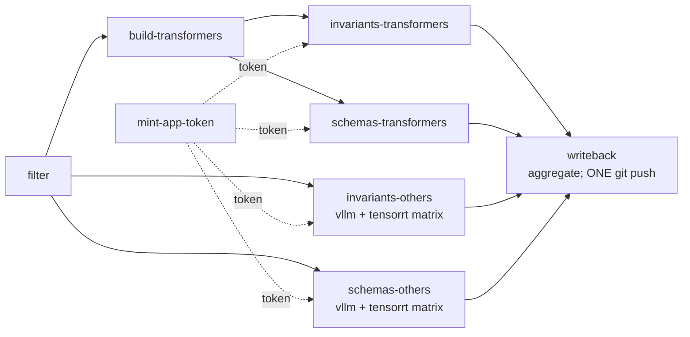

# Development guide

This project enforces an asymmetric runtime contract: **engine code runs only
inside Docker; coordination code runs on host.**

## Layer split

| Layer | Runs on | Why |
|---|---|---|
| Engine code (miners, introspectors, validation gates, model load) | Docker only | tensorrt-llm loads CUDA bindings on import; a unified host `uv.lock` produced incompatible cross-engine transitive constraints (#437); the multi-gigabyte `tensorrt_llm` wheel OOMed Renovate's lock-update runner. |
| Coordination (CLI, config validation, study runner, energy-measurement scaffolding without engines) | Host | Iteration speed for CLI / config / runner debugging matters; no GPU dependency. |
| Engine-touching tests | Docker only | Tests that import an engine library run inside that engine's image. Host tests gate themselves via `pytest.importorskip(...)` and skip when the engine is absent. |

## Setting up the host environment

```bash
uv sync --dev
```

Installs orchestration dependencies plus dev tools (pytest, ruff, mypy,
import-linter). **No engine libraries are installed on host** -
`import transformers`, `import vllm`, and `import tensorrt_llm` will all fail
on host. That is the contract, not a bug.

If you want host-side energy-measurement scaffolding without engines:

```bash
uv sync --dev --extra zeus --extra codecarbon
```

## Running engine code

The dispatch path for experiments goes through `docker_runner.py`, which
bind-mounts the project source + a tiny entrypoint script + the host's
runtime-deps cache into the container. The image tag is derived from the
SSOT (`engine_versions/{engine}.yaml`); the framework code is bind-mounted
rather than baked.

```bash
VER=$(yq '.library.current_version' engine_versions/transformers.yaml)
docker build -f docker/Dockerfile.transformers \
  --build-arg TRANSFORMERS_VERSION="$VER" \
  -t llenergymeasure:transformers-${VER} .

# Direct invocation for ad-hoc miner / introspector runs:
docker run --rm \
  -v "$(pwd)":/repo -w /repo \
  --entrypoint python3 \
  llenergymeasure:transformers-${VER} \
  -m scripts.engine_miners.build_corpus --engine transformers
```

For experiment dispatch (the `llem run` path) docker_runner.py emits a
different shape: the entrypoint script `scripts/container_entrypoint.sh`
is bind-mounted at `/llem-entry.sh` and set as `--entrypoint`. The script
diffs `pyproject.toml`'s `[project.dependencies]` against the
in-container installed dists, pip-installs any missing ones to a host-
mounted cache (`~/.cache/llem/deps/py{N.M}/`, keyed by container Python
minor), sets `PYTHONPATH` to include the cache + `/llem-src`, then exec's
the framework entrypoint module. TRT-LLM dispatches route through
`/opt/nvidia/nvidia_entrypoint.sh` first so `LD_LIBRARY_PATH` is set up
for libnvinfer. See "Runtime-deps priming" below for the full mechanism.

Replace `transformers` with `vllm` or `tensorrt` (and add `--gpus all` for
those two - they need a CUDA device) for the other engines. The automated
path is the `engine-pipeline.yml` orchestrator in `.github/workflows/`, which
fans out per-engine cells (the `_engine-invariants-cell.yml` and
`_engine-schemas-cell.yml` reusables) plus an inline `build-transformers`
job for the first-party transformers image. See "CI pipeline ordering"
below for the full sequence and
[Architecture &gt; CI architecture](/explanation/architecture/ci-architecture) for the
topology + reusable-workflow contract.

## Runtime-deps priming

vLLM and TensorRT-LLM use upstream-direct images as the engine substrate,
and those images don't ship every runtime dep `llenergymeasure` needs
(empirical spike 2026-05-12 found `vllm/vllm-openai:v0.7.3` lacks
`platformdirs`, `nvidia-ml-py`, `pyarrow`; the NGC TRT-LLM image lacks
`python-dotenv`). Rather than bake a thin wrapper image per engine, the
in-container entrypoint script primes the missing deps lazily on first
dispatch into a host-mounted persistent cache.

### Mechanism

`scripts/container_entrypoint.sh` runs once per dispatch and:

1. Computes `PY_MINOR` from the container's Python (`sys.version_info`).
2. Sets `PYTHONPATH=/llem-src:/llem-runtime-deps/py{N.M}:...` so the
   probe and subsequent imports see the cache.
3. Fast-paths via a stamp file: `sha256sum` the bind-mounted
   `pyproject.toml`, compare to `/llem-runtime-deps/py{N.M}/.llem_pyproject_hash`.
   Match means "deps probe already done against this pyproject, nothing
   changed, skip the probe." Saves ~200ms per dispatch on warm cache.
4. If stamp missing or mismatched: a small Python helper parses
   `[project.dependencies]`, calls `importlib.metadata.distribution(name)`
   per dep, and accumulates the missing ones.
5. Pip-installs missing deps via
   `pip install --no-deps --no-cache-dir --only-binary=:all: --target $DEPS_TARGET`.
6. Chowns the cache directory to `LLEM_HOST_UID:LLEM_HOST_GID` (passed
   by docker_runner) so the host can clean it without sudo despite the
   container running as root.
7. Writes the pyproject hash to the stamp file.
8. Exec's the framework entrypoint - routing through
   `nvidia_entrypoint.sh` when `LLEM_ENGINE=tensorrt`, wrapping in
   `mpirun -n {N} --allow-run-as-root` when `LLEM_MPI_NP` is set
   (TRT-LLM tensor parallelism > 1).

### Cache location

The host-side cache lives at `~/.cache/llem/deps/` by default (resolved
via `platformdirs`). Set `LLEM_DEPS_CACHE_DIR` to override - useful when
sharing across machines on cluster storage.

### What this is NOT

- **Not a wrapper image**. The upstream engine image stays untouched.
- **Not an installation step**. There's no `llem doctor` or pre-flight
  ritual; first dispatch primes automatically.
- **Not a permanent host pollution**. The cache is a single bind-mounted
  directory; `rm -rf ~/.cache/llem/deps/` cleans it.
- **Not an alternative to the engine-version SSOT**. The probed engine
  library version (`vllm.__version__`, `tensorrt_llm.__version__`,
  `transformers.__version__`) is compared at study setup against
  `engine_versions/{engine}.yaml::library.current_version` and a
  mismatch is a hard error (see `version_handshake.py`).

## Engine image strategy

Per-engine choices about runner type and image source are deliberately
asymmetric:

| Engine | CI runner | GPU required | Image source | Why |
|---|---|---|---|---|
| transformers | `ubuntu-latest` (GH-hosted) | No | First-party `docker/Dockerfile.transformers`, built by `engine-pipeline.yml :: build-transformers` per (PR, SSOT version) and consumed downstream via `docker pull` | No upstream provides FA3-included transformers |
| vllm | self-hosted GPU | Yes (CUDA) | `vllm/vllm-openai:<version>` (Docker Hub) | Canonical upstream exists; project source bind-mounted at runtime |
| tensorrt | self-hosted GPU | Yes (CUDA) | `nvcr.io/nvidia/tensorrt-llm/release:<version>` (NGC) | Canonical upstream exists; project source bind-mounted at runtime |

The principled rationale:

1. **vllm and tensorrt use upstream because canonical upstream exists.** Both
   publish per-version images at stable refs that already include the engine
   library plus its CUDA / torch substrate. Our project's value-add (the
   `llenergymeasure` package + miner / introspector scripts) is bind-mounted
   at `/app` with `PYTHONPATH=/app/src:/app -w /app` rather than baked into a
   custom overlay. No first-party Dockerfile means no version drift between
   our image and upstream's release cadence.

2. **transformers needs a first-party image because no upstream provides
   FA3-included transformers.** `pytorch/pytorch:2.5-cuda12.4-cudnn9-runtime`
   has the CUDA + torch substrate but no transformers; `huggingface/transformers-pytorch-gpu`
   has transformers but no FA3 (the hopper-extension build is niche and
   compiled from source). `docker/Dockerfile.transformers` ships transformers
   plus FA2 (PyPI wheel) plus FA3 (compiled from source) plus accelerate /
   bitsandbytes / calflops / sentencepiece / einops pre-installed, plus
   LLenergyMeasure's runtime non-engine deps (pydantic, typer, pyyaml,
   platformdirs, nvidia-ml-py, numpy, pyarrow, tqdm, rich, python-dotenv,
   filelock). The `llenergymeasure` package itself is NOT installed into the
   image - it is bind-mounted at runtime via `-v <repo>:/llem-src` +
   `PYTHONPATH=/llem-src`, identically to the vllm + tensorrt cells. This
   keeps image rebuilds dependent only on the engine substrate, not on
   project source edits, so `src/` changes never invalidate the FA3 layer.

3. **Build once, consume many.** Build engine image is the single producer
   of the transformers image; downstream workflows pull rather than rebuild.
   CI builds the same production-equivalent image users get (`INSTALL_FA3`
   defaults to `true` and is not overridden in any workflow). Cold builds
   on a brand-new SSOT version still pay the FA3 compile (~30-60 min); warm
   rebuilds reuse the GHA scope cache + the canonical `:latest` registry
   cache and finish in a few minutes. The previous shape - engine-invariants
   and engine-schemas each running their own buildx step against the same
   per-version GHA scope - was prone to cache-write contention and observed
   to deadlock at PR time on multi-GB layer writes.

## CI pipeline ordering

The engine-coupling pipeline lives in `engine-pipeline.yml`, a single
orchestrator workflow with a coherent dependency graph. See
[Architecture &gt; CI architecture](/explanation/architecture/ci-architecture) for the full
topology, reusable-workflow contract, and expected-shape table.



When Renovate (or a maintainer) bumps `engine_versions/transformers.yaml`
or `docker/Dockerfile.transformers`, the orchestrator fires:

1. **`filter`** computes which cells to expand.
2. **`mint-app-token`** mints one App token for the run (forwarded to cells).
3. **`build-transformers`** builds the transformers image and pushes it to
   `ghcr.io/<repo>/transformers-cache:transformers-<VERSION>` for the
   downstream cells to pull. The buildcache (`:<VERSION>-buildcache`) is
   exported via `cache-to: type=registry,mode=max`.
4. **`invariants-transformers`** + **`schemas-transformers`** pull the
   freshly built image and run probe + producer + classify-diff. Each
   cell uploads a writeback artefact rather than pushing per-cell.
5. **`writeback`** downloads all cell artefacts and performs ONE
   `git push` per orchestrator run. Lenient gating preserves partial
   availability: a cell that succeeded still lands its changes even if
   another cell failed.

When Renovate bumps `engine_versions/vllm.yaml` or
`engine_versions/tensorrt.yaml`, the corresponding cells (in the
`invariants-others` / `schemas-others` matrix) fire and pull upstream
images directly (no first-party build).

A weekly scheduled run (Monday 05:37 UTC) fires `build-transformers`
with `--no-cache` for drift detection - if the resulting layer cache
diverges from the prior `:<VERSION>-buildcache`, that surfaces external
dependency drift (apt repo, PyPI wheel re-publish, base image silent
update) that layer caching alone wouldn't catch. Cells skip on schedule
(no PR to write back to).

`publish-engine-image.yml` remains a separate workflow on `push: main`,
tag-copying `:transformers-<VERSION>` to canonical `:latest` for
production consumers.

## Running tests

Host tests (the majority - orchestration, config, energy scaffolding, CLI):

```bash
uv run pytest tests/
```

Engine-touching tests gate themselves via `pytest.importorskip("transformers")`
(or `vllm`, etc.) and are skipped on host. To exercise them, run pytest inside
the matching engine image:

```bash
docker run --rm \
  -v "$(pwd)":/repo -w /repo \
  --entrypoint pytest \
  llenergymeasure:transformers-${VER} \
  tests/unit/scripts/engine_miners/test_transformers_miner.py
```

## Why this contract

The project previously offered three host extras (`[transformers]`, `[vllm]`,
`[tensorrt]`), each pulling its engine library into the host `uv.lock`. Three
problems compounded:

1. `tensorrt-llm 0.21.0` loads CUDA bindings on import, so the host couldn't
   even resolve the `[tensorrt]` extra without GPU drivers (#437).
2. The unified lock fought itself: `tensorrt-llm` transitively forced
   `transformers<4.48` even when only `[transformers]` was installed, breaking
   vLLM's torch in turn (#437, #464).
3. The `tensorrt_llm` wheel is multi-gigabyte; Renovate's lock-update runner
   OOMed every time it tried to refresh the lock.

Engines-in-Docker collapses the trichotomy (Tier 1 host-import, Tier 2 host-
incompatible-Docker, Tier 3 import-requires-GPU) into a single tier: every
engine producer runs inside its own image, period. The host lock has no
engine deps and resolves cleanly; Renovate stops OOMing; CUDA-on-import is
no longer a host problem.

The cost - slower iteration on engine code (Docker build + run vs `python -m`)
- is a non-issue because engine-touching iteration was already Docker-bound
in practice. This contract just stops pretending host imports work for those
paths.
