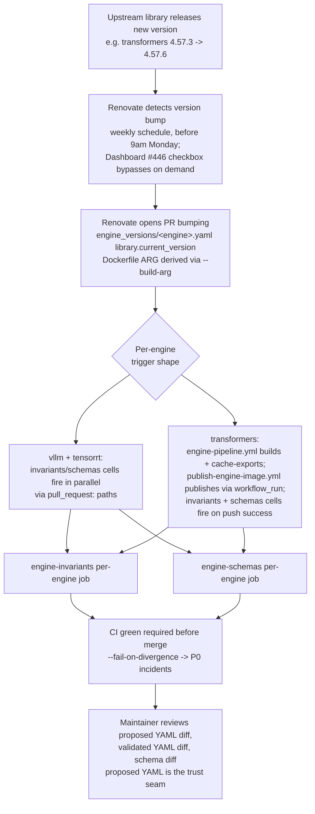

# Invariant Miner Pipeline

This document is the deep-dive reference for the invariant miner pipeline: how it extracts validation rules from engine library source code and packages them into a versioned corpus.

**Audience:** engine extenders, CI maintainers, and research readers interested in the technical approach.

For the runtime side of the pipeline (how the corpus is consumed at validation time), see [parameter-discovery.md](/explanation/architecture/parameter-discovery).

---

## What the miner pipeline does

The miner pipeline derives structured constraint rules from ML engine config classes by combining:

1. **Static analysis** - walking the AST of validator methods to extract conditional predicates.
2. **Dynamic analysis** - instantiating config classes with combinatorial probe values and observing raise/no-raise patterns.
3. **Type-system lifting** - extracting constraints directly from Pydantic `FieldInfo`, msgspec `Meta`, and stdlib `Literal[...]` annotations.

The output is a corpus of invariants, each describing one constraint on a config field or combination of fields. Corpus rules are then validated against the live library (the validation-CI gate) before shipping.

---

## Component overview

```mermaid
flowchart TD
    static[STATIC MINER<br/>inspect.getsource&#40;&#41; + ast.parse&#40;&#41;<br/>conditional detectors]
    dynamic[DYNAMIC MINER<br/>class constructors + validate&#40;&#41; calls<br/>Cartesian probe grid + predicate inference]
    lift[LIFT MODULES<br/>_pydantic_lift / _msgspec_lift / _dataclass_lift]
    staging[(staging files<br/>src/llenergymeasure/engines/_staging/)]
    build[build_corpus.py<br/>merge + dedup + fingerprint]
    replay[validate_invariants.py<br/>replay against live library]
    confirmed[(confirmed rules<br/>engines/&lt;e&gt;/invariants.proposed.yaml<br/>engines/&lt;e&gt;/invariants.validated.yaml)]
    quarantined[(quarantined rules<br/>engines/&lt;e&gt;/_staging/_failed_*.yaml)]

    static --> staging
    dynamic --> staging
    lift --> staging
    staging --> build --> replay
    replay --> confirmed
    replay --> quarantined
```



- **Static miner** walks the AST of validator methods. Detectors include `ConditionalRaiseDetector`, `ConditionalSelfAssignDetector`, `ConditionalWarningsWarnDetector`, and a few more (full list under [`_base.py` shared infrastructure](#_basepy-shared-infrastructure)).
- **Dynamic miner** instantiates config classes with combinatorial probe values, observes raise/no-raise patterns, and runs predicate inference on the resulting table.
- **Lift modules** extract type-system constraints. `_pydantic_lift.py` reads `model_json_schema()` and `FieldInfo.metadata`. `_msgspec_lift.py` reads `msgspec.inspect.type_info()` plus `Meta(ge=, le=, ...)`. `_dataclass_lift.py` reads `dataclasses.fields()` plus `Literal[...]` annotations.
- **`build_corpus.py`** merges per-miner staging files, deduplicates by fingerprint, and hands off to validation.
- **`validate_invariants.py`** replays each rule against the live library; confirmed rules ship in the proposed and validated YAMLs, quarantined rules land in `_staging/_failed_*.yaml`.

---

## Static miner

The static miner reads engine library source via `inspect.getsource()` + `ast.parse()` and walks the AST of known validator methods. It does not call constructors or run the validator methods.

This is "static" in the sense that it reads source without executing the methods under analysis. The library is still imported (to get source file paths), but no config classes are instantiated.

### Why AST walking

Pure introspection (running the constructor and observing errors) cannot recover the shape of cross-field predicates. The dynamic miner sees the message `"num_beams should be divisible by num_beam_groups"` but cannot determine that the underlying check is `num_beams % num_beam_groups != 0`. The static miner reads the predicate structure directly from the AST.

Example: the rule `not_divisible_by` can only be expressed in the corpus because the static miner found `if num_beams % num_beam_groups != 0: raise` in the AST.

### AST primitives (in `_base.py`)

```mermaid
flowchart TD
    parse["ast.parse&#40;source&#41;"]
    findcls["find_class&#40;module, GenerationConfig&#41;"]
    findmethod["find_method&#40;cls, validate&#41;"]
    walk[for stmt in if_body]
    detectors[Run pattern detectors]

    parse --> findcls --> findmethod --> walk --> detectors
```



For each `if` body, the miner runs five pattern detectors. Each detector targets a specific source pattern and emits a rule of a specific severity.

| Detector | Pattern matched | Emitted severity |
|---|---|---|
| `ConditionalRaiseDetector` | `if X: raise SomeException(msg)` | `error` |
| `ConditionalSelfAssignDetector` | `if X: self.A = B` (silent normalisation) | `dormant` |
| `ConditionalWarningsWarnDetector` | `if X: warnings.warn(msg)` | `warn` |
| `ConditionalLoggerWarningDetector` | `if X: logger.warning(msg)` | `warn` |
| `MinorIssuesDictAssignDetector` | HF-specific: `if X: minor_issues[key] = msg` | `dormant` |

### Filters (false-positive guards)

Before emitting a candidate, the static miner applies three filters:

1. `filter_condition_references_self` - the predicate must reference at least one public field via `self.<field>`. Drops argument-gated rules (`if strict: raise`) and private-state rules (`if self._initialized: ...`).

2. `filter_target_is_public_field` - for self-assign patterns, the affected field must be a public field.

3. `filter_kwargs_positive_derivable` - a representative `kwargs_positive` dict must be synthetically derivable from the predicate. Rejects predicates whose truth depends on opaque external calls.

### Miner depth

Static miner depth is fixed at 1: it walks one level of helper calls (`WatermarkingConfig.validate`, `SynthIDTextWatermarkingConfig.validate`) but does not trace through general function calls in the validator body. This avoids an unbounded call-graph traversal while capturing the most common engine validation patterns.

---

## Dynamic miner

The dynamic miner instantiates config classes with combinatorial probe values and observes raise/no-raise patterns. It then runs predicate inference on the resulting table of `(kwargs, error_message)` rows.

### Probe strategy: Cartesian primary, Hypothesis supplement

```mermaid
flowchart TD
    cluster[cluster definition<br/>e.g. beam-search:<br/>num_beams, num_beam_groups, diversity_penalty]
    values[representative values per field<br/>e.g. num_beams=&#91;1,2,4&#93;<br/>num_beam_groups=&#91;1,2,3&#93;]
    cart[Cartesian product]
    size{cluster size}
    full[Cartesian probe<br/>runs every combination]
    hyp[Hypothesis from_type<br/>deterministic value generator<br/>fixed seed, no randomness]
    loop[For each combination:<br/>try construct + validate&#40;strict=True&#41;]
    table[(probe-row table:<br/>list&lt;kwargs, error_message or None&gt;)]

    cluster --> values --> cart --> size
    size -->|small| full
    size -->|large| hyp
    full --> loop
    hyp --> loop
    loop --> table
```



The probe-row table is what predicate inference reads downstream. The branch threshold is a soft heuristic - small clusters (e.g. 3 fields, 3 values each) get full Cartesian coverage; large clusters (e.g. 8 fields, 5 values each) fall back to Hypothesis's `from_type` value generator with a fixed seed.

For each combination the miner runs:

```python
try:
    ClassName(**kwargs)
    .validate(strict=True) if applicable
    -> record (kwargs, None)
except Exception as e:
    -> record (kwargs, str(e))
```

**Important:** Hypothesis is used here only as a deterministic value generator with a fixed seed, not as a property-based test runner. The miner pipeline must be deterministic: the same library version + miner code must produce the same corpus. Randomness would break Renovate-driven library bump diffs.

### Predicate inference

Given the probe-row table, the dynamic miner infers one rule per error message class using seven predicate templates (in order of preference):

| Template | Example | Fires when |
|----------|---------|-----------|
| Cross-field divisibility | `a % b != 0` | error rows align with divisibility failure |
| Cross-field comparison | `a > b` | error rows align with comparison |
| Cross-field equality gate | `a == V AND b == W` | error rows correlate with combined field values |
| Type allowlist | `type(a) not in {T1, T2}` | error rows correlate with field type |
| Single-field range | `a < 0` | error rows correlate with one field crossing a threshold |
| Single-field equality | `a == V` | error rows correlate with one field having a specific value |
| Value allowlist | `a not in {v1, v2, ...}` | error rows correlate with field value not in a set |

The dynamic miner errs toward recall: when multiple templates fit the evidence, it emits all plausible candidates. The validation-CI gate prunes false positives downstream.

---

## Lift modules

The three lift modules extract constraints from type-system metadata without requiring probe rounds. They are independent stages that run alongside AST walking and probing.

| Type-system axis | Lift module | Engines using it |
|---|---|---|
| `pydantic.BaseModel` / `pydantic.dataclasses` | `_pydantic_lift.py` | vLLM (27 pydantic-dataclasses); TRT-LLM (`TrtLlmArgs`, including `Literal`-typed enum fields) |
| `msgspec.Struct` | `_msgspec_lift.py` | vLLM (`SamplingParams`) |
| stdlib `@dataclass` | `_dataclass_lift.py` | transformers (`GenerationConfig`, `BitsAndBytesConfig`); vLLM (`EngineArgs`, 175 fields); TRT-LLM (`BuildConfig`, `QuantConfig`) |

### Pydantic lift (`_pydantic_lift.py`)

Walks `model_json_schema()` and `FieldInfo.metadata` (Pydantic v2). Emits one rule per `annotated-types` constraint or `Literal[...]` allowlist found on a field.

Operator vocabulary aligns with the `annotated-types` standard:

| `annotated-types` predicate | Corpus operator key |
|---|---|
| `Gt(value)` | `">"` |
| `Ge(value)` | `">="` |
| `Lt(value)` | `"<"` |
| `Le(value)` | `"<="` |
| `MultipleOf(value)` | `"multiple_of"` |
| `MinLen(value)` | `"min_len"` |
| `MaxLen(value)` | `"max_len"` |
| `Literal[a, b, c]` | `"in": [a, b, c]` |

### msgspec lift (`_msgspec_lift.py`)

Walks `msgspec.inspect.type_info()` and the `Constraints` object per field. Maps `Meta(ge=, le=, ...)` constraints to corpus operator keys using the same vocabulary as the Pydantic lift.

Note: vLLM's `SamplingParams` currently ships zero `Meta` annotations - the msgspec lift returns `[]` for it. The lift exists so that if vLLM (or another msgspec user) adds `Meta(ge=...)` in a future version, the constraints are captured for free.

### Dataclass lift (`_dataclass_lift.py`)

Walks `dataclasses.fields()` and extracts `Literal[a, b, c]` annotations. Plain stdlib dataclasses carry no numeric-bound metadata, so the lift is limited to value-allowlist rules.

---

## Per-engine miner comparison

The three engines have structurally different config surfaces, which determines which components each miner uses.

| Engine | Static miner | Dynamic miner | Lift modules |
|---|---|---|---|
| transformers | `GenerationConfig.validate()`, `BitsAndBytesConfig.post_init()`; ~1700 LoC walked | Cartesian cluster probing | `dataclass_lift` (`GenerationConfig`, `BitsAndBytesConfig`) |
| vLLM | `SamplingParams._verify_args()`; ~20 validator methods | Cartesian + Hypothesis supplement | `pydantic_lift` (27 `vllm.config.*` classes); `msgspec_lift` (`SamplingParams`); `dataclass_lift` (`EngineArgs`) |
| TRT-LLM | `BaseLlmArgs.validate_*()`; ~11 validator methods | SKIPPED (constructor yields zero raises) | `pydantic_lift` (`TrtLlmArgs`); `dataclass_lift` (`BuildConfig`, `QuantConfig`) |

**Target rule count after validation-CI gate:**

| Engine | Rule count |
|---|---|
| transformers | 46 rules (shipped) |
| vLLM | 80-110 rules (target) |
| TRT-LLM | 20-28 rules (target) |

**Why no dynamic miner for TRT-LLM:** empirical probing of `TrtLlmArgs(**kwargs)` constructors produced zero raises. TRT-LLM performs construction-time validation in a much more permissive way than transformers or vLLM; its constraints are primarily enforced in validator methods (covered by the static miner) and at engine build time (hardware-gated, not corpus rules).

---

## Fail-loud import contract

Every miner module must resolve its version envelope from the engine SSOT and validate it at import time. This is a structural contract, not a guideline.

```python
# Every *_miner.py must resolve its envelope from the engine's SSOT:
from scripts.engine_miners._ssot import load_miner_pin

_envelope = load_miner_pin("transformers", "static")  # SpecifierSet

# And call this at import time:
check_installed_version(
    "transformers",
    importlib.metadata.version("transformers"),
    _envelope,
)
```

The envelope itself lives in `engine_versions/{engine}.yaml` under
`miner_pins.{static|dynamic|discovery}` - one pin per producer role. There
is no per-module `TESTED_AGAINST_VERSIONS` constant; Renovate updates the
SSOT and every miner reads through `load_miner_pin`.

If the installed library version falls outside the envelope, the miner raises `MinerVersionMismatchError` - a hard CI failure.

If an expected class or method is missing from the library source (e.g. a class was renamed in a library refactor), the miner raises `MinerLandmarkMissingError` - also a hard CI failure.

```mermaid
flowchart LR
    cv["check_installed_version&#40;&#41;"]
    cv --> cvok{version inside<br/>SSOT envelope?}
    cvok -->|yes| cvcont[continue]
    cvok -->|no| cverr[MinerVersionMismatchError<br/>CI fatal]

    fc["find_class&#40;module, GenerationConfig&#41;"]
    fc --> fcok{class found?}
    fcok -->|yes| fccont[continue]
    fcok -->|no| fcerr[MinerLandmarkMissingError<br/>CI fatal]

    classDef fatal fill:#ffe4e1,stroke:#c00,stroke-width:2px;
    class cverr,fcerr fatal;
```



**Why this matters:** the Haiku-era TRT-LLM extractor (PRs #415-#417, reverted in #423) silently degraded when it encountered an import error - it caught `ImportError` and returned `[]` instead of failing. The silent degradation was indistinguishable from "no rules found for this engine", which masked a broken extractor. The fail-loud contract makes that impossible.

### Structural fixpoint: ensuring the contract is enforced

`_fixpoint_test.py` includes a structural test that synthesises one malformed rule per gate-soundness check and asserts the validation-CI gate records a divergence for each. This pins the three checks in place:

1. `positive_raises` - `kwargs_positive` must cause the library to raise.
2. `message_template_match` - the raised message must contain the template's static fragment.
3. `negative_does_not_raise` - `kwargs_negative` must construct without raising.

If any of the three checks is removed from `validate_invariants.compute_gate_soundness_divergences`, the corresponding case in `_fixpoint_test.py` fails loudly.

---

## Build corpus: merge and dedup

`build_corpus.py` is the orchestration entrypoint. It runs all miners, collects staging files, merges them, deduplicates, and calls the validation-CI gate.

### Fingerprinting

The deduplication key is:

```python
canonical_serialise({
    "engine": rule.engine,
    "severity": rule.severity,
    "match_fields": rule.match["fields"],
})
```

Two rules with the same fingerprint are treated as the same constraint discovered by two independent paths (cross-validation). The merger keeps one rule with the primary `added_by` source and records the secondary source in `cross_validated_by`.

### Per-field merge precedence

When static and dynamic miners both emit a rule with the same fingerprint, the fields are merged by source preference:

| Field | Source that wins |
|-------|-----------------|
| `match.fields` predicate | static miner (more specific operators) |
| `message_template` | dynamic miner (real library text) |
| `observed_messages` | dynamic miner (real captured emissions) |
| `kwargs_positive` / `kwargs_negative` | static miner (derived from conditional) |
| `miner_source.line_at_scan` | static miner (real source line) |
| `references` | union (all evidence preserved) |
| `id` | first source's id is canonical |

---

## Validation-CI gate

The validation-CI gate runs after merge. It replays every rule's `kwargs_positive` and `kwargs_negative` against the live library inside the engine's Docker container and compares observed behaviour against the declared `expected_outcome`.

```mermaid
flowchart TD
    rule[For each rule in merged corpus]
    pos["run_case&#40;kwargs_positive, native_type&#41; -> CaptureBuffers"]
    c1[CHECK positive_raises]
    c2[CHECK message_template_match]
    c3[CHECK negative_does_not_raise]
    verdict{all checks pass?}
    confirmed[rule confirmed<br/>write to corpus]
    quarantined[rule quarantined<br/>_failed_validation_*.yaml]

    rule --> pos --> c1 --> c2 --> c3 --> verdict
    verdict -->|yes| confirmed
    verdict -->|no| quarantined
```



Each check has a precise contract:

- **`positive_raises`** - `CaptureBuffers.exception_type` must not be `None` after running with `kwargs_positive`.
- **`message_template_match`** - `CaptureBuffers.exception_message` must contain `rule.message_template` (the static fragment, with template variables removed).
- **`negative_does_not_raise`** - running `run_case(kwargs_negative, native_type)` must produce a `CaptureBuffers` with `exception_type is None`.

The gate runs inside the Docker container for each engine so that the live library version used for validation matches the version the miner was built against.

**Exit codes from `validate_invariants.py`:**
- `0` - all rules confirmed.
- `1` - one or more divergences; validated YAML still written (for diagnostic purposes).
- `2` - hard error (corpus malformed, engine not importable).

---

## Renovate-driven refresh loop

Library version bumps trigger corpus regeneration automatically. The flow described below reflects what was empirically observed during the Phase B.6 forced E2E run on PR #459 (transformers 4.57.3 → 4.57.6); see ["Phase B.6 observed flow"](#phase-b6-observed-flow-historical) below for the actual commit timeline.



#### Runtime fan-out per engine

| Engine | Runner | Image | Producer steps |
|---|---|---|---|
| transformers | GH-hosted `ubuntu-latest` | `llenergymeasure:transformers-${VER}` (pre-built) | transformers static miner; transformers dynamic miner |
| vLLM | Self-hosted GPU | `llenergymeasure:vllm-${VER}` | vLLM static + dynamic (Docker isolates from cross-engine constraints; [#437](https://github.com/henrycgbaker/llenergymeasure/issues/437)) |
| TRT-LLM | Self-hosted GPU | `llenergymeasure:tensorrt-${VER}` | TRT-LLM static miner (CUDA-aware import required) |

#### Per-engine step sequence (inside one job)

1. **Probe** - `scripts._probe` checks landmarks. `fail` skips downstream stages and posts a `probe-blocked` comment + label.
2. **Mine** - `build_corpus.py` merges staging into `src/llenergymeasure/engines/{engine}/invariants.proposed.yaml`.
3. **Validate-replay** - `validate_invariants.py --fail-on-divergence` replays each rule against the live library inside the engine's Docker container; confirmed cases write to `src/llenergymeasure/engines/{engine}/invariants.validated.yaml`.
4. **Doc-gen** - `generate_invariants_doc.py` refreshes `docs/reference/engines/invariants-{engine}.md`.
5. **Atomic writeback** - one bot commit covers `proposed.yaml`, `validated.yaml`, the digest doc, and `engine_versions/{engine}.compat.json`. Pushed with `--force-with-lease`.

#### engine-schemas (per-engine)

`scripts/engine_introspectors` introspects engine config classes inside Docker, regenerates `engines/{engine}/schema.discovered.json`; `generate_curation_doc.py` + `generate_schema_doc.py` refresh `docs/reference/engines/{curation,schema}-{engine}.md`. The bot commits and posts a diff comment.

See `docs/development.md` "CI pipeline ordering" for the full transformers chain detail.

### Version mismatch as CI signal

When `engine_versions/{engine}.yaml miner_pins.{producer}` does not cover the newly bumped library version, `MinerVersionMismatchError` is raised and CI fails. This is intentional: it forces a maintainer to update the miner against the new library version before the corpus is regenerated.

The update workflow:

1. Renovate opens PR bumping library version.
2. CI fires, `MinerVersionMismatchError` raised for the affected miner.
3. Maintainer checks the library's release notes for validator changes.
4. Maintainer updates `miner_pins` in the engine SSOT and any landmark names that changed.
5. CI re-runs with updated miner; validation-CI gate runs.
6. If any rules now diverge, they are quarantined; maintainer updates the corpus.

### Phase B.6 observed flow (historical)

The Phase B.6 forced E2E run on PR #459 (`renovate/transformers-4.x`, transformers v4.57.3 → v4.57.6) was the first naturally-Renovate-authored exercise of the full chain. It pre-dates the merge of mining + validate into `engine-invariants.yml` and the rename of the schema workflow to `engine-schemas.yml`; the workflow names below (`auto-mine.yml`, `invariant-miner.yml`, `parameter-discovery.yml`) are historical and reflect the predecessor pipeline shape that has since collapsed/renamed. The structural lessons (commit-back determinism, self-hosted runner serialisation) carry over to the merged workflow. The actual commit sequence on the PR branch:

| # | Commit (PR #459) | Author | Producing workflow / event | Notes |
|---|---|---|---|---|
| 1 | `2599ef21` | renovate | Renovate's initial Dockerfile bump (`TRANSFORMERS_VERSION` -> 4.57.6) | Triggers the chain |
| 2 | `a77aa185` | llem-ci-bot | `invariant-miner.yml` - validate-tensorrt | First cycle; replays existing tensorrt invariants against the live library |
| 3 | `ae22d224` | llem-ci-bot | `parameter-discovery.yml` | First cycle; rediscovered transformers schema, 1 safe change |
| 4 | `45e0d75a` | llem-ci-bot | `invariant-miner.yml` - validate-transformers | First cycle; replays existing transformers invariants against new library |
| 5 | `96d811fb` | llem-ci-bot | `auto-mine.yml` - mine-transformers | Stage 1: regenerated YAML corpus from miners against new library |
| 6 | `fb473a22` | llem-ci-bot | `invariant-miner.yml` - validate-transformers | Stage 2 RE-FIRES on auto-mine's new YAML (chain validation re-fire); validates against new YAML |
| 7 | `75d4c0c1` | llem-ci-bot | `invariant-miner.yml` - validate-vllm | Delayed (serial runner): self-hosted GPU runner is serial, vLLM job queued behind others |

The events ran in the listed order. Two arrows are load-bearing for the structural lessons: commit 5 -> 6 is the **chain validation re-fire** (auto-mine's writeback re-triggers validate against the new YAML), and commit 6 -> 7 is **delayed** because the self-hosted GPU runner is serial.

**What this proved empirically (carries over to the merged workflow):**

- **Path-filter-driven fan-out fires on a single Renovate-authored bump.** No actor-gate intervention; path filters alone are sufficient. Same property holds for `engine-pipeline.yml`.
- **Stage 1 → Stage 2 chain validation works as designed.** The historical `auto-mine.yml` writeback at `96d811fb` re-fired the historical `invariant-miner.yml` at `fb473a22` against the new YAML. The trust seam (YAML diff visible to reviewers before JSON gate runs) was exercised end-to-end. The merged `engine-pipeline.yml` preserves the trust seam in-process: the proposed-corpus diff is emitted before the validate-replay's verdict lands in the same commit.
- **App-token + `--force-with-lease` writebacks succeed** without recursion-guard issues.
- **Determinism holds.** Of the ~14 bot comments posted across the cycle, 8 were "No changes" after subsequent runs - proving the `LLENERGY_*_FROZEN_AT` env-var contracts produce reproducible outputs once the corpus has converged.
- **Self-hosted GPU runner serialisation is observable.** The vLLM validation gate (`75d4c0c1`) was queued behind validate-tensorrt and arrived after the transformers chain had already converged.

**What did not work on this PR (separate blockers, not chain-validation failures):**

- `mine-vllm` - the vLLM version in use at the time (v0.7.3, then sourced from a project Dockerfile ARG; now sourced from `engine_versions/vllm.yaml library.current_version`) is outside the vLLM miner's SSOT-pinned envelope (`engine_versions/vllm.yaml miner_pins.* = >=0.17,<0.18`); raised `MinerVersionMismatchError` as designed. Resolution requires the per-engine version-bundle work (#468-#471).
- `mine-tensorrt` - runtime-symlink script bug inside the NGC container (#472).

Both are tracked as engine-specific follow-ups; neither invalidates the chain-validation outcome.

For the full closure summary and bot-comment audit, see PR #459's final comment (PR closed without merge; the PR was the test instrument, not a real upstream bump record).

### Status: #394 (check-vs-commit semantics)

Issue #394 raised the question of whether Stage 2's bot writeback should commit the validated YAML back to the PR or merely check it (a "check-only" mode without a writeback). At the time of writing the simplification looked attractive - the YAML at Stage 1 already serves the trust-seam role.

Status note as of Phase C closure:

- The runtime currently reads the validated YAML via `_apply_invariants` in `src/llenergymeasure/config/models.py` (which calls `_get_invariants_loader().load_invariants`). Removing the commit-back without first migrating the runtime path would break runtime validation.
- This makes the blast radius of #394's proposed simplification larger than the issue thread implied. A clean resolution depends on the Docker-only target architecture being settled first (#467), since the JSON consumption pattern is a function of how the runtime resolves rules at experiment-run time.
- Cross-references: #394 (the original check-vs-commit question), #467 (Docker-only architecture that affects the runtime side), #393 (the historical auto-mine automation gap, partially closed by Phase B.4 and finished by the merge into `engine-invariants.yml`).

Decision: leave the JSON commit-back in place; revisit when #467 lands.

---

## Single-tier CI

All miners run inside their engine's Docker image. The host has no engine
libraries (`import transformers`, `import vllm`, `import tensorrt_llm` all
fail by design - see [development.md](/contributing/development)), so every engine's
mining stage must run in the matching container.

| Runner | Image | What runs |
|--------|-------|-----------|
| Self-hosted GPU | `llenergymeasure:transformers-${VER}` | transformers static + dynamic miners |
| Self-hosted GPU | `llenergymeasure:vllm-${VER}` | vLLM static + dynamic miners. Docker isolates the miner against vLLM's own published torch/vllm combo (#437). |
| Self-hosted GPU | `llenergymeasure:tensorrt-${VER}` | TRT-LLM static miner. The miner reads `tensorrt_llm` source files from `/tmp/trt-llm-${VER}/`; the workflow downloads the canonical GitHub release tarball on the runner host and bind-mounts it into the container at the same path. Decouples source resolution from NGC's package layout (which has churned across releases). The probe step also reads from the tarball-mounted path; CUDA is only required if the probe needs to import `tensorrt_llm` itself (the static miner does not). |

The single-tier model mirrors the project's broader principle that
engine-touching activity runs inside the same image the user's
multi-engine orchestration uses (multi-engine without Docker is a hard
error). TRT-LLM is pinned at v0.21.0 (CUDA 12.6.x) because v1.x requires
CUDA 13.x, which is not available on the current A100 (SM80) runner fleet.

---

## `_base.py` shared infrastructure

All miners import from `scripts/engine_miners/_base.py`. It provides:

- `RuleCandidate` - the output type; fields mirror the corpus YAML schema exactly (no translation step needed).
- `MinerSource` - `{path, method, line_at_scan}` provenance record.
- `MinerError`, `MinerVersionMismatchError`, `MinerLandmarkMissingError` - fail-loud error hierarchy.
- `check_installed_version` - version envelope guard.
- `find_class`, `find_method` - AST navigation helpers.
- `call_func_path`, `first_string_arg`, `extract_condition_fields`, `resolve_local_assign`, `extract_loop_literal_iterable` - AST extraction primitives.
- `ConditionalRaiseDetector`, `ConditionalSelfAssignDetector`, `ConditionalWarningsWarnDetector`, `ConditionalLoggerWarningDetector`, `MinorIssuesDictAssignDetector` - pattern detectors.
- `filter_condition_references_self`, `filter_target_is_public_field`, `filter_kwargs_positive_derivable` - false-positive guards.
- `candidate_to_dict` - serialises `RuleCandidate` to the corpus YAML dict shape.

---

## Predicate-inference template coverage

The seven templates were derived empirically from the transformers corpus. When the static miner encounters an AST predicate it cannot translate, it logs the dropped sub-clause (without failing). A monthly audit of the unparsed-predicate log drives empirical template expansion - templates are only added when a real rule shape appears three or more times.

The templates NOT adopted from Daikon's full library: linear arithmetic ternary (`z = ax + by + c`), sortedness, sequence-equality. These cover scientific-computing trace patterns not seen in engine config classes.

---

## See also

- [architecture-overview.md](/explanation/architecture/architecture-overview) - system overview and data-flow
- [invariants-corpus-format.md](/reference/invariants-corpus-format) - corpus YAML format reference
- [extending-miners.md](/contributing/extending-miners) - how to add a new engine miner
- [parameter-discovery.md](/explanation/architecture/parameter-discovery) - runtime validation pipeline
- [comparison-context.md](/explanation/methodology/comparison-context) - how results relate to other benchmarks and prior art
- [engines.md](/reference/engines/configuration) - engine configuration reference
- [schema-refresh.md](/contributing/schema-refresh) - parameter-discovery pipeline (Renovate-driven schema refresh)
