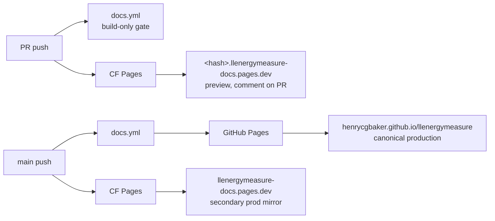

# Preview deployments

Per-PR Docusaurus previews are deployed to **Cloudflare Pages** via direct
GitHub App integration. Production stays on GitHub Pages
(`https://henrycgbaker.github.io/llenergymeasure/`); CF Pages handles the
preview URL surface only.

This split is deliberate. Production belongs on the existing, working
deployment path (`actions/deploy-pages` from `.github/workflows/docs.yml`,
which deploys on push to `main`). Previews are a separate concern,
covered by two complementary surfaces:

- **GitHub Actions** runs `docs.yml` on every docs-touching PR, build-only
  (no deploy), as the authoritative correctness gate. Catches broken
  links, generator failures, and Docusaurus build errors before merge.
- **Cloudflare Pages** auto-builds on PR via direct GitHub App integration
  and posts a comment with a clickable preview URL. Reviewer convenience.

Either surface alone leaves a class of bug uncaught: GH Actions alone
can't surface a clickable preview, and CF alone can't detect itself
being misconfigured (a path filter or App permission drift can silently
disable CF builds while the comment looks alive). Defence-in-depth is
cheap here - one extra ~40 s build per docs PR.

## What contributors see

Open a PR that touches `docs/**` or `website/**` and CF Pages builds the
site from the PR head. Once the build completes (~40 s), the **Cloudflare
Pages GitHub App** posts a comment on the PR with:

- A `*.pages.dev` preview URL (alias: branch name; permalink: commit SHA)
- Build status (success / failure / skipped)
- Last-built commit

Each push to the PR rebuilds and updates the comment in place. The
production site is unaffected until the PR merges and `docs.yml` runs.

To compare a PR against production, open the preview URL and
`https://henrycgbaker.github.io/llenergymeasure/` in adjacent tabs.

## Build sequence

CF Pages calls `scripts/cloudflare-build.sh`, which mirrors the production
build steps in `.github/workflows/docs.yml`:

```bash
pip install -e .
python scripts/generate_api_docs.py   # populates docs/api/llenergymeasure.md (gitignored)
cd website
npm ci
npm run build                          # → website/build/
```

The Python step is required: `docs/api/llenergymeasure.md` is generated
from docstrings on every build (it's gitignored, so without this step the
API reference pillar is empty in the preview).

`onBrokenLinks: 'throw'` in `website/docusaurus.config.ts` gates the
build - broken internal links fail the preview just as they fail the
production build.

## Runtime versions

Pinned at the repo root so CF, GH Actions, and local tooling all converge:

| File | Pin | Consumed by |
|---|---|---|
| `.nvmrc` | `20` | CF Pages, nvm/fnm/mise locally |
| `.python-version` | `3.12` | CF Pages, pyenv locally |

CF Pages V2 build image reads both files automatically; no dashboard env
vars needed for version selection.

## One-time maintainer setup

These steps activate the CF Pages integration. Until they're done, the
build script and config files in this PR sit dormant - no preview URL is
generated. Once complete, every existing open PR (including ones merged
in before this setup) gets previews on next push.

1. **Create a Cloudflare account** at `dash.cloudflare.com` if you don't
   have one. Free tier covers this project comfortably (500 builds/mo,
   unlimited bandwidth, unlimited preview deployments).

2. **Create a Pages project** linked to the GitHub repo:
   - Workers & Pages → Create application → Pages → Connect to Git
   - Authorise the Cloudflare GitHub App for `henrycgbaker/llenergymeasure`
   - Project name: `llenergymeasure-docs` (becomes the
     `llenergymeasure-docs.pages.dev` subdomain root for previews)
   - Production branch: `main`

3. **Configure the build**:
   | Field | Value |
   |---|---|
   | Build command | `bash scripts/cloudflare-build.sh` |
   | Build output directory | `website/build` |
   | Root directory (advanced) | `/` (default) |
   | Environment variables | *(none required - see Runtime versions)* |

4. **Verify** by triggering a manual deploy of `main` from the CF dashboard.
   Expected: ~40 s build, output URL serves the Docusaurus site.

5. **Open or push to any docs-touching PR** - the CF GitHub App posts a
   preview-URL comment within ~1 minute of build completion.

No GitHub Actions secrets are needed; the GitHub App handles auth.

## Production stays on GitHub Pages

This setup intentionally does not migrate production to CF Pages.
`.github/workflows/docs.yml` continues to deploy `main` to GH Pages on
every push. The pipelines on each git event:



If CF availability degrades, PRs lose the clickable preview URL but the
GH Actions build still gates merge correctness. If GH Pages degrades,
the CF mirror at `llenergymeasure-docs.pages.dev` still serves prod.
Neither single failure blocks the other.

Path filters on `docs.yml` are asymmetric on purpose. PRs include
`scripts/generate_api_docs.py` (the custom stdlib API renderer can
break and only a docs build catches that). Push to main does not -
API-reference drift on src changes is accepted until the next
docs/website push, avoiding republish on every src commit.

## Troubleshooting

**"Preview URL doesn't appear on my PR"**
- CF builds are gated by the dashboard's "Include paths" filter. CF uses
  non-standard glob syntax: a single `*` matches across path separators,
  so `docs/*` matches `docs/foo/bar.md`. Bare `docs/` (no wildcard) does
  not match anything and every PR will be marked "skipped". The current
  include set should mirror `docs.yml`'s `pull_request.paths`:
  `docs/*`, `website/*`, `scripts/generate_api_docs.py`,
  `scripts/cloudflare-build.sh`, `pyproject.toml`, `.python-version`,
  `.nvmrc`. Manual "Retry deployment" bypasses the path filter, which
  is why retries always work after a "skipped" status.
- Check the PR's "Checks" tab for a `cloudflare-pages` entry - if the
  build failed, click through to the CF dashboard logs.
- If the GitHub App is mis-authorised, the comment won't post but the
  build may still succeed. Re-authorise from the repo's Settings →
  GitHub Apps.

**"Preview shows stale content"**
- Each push triggers a fresh build; if the preview URL still serves the
  old commit, force-refresh (CF edge cache is short but non-zero).
- The PR comment links to the latest deployment; permalink (`<sha>.<project>.pages.dev`)
  is always fresh per commit.

**"`pip install -e .` fails on CF"**
- Verify `.python-version` resolves to a CF-supported Python (3.6-3.13
  are available in the V2 image).
- Engine extras (`zeus`, `codecarbon`) are intentionally not installed
  for previews - they're not needed to import `llenergymeasure` for the
  API doc generator.

**"Build succeeds but a page 404s in the preview"**
- `onBrokenLinks: 'throw'` only catches links discoverable from the
  sidebar/route tree. Orphan pages (not in any sidebar) still build but
  aren't reachable. Add the new page to the relevant `website/sidebars*.ts`.

## Cost

Free tier is sized for a project this size with margin:

| Limit | Free tier | Project usage estimate |
|---|---|---|
| Builds | 500 / month | ~30-50 (generous PR cadence) |
| Bandwidth | unlimited | n/a |
| Concurrent builds | 1 | sequential per PR |
| Preview retention | unlimited | n/a |

No credit card is required to enable the free tier.
