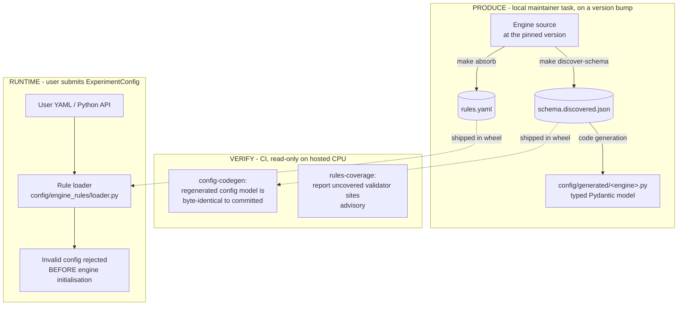

# Architecture Overview

This document is the entry point to the LLenergyMeasure architecture documentation suite. It introduces the engine-knowledge subsystem - how llem learns each engine's configuration surface and validation rules - and shows how that connects to the runtime measurement framework.

**Start here.** Deep-dive docs for each subsystem are linked throughout.

---

## Who this is for

- **Engine extenders** adding a new engine: read this overview, then [engine extensibility](/explanation/architecture/engine-extensibility) for the plugin contract and [CI architecture](/explanation/architecture/ci-architecture) for what CI checks.
- **Researchers**: read this overview, then [comparison context](/explanation/methodology/comparison-context) for how results relate to other benchmarks.

---

## The two engine-knowledge products

For each engine, llem ships two committed artifacts that together let it validate a user's config before spending GPU time:

1. **A typed config schema.** `schema.discovered.json` records the engine's full parameter surface (fields, types, bounds, enums), discovered by introspecting the engine at a pinned version. A code generator turns it into the typed Pydantic model `src/llenergymeasure/config/generated/<engine>.py` that users configure against.
2. **Validation rules.** `rules.yaml` is a list of validation rules - cross-field constraints, silent-normalisation cases - extracted from the engine's own source and verified against it. The runtime loader evaluates these against each submitted config.

Both artifacts are produced locally by a maintainer when an engine version bumps, committed to the repo, and shipped inside the wheel. CI never produces them; it only verifies that the committed bytes stay internally consistent (see [CI architecture](/explanation/architecture/ci-architecture)).



---

## Runtime config validation

At runtime, when a user submits an `ExperimentConfig`, `_apply_rules` in `src/llenergymeasure/config/models.py` loads the engine's rules and evaluates each one against the config:

- `EngineRulesLoader().load_rules(<engine>)` parses the shipped `rules.yaml` into an `EngineRules` object.
- For each `Rule`, `rule.try_match(config)` returns a `RuleMatch` when the rule's predicate fires, or `None` when it does not.
- A matched rule at **`error`** severity raises before engine initialisation begins (Pydantic surfaces it as a `ValidationError`), so an invalid combination costs milliseconds rather than the minutes an engine takes to load weights and initialise CUDA.
- A matched rule at **`dormant`** severity records that the engine will silently ignore or coerce a field. The study planner uses this to deduplicate configs that look distinct but resolve to the same effective configuration, so the GPU only runs cells that produce distinct measurements.

Severity is a closed two-value enum - `error` and `dormant`. There is no `warn` level: the study workflow records effective parameters separately, so a rule either changes what runs or it does not.

Deep dive: [parameter discovery and config validation](/explanation/architecture/parameter-discovery).

---

## Keeping knowledge current

Upstream engines ship frequently. A self-hosted Renovate cron (`renovate.yml`) watches upstream releases and opens a pull request that bumps the pin in `engine_versions/<engine>/current.yaml`. Detection stays automatic; refreshing the committed knowledge is a local maintainer step on that PR:

1. Re-discover the schema: `make discover-schema ENGINE=<engine>`.
2. Re-absorb the rules against the new source: `make absorb ENGINE=<engine> SRC=<engine-source>`.
3. Commit the regenerated `schema.discovered.json`, `config/generated/<engine>.py`, and `rules.yaml`.
4. CI verifies the committed bytes are consistent before merge.

This is a deliberate split: production needs the engine source (and sometimes a GPU), so it runs on a maintainer's machine; verification is a fast read-only check that runs on hosted CPU runners. See [CI architecture](/explanation/architecture/ci-architecture) for the verification surface and [schema refresh](/contributing/schema-refresh) for the schema-side operations guide.

---

## Broader framework context

The engine-knowledge subsystem plugs into the config layer, which the rest of the stack builds on. Every `ExperimentConfig` constructed by the API or CLI passes through `config/engine_rules/loader.py` before reaching the harness.

Each layer may import the layers below it and never the layers above. The ordering below is the one CI enforces (`[tool.importlinter]` in `pyproject.toml`); layers listed on the same line are siblings that must not import each other.

```mermaid
flowchart TD
    L11["Layer 11 - cli/<br/>llem run, llem doctor"]
    L10["Layer 10 - api/<br/>run_experiment&#40;&#41;, run_study&#40;&#41;"]
    L9["Layer 9 - study/<br/>StudyRunner, sweep expansion"]
    L8["Layer 8 - entrypoints/<br/>in-container process entry point"]
    L7["Layer 7 - harness/<br/>MeasurementHarness, energy sampling"]
    L6["Layer 6 - results/<br/>persistence, aggregation, extended metrics"]
    L5["Layer 5 - engines/ + energy/ + datasets/<br/>transformers, vLLM, TensorRT-LLM plugins"]
    L4["Layer 4 - serving/<br/>server placement, launch, readiness, transport"]
    L3["Layer 3 - infra/<br/>Docker runner, image registry, runner resolution"]
    L2["Layer 2 - device/<br/>GPU info, NVML, power and thermal"]
    L1["Layer 1 - config/ + domain/<br/>rule loader lives here<br/>engine_rules/loader.py"]
    L0["Layer 0 - utils/<br/>exceptions, constants, security"]

    L11 --> L10 --> L9 --> L8 --> L7 --> L6 --> L5 --> L4 --> L3 --> L2 --> L1 --> L0

    classDef target fill:#fffae6,stroke:#b58900,stroke-width:2px;
    class L1 target;
```



`entrypoints/` sits below `study/` and `api/` rather than beside `cli/`: it is the process the container runner starts, and it drives one already-resolved experiment, so it must never re-enter the public API or the study orchestrator.

`serving/` sits below the engines group: it owns the online-serving server lifecycle that every server-capable engine composes, so it must carry no engine knowledge of its own. Each engine's serve command and readiness-probe body stay in that engine's adapter.

---

## Why validate before engine initialisation?

GPU time is the scarce resource. Two distinct failure modes burn it, and the two rule severities target them:

**Duplicate runs from silent normalisation.** Engines silently normalise many fields - `seed=-1` becomes `None`, sampling parameters are dropped under greedy decoding. A sweep that varies such a field generates configs that look distinct to the user (and to Pydantic) but produce identical effective configurations once the engine has normalised them. `dormant` rules let the loader resolve the effective config at parse time so the study planner deduplicates measurement-equivalent cells; the GPU only runs cells that produce distinct measurements.

**Invalid-combination late rejection.** Engine initialisation is expensive: weights load from disk, CUDA contexts initialise, and TensorRT-LLM may compile an engine. A config rejected after two minutes of initialisation wastes that GPU time outright. `error` rules catch the most common cross-field violations at config-parse time.

The rules complement, rather than replace, engine-side validation: they capture the constraints that fire only in specific field combinations and the silent normalisations the engine does not warn about.

---

## Why committed artifacts instead of live introspection?

Live introspection at runtime would require importing each engine at startup - which on vLLM and TensorRT-LLM means initialising CUDA contexts. The committed `rules.yaml` and `schema.discovered.json` load in a few milliseconds with no GPU dependency.

The trade-off is staleness risk: the artifacts must be refreshed when the engine library changes. The Renovate-driven bump PR plus the local refresh step and the CI byte-verification together enforce that discipline.

---

## Key concepts

| Term | Meaning |
|------|---------|
| **Schema discovery** | Introspecting an engine at its pinned version to record its full parameter surface as `schema.discovered.json` |
| **Config codegen** | Generating the typed Pydantic `config/generated/<engine>.py` from the discovered schema; CI asserts the regenerated file is byte-identical to the committed one |
| **Rule** | A single validation constraint in `rules.yaml`: an `id`, a `severity`, a `match` predicate over config fields, a message template, and provenance |
| **Severity** | Closed enum: `error` (reject the config) or `dormant` (the engine silently normalises a field; used for deduplication) |
| **Absorb** | The local workflow that reads an engine's source into candidate rules, verifies them against the engine, and promotes the confirmed ones into `rules.yaml` |
| **Rules coverage** | An advisory report of validator sites in the engine source that no shipped rule covers |
| **Loader grammar** | The predicate language used in `match.fields`: `in`, `not_in`, `@field_ref`, `not_divisible_by`, `type_is`, and so on |

---

## File and package map

```
  src/llenergymeasure/engines/
  └── <engine>/                      Per-engine sub-package, ships with the wheel
      ├── plugin.py                  EnginePlugin implementation (inference code)
      ├── schema.discovered.json     Discovered parameter surface (pinned version)
      └── rules.yaml                 Shipped validation rules (single runtime source)

  src/llenergymeasure/config/
  ├── generated/
  │   └── <engine>.py                Typed Pydantic model, generated from the schema
  └── engine_rules/
      ├── loader.py                  Runtime rule loader + predicate engine
      └── __init__.py

  engine_versions/
  └── <engine>/current.yaml          Per-engine pin: library version. Renovate-writable.

  scripts/                           Local production tooling (not shipped in the wheel)
  ├── absorb.py                      The absorb workflow entry point
  ├── analyst_cold_read.py           Reads engine source into candidate rules
  ├── check_citations.py             Confirms each candidate's citation resolves
  ├── probe_candidates.py            Verifies candidates against the real engine
  └── rules_coverage.py              Advisory uncovered-validator-site report
```

---

## See also

- [Parameter discovery and config validation](/explanation/architecture/parameter-discovery) - the runtime loader
- [Pipeline architecture](/explanation/architecture/pipeline-architecture) - per-engine ordering and the asymmetric image architecture
- [CI architecture](/explanation/architecture/ci-architecture) - what CI verifies
- [Engine extensibility](/explanation/architecture/engine-extensibility) - what a new engine must contribute
- [Comparison context](/explanation/methodology/comparison-context) - how results relate to other benchmarks
- [Engine configuration reference](/reference/engines/configuration) - the per-engine configuration surface
- [Schema refresh](/contributing/schema-refresh) - schema-side operations guide
