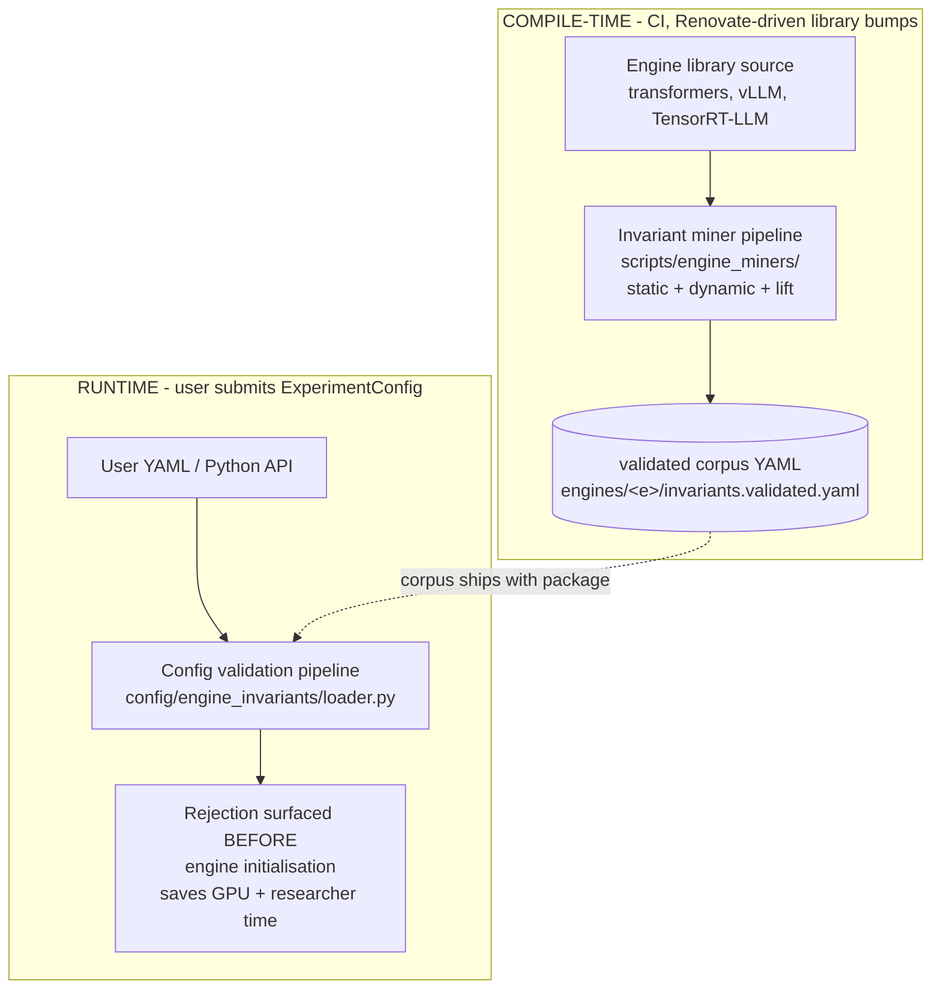
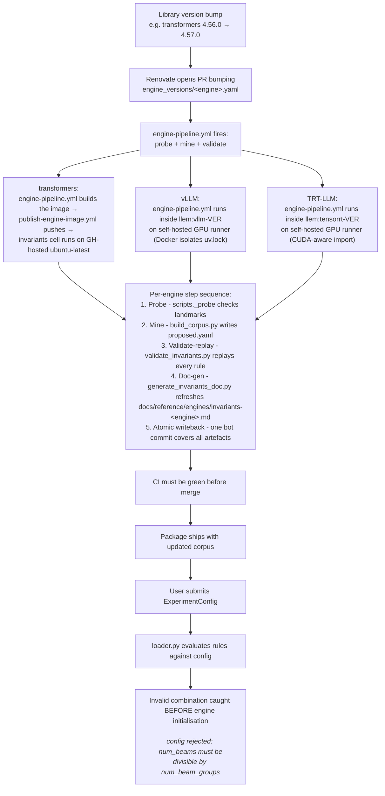

# Architecture Overview

This document is the entry point to the LLenergyMeasure architecture documentation suite. It introduces the two major subsystems - the invariant miner pipeline and the runtime config-validation pipeline - and shows how they connect to the broader measurement framework.

**Start here.** Deep-dive docs for each subsystem are linked throughout.

---

## Who this is for

- **Engine extenders** adding a new engine: read this overview, then [miner-pipeline](/contributing/miner-pipeline) and [extending-miners](/contributing/extending-miners).
- **Researchers**: read this overview, then [comparison-context](/explanation/methodology/comparison-context) for how results relate to other benchmarks.

---

## System overview

LLenergyMeasure has two pipelines that work together to give users early, actionable feedback when their configs are invalid before an expensive engine initialisation takes place.



---

## The two pipelines

### 1. The invariant miner pipeline

**What it does:** Extracts validation invariants from ML engine library source code and packages them into a versioned corpus of structured rules. Runs in CI whenever a library version bumps (Renovate-driven).

**Inputs:** Engine library source code (at a pinned version).

**Outputs:** `src/llenergymeasure/engines/{engine}/invariants.proposed.yaml` (maintainer-seeded corpus, post-mining) and `src/llenergymeasure/engines/{engine}/invariants.validated.yaml` (CI-validated observed behaviour, post-validate-replay; both ship with the package).

**Three components:**
- Static miner - walks Python AST of validator methods; no constructor calls.
- Dynamic miner - instantiates config classes with combinatorial probe values; observes raise/no-raise patterns.
- Lift modules (`_pydantic_lift.py`, `_msgspec_lift.py`, `_dataclass_lift.py`) - extract constraints directly from type-system metadata (Pydantic `FieldInfo`, msgspec `Meta`, stdlib `Literal[...]`).

Deep-dive: [miner-pipeline.md](/contributing/miner-pipeline)

### 2. The parameter-discovery / config-validation pipeline

**What it does:** At runtime, when a user submits an `ExperimentConfig`, evaluates each invariant in the validated corpus against the config and rejects invalid combinations before engine initialisation begins.

**Inputs:** User's `ExperimentConfig`; validated corpus YAML.

**Outputs:** Error / warning / dormant annotations surfaced to the user via the CLI or the Python API.

**Key components:**
- `loader.py` - parses the corpus and exposes `Rule.try_match()`.
- Loader grammar - the predicate DSL (`type_is`, `@field_ref`, `not_divisible_by`, etc.).
- Gap reporting - flags when a config combination the corpus has no rule for is encountered.

Deep-dive: [parameter-discovery.md](/explanation/architecture/parameter-discovery)

---

## Broader framework context

Both pipelines sit inside the larger LLenergyMeasure architecture. The config-validation pipeline plugs into Layer 0 (`config/`), which the rest of the stack builds on.

```mermaid
flowchart TD
    L6["Layer 6 - cli/<br/>llem run, llem config"]
    L5["Layer 5 - api/<br/>run_experiment&#40;&#41;, run_study&#40;&#41;"]
    L4["Layer 4 - study/<br/>StudyRunner, sweep expansion"]
    L3["Layer 3 - harness/<br/>MeasurementHarness, energy sampling"]
    L2["Layer 2 - engines/<br/>transformers, vLLM, TensorRT-LLM plugins"]
    L1["Layer 1 - infra/<br/>Docker runner, container entrypoint"]
    L0["Layer 0 - config/ + domain/ + device/ + utils/<br/>config validation pipeline lives here<br/>engine_invariants/loader.py"]

    L6 --> L5 --> L4 --> L3 --> L2 --> L1 --> L0

    classDef target fill:#fffae6,stroke:#b58900,stroke-width:2px;
    class L0 target;
```



The config-validation pipeline lives in Layer 0 (highlighted). Higher layers build on it: every `ExperimentConfig` constructed by the API or CLI passes through `engine_invariants/loader.py` before reaching the harness.

The invariant miner pipeline lives in `scripts/engine_miners/` - it is a build-time tool, not a library module. Its output is the validated corpus that ships with the package.

---

## Data flow: end-to-end



---

## Why validate before engine initialisation?

GPU time is the scarce resource. Two distinct failure modes burn it:

**Dormancy-driven duplicate runs.** This is the larger cost. Engines silently normalise many fields - `seed=-1` becomes `None`, `early_stopping=True` is stripped when `num_beams=1`, sampling parameters are dropped under greedy decoding. A sweep that varies a dormant field generates configs that look distinct to the user (and to Pydantic) but produce *identical effective configurations* once the engine has normalised them. Without invariance mining, the harness runs every cell, and the resulting cells are measurement-equivalent: the user spends hours of GPU time to discover that twelve of their sixteen cells collapsed to four. With a corpus of `dormant` invariants, the loader resolves the effective config at parse time, the study planner deduplicates measurement-equivalent cells, and the GPU only runs the cells that produce distinct measurements.

**Invalid-combination late rejection.** Engine initialisation is expensive: model weights load from disk, CUDA contexts initialise, and for TensorRT-LLM the engine may need compilation. A rejected config discovered after two minutes of initialisation wastes that GPU time outright. Pre-construction validation from `error` invariants catches the most common cross-field violations at config-parse time - a few milliseconds rather than several minutes.

The corpus complements, rather than replaces, engine-side validation: it captures invariants that fire only in specific combinations (cross-field constraints), silent normalisations (`dormant` rules underpinning the deduplication above), and invariants from methods that run at build time rather than construction time.

---

## Why a versioned corpus instead of live introspection?

Live introspection at runtime would require importing each engine at startup - which on vLLM and TRT-LLM means initialising CUDA contexts. The corpus is pre-computed and ships as a YAML file that loads in a few milliseconds with no GPU dependency.

The trade-off is staleness risk: the corpus must be regenerated when the engine library changes. The Renovate-driven refresh loop and the validation-CI gate together enforce this discipline. See [engine-introspection-pipelines - Renovate refresh loop](/explanation/architecture/engine-introspection-pipelines#renovate-driven-refresh-loop).

---

## Key concepts

| Term | Meaning |
|------|---------|
| **Invariant miner** | The umbrella for the mining pipeline; extracts constraints from library source |
| **Static miner** | The AST-walking component; reads source, no constructor calls |
| **Dynamic miner** | The probing component; constructs config objects, observes raises |
| **Lift module** | Type-system adapter; extracts constraints from Pydantic / msgspec / dataclass metadata |
| **Corpus** | The YAML file of extracted, validation-gate-confirmed invariants for one engine |
| **Validated YAML** | The CI-observed version of the corpus that ships with the package |
| **Validation-CI gate** | The step that replays every invariant against the live library; divergences fail CI |
| **Fixpoint contract** | `_fixpoint_test.py` - asserts dormant invariants converge to a stable state under repeated application |
| **AddedBy** | Provenance field on each invariant: `static_miner`, `dynamic_miner`, `pydantic_lift`, `msgspec_lift`, `dataclass_lift`, `manual_seed`, `runtime_warning`, `observed_collision` (full reference in [invariants-corpus-format.md](/reference/invariants-corpus-format#added_by)) |
| **MinerSource** | The `{path, method, line_at_scan}` record pointing back to the library source line that produced an invariant |
| **Loader grammar** | The predicate DSL used in `match.fields`: `in`, `not_in`, `@field_ref`, `not_divisible_by`, `type_is`, etc. |

---

## File and package map

```
  scripts/
  └── engine_miners/              Invariant miner pipeline (build-time)
      ├── _base.py                Shared infrastructure: RuleCandidate, MinerError types,
      │                           AST primitives, pattern detectors
      ├── _pydantic_lift.py       Pydantic v2 sub-library lift
      ├── _msgspec_lift.py        msgspec sub-library lift
      ├── _dataclass_lift.py      stdlib dataclass sub-library lift
      ├── _fixpoint_test.py       Gate-soundness + corpus fixpoint contract
      ├── transformers_miner.py   Transformers orchestration entry
      ├── transformers_static_miner.py
      ├── transformers_dynamic_miner.py
      ├── vllm_static_miner.py
      ├── vllm_dynamic_miner.py
      ├── tensorrt_miner.py       TensorRT-LLM orchestration entry
      ├── tensorrt_static_miner.py
      └── build_corpus.py         Merge + dedup + validation-gate orchestration

  scripts/
  ├── validate_invariants.py             Replay invariants against live library; write validated YAML
  └── _invariant_validation_common.py Shared capture + comparison utilities

  src/llenergymeasure/engines/
  └── {engine}/                        Per-engine sub-package, ships with the wheel
      ├── invariants.proposed.yaml     Authoritative corpus post-mine
      └── invariants.validated.yaml    Validated observations post-replay

  src/llenergymeasure/config/
  └── engine_invariants/
      ├── loader.py                    Runtime corpus consumer + predicate engine
      └── __init__.py

  engine_versions/
  └── {engine}.yaml                    Per-engine SSOT: library version, miner pins,
                                       artefact paths. Renovate-authored.
```

---

## See also

- [miner-pipeline.md](/contributing/miner-pipeline) - invariant miner deep-dive
- [parameter-discovery.md](/explanation/architecture/parameter-discovery) - runtime validation pipeline
- [invariants-corpus-format.md](/reference/invariants-corpus-format) - corpus YAML format reference
- [extending-miners.md](/contributing/extending-miners) - how to add a new engine miner
- [comparison-context.md](/explanation/methodology/comparison-context) - how results relate to other benchmarks
- [engines.md](/reference/engines/configuration) - engine configuration reference
- [methodology.md](/explanation/methodology/methodology) - energy measurement methodology
- [schema-refresh.md](/contributing/schema-refresh) - parameter-discovery pipeline (Renovate-driven schema refresh)
