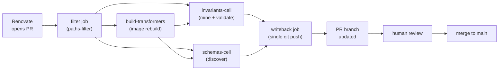

# Auto-refresh pipeline

Inference engines release new versions monthly. Each release may add
configuration parameters, change defaults, or retire flags. A measurement
tool that hardcodes parameter metadata against one version becomes a
liability for longitudinal studies: the tool's understanding of what
parameters mean drifts from the library's actual behaviour.

LLenergyMeasure addresses this with an automated refresh loop. Renovate-driven
version bumps trigger CI jobs that re-run schema discovery and invariant
mining inside the updated engine container. The results are committed back
to the PR branch by a bot; a human reviewer approves and merges. The
artefacts on `main` always describe the current pinned version of each
engine.

For CI workflow mechanics, see [CI architecture](ci-architecture.md). For how a
new engine plugs into this pipeline, see [Engine extensibility](engine-extensibility.md).

## The refresh loop

The loop has four stages:

**1. Renovate PR** - Renovate watches `engine_versions/<engine>/current.yaml` for
version string changes (via a `custom.regex` manager) and the `docker/Dockerfile.*`
files for base image changes. When an upstream release is detected, Renovate
opens a PR bumping the relevant `current_version` field and/or the `FROM` line.
The `renovate.json` rule applies a 14-day minimum release age and requires a
high Mend merge-confidence signal before a PR is opened.

**2. CI trigger** - the `engine-pipeline.yml` workflow fires on `pull_request`
events when paths under `engine_versions/`, `docker/`, `scripts/engine_producers/`,
`scripts/engine_producers/`, or `src/llenergymeasure/engines/` change. The
`filter` job runs `dorny/paths-filter` to compute per-engine change flags so
only the affected engine's cells run.

**3. Discovery and mining inside containers** - each engine runs two reusable
workflow cells:

- `_engine-schemas-cell.yml` - runs the engine introspector
  (`scripts/engine_producers/`) inside the new engine container. The
  introspector imports the live library and walks its Pydantic models to
  produce a JSON schema of all configurable parameters.
- `_engine-invariants-cell.yml` - runs the `_probe.py` entry point
  (`Mine + validate inside container` step) inside the container. The probe
  dispatches to the engine-specific miner (`scripts/engine_producers/`) which
  extracts validator functions, default values, and invalid-combination rules.
  The output is validated against the existing rule corpus and the diff is
  computed.

Both cells upload their output as GitHub Actions artefacts rather than
committing directly.

**4. Writeback** - the `writeback` job in `engine-pipeline.yml` downloads all
cell artefacts and performs a single `git push --force-with-lease` to the PR
branch. One push per pipeline run avoids commit-race conditions when multiple
engine cells complete concurrently. The commit message identifies which cells
contributed (for example:
`chore(bot): writeback from cells: invariants:vllm,schemas:vllm`).

## The artefacts

Each engine directory under `src/llenergymeasure/engines/<engine>/` contains
four tracked artefacts:

| File | Produced by | Contents |
|---|---|---|
| `schema.discovered.json` | Schema introspector | Full JSON Schema of all engine config parameters, with types, defaults, and docstrings |
| `invariants.proposed.yaml` | Invariant miner | Raw mined rules before validation |
| `invariants.validated.yaml` | Validation pass | Rules that passed the corpus validation check; used at runtime by the config validator |
| `docs/user/generated/invariants-<engine>.md` | `generate_invariants_doc.py` | Human-readable invariant reference, regenerated from the validated YAML |

The curation and schema docs (`docs/user/generated/curation-<engine>.md`,
`schema-<engine>.md`) are also regenerated as part of the same writeback
commit.

## Determinism guarantees

The mining and discovery pipelines are deterministic: given the same engine
library version, the same artefacts are produced on every run.

- Miners use static AST analysis and fixed-seed value generation rather than
  runtime sampling or LLM-assisted generation. The same source code always
  yields the same rules.
- Schema discovery uses the library's own Pydantic model introspection. The
  JSON schema is a pure reflection of the class definitions; it cannot vary
  between runs of the same library version.
- The cells compute a diff against the current committed artefacts
  (`diff_engine_invariants.py`, `diff_discovered_schemas.py`) and post the
  diff as a PR comment. If a re-run produces an empty diff (`no-changes`
  classification), the writeback job exits without committing. This is the
  determinism guard - a passing re-run that produces changes signals a
  non-deterministic miner, which is treated as a bug.

## What this enables

Researchers running studies that span engine releases need to trust that the
tool's parameter handling tracks upstream. With the auto-refresh loop:

- A vLLM 0.8 PR includes an updated `invariants.validated.yaml` reflecting
  parameters introduced in 0.8. The reviewer sees exactly what changed.
- A `default_value` that shifts between releases is visible in the invariant
  diff comment on the Renovate PR before it reaches `main`.
- Generated documentation (`invariants-vllm.md`, `schema-vllm.md`) stays in
  sync with the pinned version on `main`; there is no documentation lag.

## Limits

The pipeline has two intentional limits that require human oversight:

**Human review is required.** The bot proposes; a human approves. The diff
comment on the PR makes this tractable - reviewers see exactly which rules
changed, not a wall of YAML. Automerge is disabled for all engine-related
Renovate PRs (`renovate.json` `automerge: false`).

**Semantic shifts are not detected.** If a parameter's name is stable but its
meaning changes between versions (for example, a `temperature` field that now
applies to a different sampling stage), the miner will not flag this as a
change. The schema and invariant diffs surface structural changes (new fields,
changed defaults, removed validators); interpreting the semantic implications
of those changes is the reviewer's responsibility.

These limits are intentional. The pipeline's job is to eliminate the toil of
manual artefact updates, not to replace the judgement of a domain expert
reviewing an engine release.
