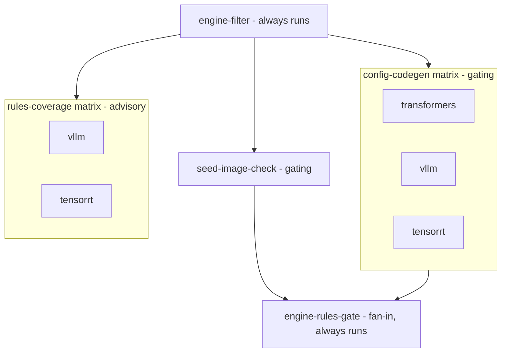

# CI architecture

This document describes the CI surface - what runs, when, why, and how the
pieces compose. It complements [Pipeline architecture](/explanation/architecture/pipeline-architecture)
(per-engine ordering) and [Local knowledge production](/contributing/knowledge-production)
(how the committed artifacts are produced); this file focuses on the workflow
shapes themselves.

CI verifies committed artifacts; it does not produce them. Reading an engine's
source into the committed rule and schema snapshots is a local maintainer task
run on demand, not on every PR. That split is the load-bearing decision behind
the engine surface: no GPU, no containers, no self-hosted runners, and nothing
in CI commits back to a branch. Everything CI does is a read-only check on
hosted CPU runners.

## Two-pattern catalogue

The repo uses two workflow patterns, picked per-concern:

| Pattern | When | Examples |
|---|---|---|
| **Reusable workflow** (`workflow_call`) | a body invoked by another workflow | `docker-publish.yml`, `gpu-ci.yml` |
| **Monolithic-direct** | one concern, triggered directly | `ci.yml`, `engine-rules-check.yml`, `security.yml`, `release.yml`, `auto-release.yml`, `ghcr-prune.yml`, `publish-engine-image.yml`, `docs.yml`, `issue-type-labeller.yml`, `renovate.yml` |

A monolithic-direct workflow may still fan out over a matrix (see
`engine-rules-check.yml`, which runs one concern across the engines). The
reusable workflows are invoked with `uses: ./.github/workflows/<name>.yml`:
`release.yml` calls `docker-publish.yml`, and `auto-release.yml` calls
`gpu-ci.yml`.

## Engine rules check

`engine-rules-check.yml` verifies that the committed engine-knowledge
artifacts stay internally consistent. It reads only committed bytes and pinned
upstream source; it never mines, and it never writes back.

### Topology



`engine-filter` runs on every PR and decides whether the work jobs do anything
(see [Requireable without a workflow-level paths filter](#requireable-without-a-workflow-level-paths-filter)).
The two matrix jobs and the seed check are otherwise independent - each cell is
a self-contained check. `engine-rules-gate` is the single fan-in the branch
requires; `rules-coverage` feeds nothing downstream because it is advisory.

### Jobs

- **`engine-filter`** (always runs): a `dorny/paths-filter` job whose `engine`
  output is true when the PR touches any engine-knowledge path (a config,
  a `rules.yaml`, the engine-rules loader, a pin, a snapshot output, the
  producers, or this workflow file). It replaces the workflow-level `paths:`
  filter this workflow used to carry (see below). Named `engine-filter` - not
  `filter` - so its check context is distinguishable from `ci.yml`'s `filter`
  job.

- **`config-codegen`** (gating, matrix over `transformers` / `vllm` /
  `tensorrt`): regenerates the typed config model from the engine's committed
  schema snapshot and asserts it is byte-identical to the committed
  `src/llenergymeasure/engines/<engine>/config.py`. A drifted config fails the
  job. This needs no upstream source: the snapshot under
  `engine_versions/<engine>/<version>/outputs/` is the only input.

- **`rules-coverage`** (advisory, matrix over `vllm` / `tensorrt`): scans the
  pinned engine source for validator sites and reports the sites no shipped
  rule covers. It writes the report to the job summary but always exits 0, so
  coverage gaps are visible without blocking a merge. The pinned source is
  fetched by blobless sparse checkout of just the engine's Python package tree
  (see below), keyed and cached per engine and version.

- **`seed-image-check`** (gating, transformers only): the transformers runtime
  image is seeded locally before a bump lands (`make docker-seed-transformers`)
  and tag-copied on merge by `publish-engine-image.yml`. This job checks the
  GHCR seed for the current pin already exists, so a bump PR that forgot to seed
  fails at PR time rather than at merge-time promotion.

- **`engine-rules-gate`** (fan-in, always runs, matrix-free): depends on
  `config-codegen` and `seed-image-check` and fails iff a gating job failed
  (skipped gating jobs count as satisfied). This is the only context from this
  workflow branch protection requires - see below for why the matrix job names
  cannot be required directly.

`transformers` is absent from `rules-coverage` on purpose: its config
validation uses imperative post-init idioms that the validator-site model does
not recognise, so a coverage number there would be noise. transformers is
still covered by the gating `config-codegen` job.

### Requireable without a workflow-level paths filter

This workflow carries no workflow-level `paths:` filter. A required check must
report a check-run context on every PR: a workflow that `paths:`-skips never
reports, and a required check that never reports blocks the PR forever on
"Expected - waiting for status". So the work is gated per-job (via
`engine-filter`) rather than by omitting the workflow, mirroring `ci.yml`'s
`filter` pattern: on a non-engine PR the gating jobs skip, and a skipped
required check counts as satisfied.

Branch protection requires one context from this workflow: `engine-rules-gate`.
It cannot require the matrix job names (`config-codegen (vllm)` and so on):
when a matrix job is skipped at job level, GitHub reports one check run under
the unexpanded job name, so an expanded-name required context never reports on
a non-engine PR and the merge waits forever. `engine-rules-gate` is matrix-free
and always runs, so it always reports.

### Fetching pinned engine source affordably

`rules-coverage` needs the upstream engine source at the pinned version. The
full source archive for these projects is large - hundreds of megabytes for the
compiled-kernel engine, whose repository carries C++ and CUDA sources the
coverage scan never reads. Downloading that on every relevant PR is not
affordable.

Instead the job does a blobless sparse checkout of only the engine's Python
package directory:

```bash
git clone --filter=blob:none --no-checkout --depth 1 --branch "v${VERSION}" "$REPO" engine-source
git -C engine-source sparse-checkout init --cone
git -C engine-source sparse-checkout set "$PACKAGE_DIR"
git -C engine-source checkout
```

This pulls tens of megabytes in a few seconds and is cached with
`actions/cache@v4` keyed on engine + version, so an unchanged pin is a cache
hit. The pinned `VERSION` is read at runtime from
`engine_versions/<engine>/current.yaml` (the single source of truth); the
repository slug and package directory are stable per engine and carried in the
matrix.

### Citation verification is a local step, not CI

The shipped `rules.yaml` carries compact human-readable citations
(`file:line`). The machine-checkable citation verifier consumes a richer
candidate shape (a file, an inclusive line range, and the verbatim quoted span)
that the shipped rules deliberately drop once a rule is accepted. Citation
re-checking therefore stays a local maintainer step, run against the pinned
source before a rule is committed, and is not part of CI. CI's engine check is
the coverage report above, which needs only the shipped rule field names.

## Shadow byte-identity checks

Two further committed-byte checks live in `ci.yml` (not in the engine
workflow), because they gate the same core artifacts the rest of `ci.yml`
guards:

- `check_pydantic_matches_discovered.py` - the typed config models match the
  discovered schema for all engines. It runs as the second step of the
  `docs-freshness` job (gated on `ci.yml`'s `filter.docs_inputs`).
- `check_discovered_schema_versions.py` - the discovered schema snapshots carry
  the versions the pins declare. It runs as the `schema-version-check` job, a
  three-engine matrix (`transformers` / `vllm` / `tensorrt`) gated on
  `ci.yml`'s `filter.docker` output (which includes `engine_versions/**`), one
  cell per engine.

They run host-only on hosted CPU runners and fail on drift.

## Transformers image lifecycle

The transformers engine runs in a first-party image (vLLM and TensorRT-LLM run
inside upstream images with the source bind-mounted). Its lifecycle follows the
same production split as the knowledge artifacts: built locally, promoted and
published by CI. The flash-attention compile needs far more memory than hosted
runners have, so CI never builds this image on the PR or merge path.

1. **Local seed.** During a transformers bump session the maintainer runs
   `make docker-seed-transformers`, which builds the runtime image on a machine
   with enough memory and pushes it to `transformers-cache:transformers-<VER>`
   (`<VER>` is `library.current_version` from
   `engine_versions/transformers/current.yaml`). Run it before or alongside the
   bump PR.
2. **Merge-time promotion.** When the bump lands on main,
   `publish-engine-image.yml` tag-copies the seeded image to the canonical
   `transformers:transformers-<VER>` and `transformers:latest` tags. No
   rebuild: production gets the bit-identical seeded image.
3. **Release-time build.** `docker-publish.yml` (called by `release.yml`)
   builds the package-versioned release image on a hosted runner with capped
   compile parallelism, reusing the registry build cache that the seed target
   also warms.

A missing seed fails the promotion run loudly: the tag-copy step finds no
source manifest at `transformers-cache:transformers-<VER>`. Recovery is to run
the seed locally, then re-run the promotion via `workflow_dispatch`.

## Expected workflow behaviour per PR shape

`engine-rules-check` runs on every PR (no workflow-level `paths:` filter), so
its `engine-filter`, `engine-rules-gate`, and - on `transformers` engines -
`seed-image-check` contexts always report. What varies per PR shape is whether
`engine-filter` sees an engine-knowledge change and lets the work jobs run.

| PR shape | `engine-filter.engine` | Work jobs that run |
|---|---|---|
| **Workflow-only edit** (`engine-rules-check.yml` changed) | `true` (self-test) | Both matrices, seed check, gate |
| **Pin bump** (`engine_versions/<engine>/current.yaml`) | `true` | Both matrices, seed check, gate |
| **Config or snapshot change** (`engines/<engine>/config.py`, or an `outputs/` snapshot) | `true` | Both matrices, seed check, gate |
| **Rules edit** (`engines/<engine>/rules.yaml`) or loader change | `true` | Both matrices, seed check, gate |
| **Pure ci.yml / docs change** | `false` | Work jobs **skip**; `engine-filter` and `engine-rules-gate` still report (green) |

The load-bearing observation is that the last shape does not omit the workflow:
the gating jobs skip, `engine-rules-gate` runs anyway and passes (skipped needs
count as satisfied), and the required context reports green. This is what lets
branch protection require `engine-rules-gate` without wedging non-engine PRs on
"Expected - waiting for status". The workflow does not sub-filter per engine -
when `engine-filter.engine` is true, the full matrix runs. The matrix is small
and every job is a fast read-only check, so per-engine gating would add
machinery without saving meaningful time.

## Branch-protection required contexts

`main` requires these seven check contexts, all of which report on every PR:

| Context | Workflow | Job |
|---|---|---|
| `test` | `ci.yml` | `test` |
| `lint` | `ci.yml` | `lint` |
| `type-check` | `ci.yml` | `type-check` |
| `actionlint` | `ci.yml` | `actionlint` |
| `filter` | `ci.yml` | `filter` |
| `engine-filter` | `engine-rules-check.yml` | `engine-filter` |
| `engine-rules-gate` | `engine-rules-check.yml` | `engine-rules-gate` |

These constraints follow from the requireable-contexts rules described above.

`filter` and `engine-filter` are deliberately distinct job IDs even though both
are `dorny/paths-filter` gates, so their check contexts do not collide on the
PR checks tab.

## Cancel-in-progress policy

- **`cancel-in-progress: true`** for read-only / stateless workflows:
  `engine-rules-check.yml` and `docs.yml` set it unconditionally. `ci.yml` sets
  it to `${{ github.event_name == 'pull_request' }}` - cancel superseded PR
  runs, but let merge-queue / push runs on `main` finish.
- **`cancel-in-progress: false`** for workflows that mutate a registry, open
  or update PRs, or run long-cached builds: `publish-engine-image.yml` (grouped
  per commit SHA), `ghcr-prune.yml` (a single in-flight sweep; a cancelled prune
  pass leaves the registry half-pruned), and `renovate.yml` (a single in-flight
  Renovate run; a cancelled run can strand a half-updated dependency dashboard
  or PR).
- **No `concurrency:` block** on `gpu-ci.yml` and `security.yml`: GPU runs are
  label-gated and rare, and the security scan is cheap, so neither needs
  supersession control.

Rationale: a read-only check can be cancelled and superseded freely by a newer
push; cancelling a long build or a registry mutation wastes accumulated layer
cache or strands a half-done write. No workflow writes back to a PR branch, so
there is no partial-write state to orphan on the PR side.

## Path-trigger self-tests

Every workflow's correctness MUST be verifiable at PR time when the workflow
file is edited. Two mechanisms together provide complete coverage:

1. **Runtime self-test where possible.** A workflow that filters on paths lists
   its own file among them, so an edit to the workflow exercises it.
   - `ci.yml` and `docs.yml` include their own filename in a workflow-level
     `on.pull_request.paths`.
   - `engine-rules-check.yml` has no workflow-level `paths:` (it must report on
     every PR), so it self-tests through the `engine-filter` job's filter list,
     which includes `.github/workflows/engine-rules-check.yml`: editing the
     workflow flips `engine-filter.engine` true and runs the full matrix.
2. **Shape validation for everything else.** Workflows that cannot self-test at
   runtime (`workflow_call`-only, label-only, tag-only, or closed-PR triggers)
   are covered by the `actionlint` job in `ci.yml`, which fires on edits to any
   `.github/workflows/**` file.

Workflows that cannot self-test at runtime:

- `gpu-ci.yml` - label-gated (`gpu-ci` PR label).
- `publish-engine-image.yml` - `push` on a narrow path plus `workflow_dispatch`.
- `docker-publish.yml` - `workflow_call` / `workflow_dispatch` only.
- `auto-release.yml` - `pull_request: closed` only.
- `release.yml` - `push: tags` only.
- `issue-type-labeller.yml` - `issues` events only.
- `renovate.yml` - `schedule` cron plus `workflow_dispatch` only. Its
  operational health signal is the dependency-dashboard issue: the daily run
  refreshes it, so a stale dashboard means the cron (or its App credentials)
  has died - the same staleness signal that exposed the hosted app's death.

## Conventions

### File names

- Kebab-case, one concern per file: `<verb>-<scope>.yml` (e.g.
  `engine-rules-check.yml`).
- Reusable (`workflow_call`) workflows use the same kebab-case naming as any
  other file - `docker-publish.yml`, `gpu-ci.yml` - with no special prefix.
- Single-word workflows lowercase: `ci.yml`, `release.yml`, `security.yml`.

### Workflow `name:` field

- Imperative or noun phrase: `Engine rules check`, `Build engine image`.
- Single-word workflows: bare noun, Title-Case: `CI`, `GPU CI`, `Security`.

### Job IDs

- Lowercase kebab-case, naming the concern: `config-codegen`, `rules-coverage`.
- A per-engine matrix appends the engine to the check display, e.g.
  `Engine rules check / config-codegen (vllm)`. When a single workflow carries
  more than one concern over the same engines, keep the concern in the job ID
  (not bare engine names) so the two matrices do not collide in the check list.

### Step names

- Imperative verb + object: `Checkout PR branch`, `Resolve pinned version`,
  `Verify generated config matches committed snapshot`,
  `Report uncovered validator sites (advisory)`.

## Adding a new engine

A future engine (e.g. SGLang) is absorbed in a few places:

1. New pin: `engine_versions/sglang/current.yaml`.
2. Local production of its committed rule and schema snapshots (a maintainer
   task, off CI).
3. Add `sglang` to the `config-codegen` matrix, and - if its config validation
   fits the validator-site model - to the `rules-coverage` matrix with its
   repository slug and package directory.

## Cross-references

- [Pipeline architecture](/explanation/architecture/pipeline-architecture) -
  per-engine pipeline ordering.
- [Local knowledge production](/contributing/knowledge-production) - how the
  committed rule and schema artifacts are produced locally.
- [Engine configuration reference](/reference/engines/configuration) - per-engine
  configuration surface.
