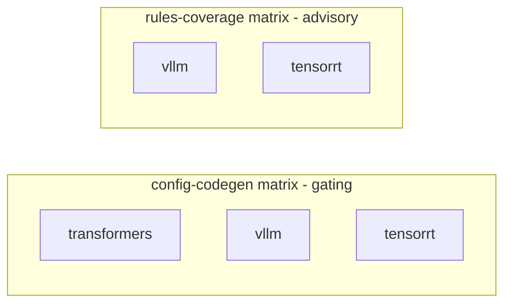

# CI architecture

This document describes the CI surface - what runs, when, why, and how the
pieces compose. It complements [Pipeline architecture](/explanation/architecture/pipeline-architecture)
(per-engine ordering) and [Miner pipeline](/contributing/miner-pipeline)
(mining internals); this file focuses on the workflow shapes themselves.

CI verifies committed artifacts; it does not produce them. Reading an engine's
source into the committed rule and schema snapshots is a local maintainer task
run on demand, not on every PR. That split is the load-bearing decision behind
the engine surface: no GPU, no containers, no self-hosted runners, and nothing
in CI commits back to a branch. Everything CI does is a read-only check on
hosted CPU runners.

## Two-pattern catalogue

The repo uses two workflow patterns, picked per-concern:

| Pattern | When | Examples |
|---|---|---|
| **Reusable workflow** (`workflow_call`) | a body invoked by another workflow | `docker-publish.yml`, `gpu-ci.yml` |
| **Monolithic-direct** | one concern, triggered directly | `ci.yml`, `engine-rules-check.yml`, `security.yml`, `release.yml`, `auto-release.yml`, `ghcr-prune.yml`, `publish-engine-image.yml` |

A monolithic-direct workflow may still fan out over a matrix (see
`engine-rules-check.yml`, which runs one concern across the engines). Reusable
workflows are invoked with `uses: ./.github/workflows/<name>.yml` from
`release.yml` and `auto-release.yml`.

## Engine rules check

`engine-rules-check.yml` verifies that the committed engine-knowledge
artifacts stay internally consistent. It reads only committed bytes and pinned
upstream source; it never mines, and it never writes back.

### Topology



The two jobs are independent - there is no dependency edge and no aggregation
step. Each matrix cell is a self-contained check.

### Jobs

- **`config-codegen`** (gating, matrix over `transformers` / `vllm` /
  `tensorrt`): regenerates the typed config model from the engine's committed
  schema snapshot and asserts it is byte-identical to the committed
  `src/llenergymeasure/engines/<engine>/config.py`. A drifted config fails the
  job. This needs no upstream source: the snapshot under
  `engine_versions/<engine>/<version>/outputs/` is the only input.

- **`rules-coverage`** (advisory, matrix over `vllm` / `tensorrt`): scans the
  pinned engine source for validator sites and reports the sites no shipped
  rule covers. It writes the report to the job summary but always exits 0, so
  coverage gaps are visible without blocking a merge. The pinned source is
  fetched by blobless sparse checkout of just the engine's Python package tree
  (see below), keyed and cached per engine and version.

`transformers` is absent from `rules-coverage` on purpose: its config
validation uses imperative post-init idioms that the validator-site model does
not recognise, so a coverage number there would be noise. transformers is
still covered by the gating `config-codegen` job.

### Fetching pinned engine source affordably

`rules-coverage` needs the upstream engine source at the pinned version. The
full source archive for these projects is large - hundreds of megabytes for the
compiled-kernel engine, whose repository carries C++ and CUDA sources the
coverage scan never reads. Downloading that on every relevant PR is not
affordable.

Instead the job does a blobless sparse checkout of only the engine's Python
package directory:

```bash
git clone --filter=blob:none --no-checkout --depth 1 --branch "v${VERSION}" "$REPO" engine-source
git -C engine-source sparse-checkout init --cone
git -C engine-source sparse-checkout set "$PACKAGE_DIR"
git -C engine-source checkout
```

This pulls tens of megabytes in a few seconds and is cached with
`actions/cache@v4` keyed on engine + version, so an unchanged pin is a cache
hit. The pinned `VERSION` is read at runtime from
`engine_versions/<engine>/current.yaml` (the single source of truth); the
repository slug and package directory are stable per engine and carried in the
matrix.

### Citation verification is a local step, not CI

The shipped `rules.yaml` carries compact human-readable citations
(`file:line`). The machine-checkable citation verifier consumes a richer
candidate shape (a file, an inclusive line range, and the verbatim quoted span)
that the shipped rules deliberately drop once a rule is accepted. Citation
re-checking therefore stays a local maintainer step, run against the pinned
source before a rule is committed, and is not part of CI. CI's engine check is
the coverage report above, which needs only the shipped rule field names.

## Shadow byte-identity checks

Two further committed-byte checks live in `ci.yml` (not in the engine
workflow), because they gate the same core artifacts the rest of `ci.yml`
guards:

- `check_pydantic_matches_discovered.py` - the typed config models match the
  discovered schema for all engines.
- `check_discovered_schema_versions.py` - the discovered schema snapshots carry
  the versions the pins declare.

They run host-only on hosted CPU runners and fail on drift.

## Transformers image lifecycle

The transformers engine runs in a first-party image (vLLM and TensorRT-LLM run
inside upstream images with the source bind-mounted). Its lifecycle follows the
same production split as the knowledge artifacts: built locally, promoted and
published by CI. The flash-attention compile needs far more memory than hosted
runners have, so CI never builds this image on the PR or merge path.

1. **Local seed.** During a transformers bump session the maintainer runs
   `make docker-seed-transformers`, which builds the runtime image on a machine
   with enough memory and pushes it to `transformers-cache:transformers-<VER>`
   (`<VER>` is `library.current_version` from
   `engine_versions/transformers/current.yaml`). Run it before or alongside the
   bump PR.
2. **Merge-time promotion.** When the bump lands on main,
   `publish-engine-image.yml` tag-copies the seeded image to the canonical
   `transformers:transformers-<VER>` and `transformers:latest` tags. No
   rebuild: production gets the bit-identical seeded image.
3. **Release-time build.** `docker-publish.yml` (called by `release.yml`)
   builds the package-versioned release image on a hosted runner with capped
   compile parallelism, reusing the registry build cache that the seed target
   also warms.

A missing seed fails the promotion run loudly: the tag-copy step finds no
source manifest at `transformers-cache:transformers-<VER>`. Recovery is to run
the seed locally, then re-run the promotion via `workflow_dispatch`.

## Expected workflow behaviour per PR shape

The canonical PR shapes and what the check matrix shows.

| PR shape | `engine-rules-check` triggered? | Jobs that run |
|---|---|---|
| **Workflow-only edit** (`engine-rules-check.yml` changed) | Yes (self-test) | Both jobs, full matrix |
| **One-engine pin bump** (`engine_versions/vllm/current.yaml`) | Yes | Both jobs, all cells (the paths filter is workflow-wide) |
| **Config or snapshot change** (`engines/<engine>/config.py` or a snapshot output) | Yes | Both jobs, full matrix |
| **Rules edit** (`engines/<engine>/rules.yaml`) | Yes | Both jobs, full matrix |
| **Pure ci.yml / docs change** | **Absent** | - |

`engine-rules-check` absent on the last shape is the load-bearing observation:
PRs that touch only unrelated paths leave the workflow out of the check matrix
entirely (the workflow-level `paths:` filter does not match). The workflow does
not sub-filter per engine - when it fires, the full matrix runs. The matrix is
small and every job is a fast read-only check, so per-engine gating would add
machinery without saving meaningful time.

## Cancel-in-progress policy

- `true` for read-only / stateless workflows: `ci.yml`, `engine-rules-check.yml`,
  `gpu-ci.yml`, `security.yml`.
- `false` for workflows that run long-cached builds: `publish-engine-image.yml`.

Rationale: a read-only check can be cancelled and superseded freely by a newer
push; cancelling a long build wastes accumulated layer cache. No workflow
writes back to a PR branch, so there is no partial-write state to orphan.

## Path-trigger self-tests

Every workflow's correctness MUST be verifiable at PR time when the workflow
file is edited. Two mechanisms together provide complete coverage:

1. **Runtime self-test where possible.** Workflows using `paths:` filters
   include their own file in the filter, so an edit to the workflow runs it.
   `engine-rules-check.yml` and `ci.yml` both list their own path.
2. **Shape validation for everything else.** Workflows that cannot self-test at
   runtime (`workflow_call`-only, label-only, tag-only, or closed-PR triggers)
   are covered by the `actionlint` job in `ci.yml`, which fires on edits to any
   `.github/workflows/**` file.

Workflows that cannot self-test at runtime:

- `gpu-ci.yml` - label-gated (`gpu-ci` PR label).
- `publish-engine-image.yml` - `push` on a narrow path plus `workflow_dispatch`.
- `docker-publish.yml` - `workflow_call` / `workflow_dispatch` only.
- `auto-release.yml` - `pull_request: closed` only.
- `release.yml` - `push: tags` only.

## Conventions

### File names

- Kebab-case, one concern per file: `<verb>-<scope>.yml` (e.g.
  `engine-rules-check.yml`).
- Reusable workflows: `_<name>.yml` underscore prefix.
- Single-word workflows lowercase: `ci.yml`, `release.yml`, `security.yml`.

### Workflow `name:` field

- Imperative or noun phrase: `Engine rules check`, `Build engine image`.
- Single-word workflows: bare noun, Title-Case: `CI`, `GPU CI`, `Security`.

### Job IDs

- Lowercase kebab-case, naming the concern: `config-codegen`, `rules-coverage`.
- A per-engine matrix appends the engine to the check display, e.g.
  `Engine rules check / config-codegen (vllm)`. When a single workflow carries
  more than one concern over the same engines, keep the concern in the job ID
  (not bare engine names) so the two matrices do not collide in the check list.

### Step names

- Imperative verb + object: `Checkout PR branch`, `Resolve pinned version`,
  `Verify generated config matches committed snapshot`,
  `Report uncovered validator sites (advisory)`.

## Adding a new engine

A future engine (e.g. SGLang) is absorbed in a few places:

1. New pin: `engine_versions/sglang/current.yaml`.
2. Local production of its committed rule and schema snapshots (a maintainer
   task, off CI).
3. Add `sglang` to the `config-codegen` matrix, and - if its config validation
   fits the validator-site model - to the `rules-coverage` matrix with its
   repository slug and package directory.

## Cross-references

- [Pipeline architecture](/explanation/architecture/pipeline-architecture) -
  per-engine pipeline ordering.
- [Miner pipeline](/contributing/miner-pipeline) - mining internals (local).
- [Engine configuration reference](/reference/engines/configuration) - per-engine
  configuration surface.
