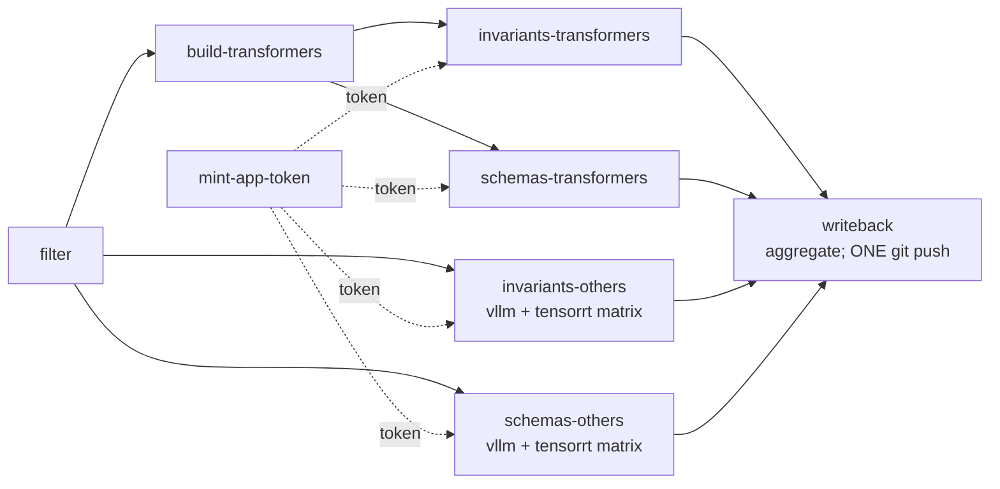

# CI architecture

This document describes the CI surface - what runs, when, why, and how the
pieces compose. It complements [Pipeline architecture](/explanation/architecture/pipeline-architecture)
(per-engine ordering) and [Miner pipeline](/contributing/miner-pipeline)
(mining internals); this file focuses on the workflow shapes themselves.

## Three-pattern catalogue

The repo uses exactly three workflow patterns, picked per-concern:

| Pattern | When | Examples |
|---|---|---|
| **Orchestrator** | dependency-graph + fan-out (engine pipeline) | `engine-pipeline.yml` |
| **Reusable workflow** (`workflow_call` only) | per-target body invoked by an orchestrator | `_engine-rules-cell.yml`, `_engine-schemas-cell.yml`, `docker-publish.yml` |
| **Monolithic-direct** | single concern, no fan-out | `ci.yml`, `security.yml`, `release.yml`, `gpu-ci.yml`, `auto-release.yml`, `ghcr-prune.yml`, `publish-engine-image.yml` |

Reusable workflows are file-prefixed `_` to signal "callable only, not a
top-level entry point". Composite actions in `.github/actions/<name>/action.yml`
provide step-level reuse (currently `synthesize-passwd` and
`clean-self-hosted-workspace`).

## Engine-pipeline orchestrator

`engine-pipeline.yml` is the load-bearing CI surface for engine-coupling
work. It collapses the prior `build-engine-image.yml` +
`update-engine-invariants.yml` + `update-engine-schemas.yml` triplet into a
single workflow with a coherent dependency graph.

### Topology



### Jobs

- **`filter`**: runs on every PR + workflow_dispatch. Uses
  `dorny/paths-filter@v3` to compute 7 boolean change-flags
  (`transformers_build`, `invariants_<engine>`, `schemas_<engine>`) plus
  two JSON arrays of cell-objects for the vllm + tensorrt matrix. The
  arrays are the
  [#564](https://github.com/henrycgbaker/llenergymeasure/issues/564)
  dynamic-engine-matrix mechanism - adding SGLang as the next engine
  means appending one line to the JSON-emit step rather than declaring
  new jobs.

- **Bot token mint** is per-cell + per-writeback (each consumer mints
  its own via `actions/create-github-app-token@v1`). Cross-job
  forwarding via `outputs:` is unviable: GitHub redacts secret-derived
  job outputs to empty when crossing job boundaries. ~7 mints per
  orchestrator run; well below App rate-limit. Skipped on fork PRs (App
  secrets aren't available cross-fork) - cells fall back to read-only
  `secrets.GITHUB_TOKEN`.

- **`build-transformers`**: builds the transformers Docker image and pushes
  the runtime image to `ghcr.io/<repo>/transformers-cache:transformers-<VER>`,
  which downstream cells pull. Fires when (PR with `transformers_build`
  match) OR (schedule, weekly drift detection with `--no-cache`) OR
  (workflow_dispatch with `engine=transformers` or `engine=all`).

- **`invariants-transformers` / `schemas-transformers`**: explicit jobs
  (not matrix), each `needs: [filter, mint-app-token, build-transformers]`
  with `if: success() || skipped` on build, so they run when build skipped
  (PRs that don't change the build inputs) and wait when build fires.

- **`invariants-others` / `schemas-others`**: matrix jobs over
  `[vllm, tensorrt]` cells (the two engines that consume upstream images
  directly and don't depend on `build-transformers`). The matrix expands
  dynamically from the JSON arrays emitted by `filter`.

- **`writeback`**: aggregate-writeback. Downloads all
  `{invariants,schemas}-writeback-<engine>` artefacts uploaded by the
  cells, applies them on top of the PR HEAD, and performs **ONE** `git push`.
  Lenient gating: runs whenever ANY cell produced an artefact, so partial
  successes (e.g. vllm-pass + tensorrt-fail) still write back vllm's
  changes.

### Reusable cell workflow contract

Both `_engine-rules-cell.yml` and `_engine-schemas-cell.yml` accept
the same input signature:

| Input | Type | Description |
|---|---|---|
| `engine` | string | `transformers` / `vllm` / `tensorrt` |
| `runner` | string | `ubuntu-latest` / `self-hosted` |
| `image-source` | string | `ghcr-cache` / `dockerhub` / `ngc` |
| `pr-number` | string | PR number (empty for non-PR triggers) |
| `pr-head-repo` | string | `owner/repo` of the PR head; gates writeback contributions on same-repo only |
| `app-token` | string | App token from orchestrator (empty for fork PRs) |

Internally the cell:

1. Synthesises passwd/group + cleans workspace (composite actions, self-hosted only).
2. Pulls the engine image per `image-source`.
3. (tensorrt only) fetches the tensorrt-llm source tarball.
4. Computes the deterministic mining/discovery anchor.
5. **Probes** the producer module's landmarks - preserved as its own
   step for failure-clarity in the GitHub UI. The dispatcher resolves
   which `v<safe>/producers/` archive to import for the SSOT-pinned
   `library.current_version`, falling back to the most-recent prior
   vendored version when no exact-match archive exists.
6. Runs the producer (mine + validate, or discover-schema) inside the
   container.
7. Regenerates host-side digest doc(s).
8. Classifies the diff (`safe` / `breaking` / `no-changes`).
9. Posts/upserts a PR comment under `bot-id: <pipeline>-<engine>-*`,
   surfacing DriftReport diagnostic counts (`fingerprint_drift`,
   `landmarks_aliased`) in collapsible blocks when non-empty.
10. Applies per-pipeline labels (`<pipeline>-{changed,safe,breaking}` +
    `probe-blocked` / cleanup).
12. **Uploads writeback artefact** (instead of pushing per-cell). The
    aggregate writeback in the orchestrator collects all artefacts and
    performs ONE git push per orchestrator run.
13. Emits a probe-fail gate (red CI) if probe failed.

### Concurrency + writeback contract

The orchestrator has one concurrency group: `engine-pipeline-<head-ref>`.
`cancel-in-progress: false` because the orchestrator performs writeback;
cancelling mid-flight would orphan partial state. Subsequent pushes to
the same PR queue behind the in-flight orchestrator and run against the
post-writeback HEAD.

Aggregate writeback (the `writeback` job) is structurally race-free: only
one writer exists per orchestrator run, so no `git pull --rebase` retry
loop is needed across cells (the rebase is still done defensively before
the push to absorb concurrent human pushes).

### Permissions + secrets

Permissions declared at orchestrator level (D1):
`contents: write`, `pull-requests: write`, `packages: write`. Reusables
inherit. PyTorch's `pull.yml` uses the same shape.

Secrets propagated via `secrets: inherit` on every `uses:` invocation
(E1). Repo's secrets inventory is `APP_ID`, `APP_PRIVATE_KEY`,
`GITHUB_TOKEN`, optional `DOCKERHUB_*`.

### Two-tier path filter

The orchestrator has BOTH a top-level `paths:` filter (engine-pipeline
concerns) AND an inner `dorny/paths-filter@v3` per-engine. The two tiers
serve different purposes:

- **Top-level `paths:`**: triggers the workflow. PRs that touch only
  `ci.yml` or `docs/` don't fire engine-pipeline at all - workflow is
  ABSENT in the PR check matrix (not skipped).
- **Inner dorny filter**: per-engine + per-pipeline. When the workflow
  fires, the filter emits the JSON arrays of cells that should expand.
  Engines whose paths didn't change are absent from the matrix.

Together they preserve the "not fired (absent)" surface for unrelated PRs
while still allowing fine-grained per-engine gating.

## Expected workflow behaviour per PR shape

The four canonical PR shapes and what the check matrix shows. Reviewers
audit unexpected shapes against this table.

| PR shape | `engine-pipeline` triggered? | Cells that fire | Writeback fires? |
|---|---|---|---|
| **Workflow-only edit** (only `engine-pipeline.yml` or `_*-cell.yml` or `.github/actions/**` changed) | Yes (self-test) | All 6 cells (filter file in every group) + build-transformers | Yes if any cell changed an artefact |
| **One-engine SSOT bump** (e.g. `engine_versions/vllm/current.yaml`) | Yes | `invariants-vllm` + `schemas-vllm` only | Yes if either cell changed an artefact |
| **Miner-code change** (`scripts/engine_producers/<engine>_*.py`) | Yes | `invariants-<engine>` only | Yes if cell changed an artefact |
| **Hand-edit corpus** (`engines/<engine>/rules.proposed.yaml`) | Yes | `invariants-<engine>` only (re-validates) | Yes if cell changed validated yaml |
| **Pure ci.yml / docs change** | **Absent** | - | - |

`engine-pipeline` absent on the last shape is the load-bearing observation:
PRs that touch only ci.yml-relevant paths leave `engine-pipeline` out of
the check matrix entirely (the top-level `paths:` filter doesn't match).

## Cancel-in-progress policy

- `true` for read-only / stateless workflows: `ci.yml`, `gpu-ci.yml`,
  `security.yml`.
- `false` for workflows that perform writeback (commits to PR branch) or
  run long-cached builds: `engine-pipeline.yml`, `publish-engine-image.yml`.

Rationale: cancelling a writeback orphans partial state on the PR
branch; cancelling a long build wastes accumulated layer cache.

## Path-trigger self-tests

Every workflow's correctness MUST be verified at PR time when the
workflow file is edited. Two mechanisms together provide complete
coverage:

1. **Runtime self-test where possible.** Workflows using `paths:`
   filters include their own file in the filter, so an edit to the
   workflow runs the workflow:
   - `paths-filter@v3` job-level filters: include the workflow file in
     every named filter group.
   - Workflow-level `paths:`: include `.github/workflows/<this>.yml`.
2. **Shape validation for everything else.** Workflows that can't
   self-test at runtime (workflow_run-only, label-only, tag-only,
   comment-only triggers) are covered by the `actionlint` job in
   `ci.yml`, which fires on edits to ANY `.github/workflows/**` file.

Workflows that CAN'T self-test runtime:
- `gpu-ci.yml` - label-gated (`gpu-ci` PR label).
- `publish-engine-image.yml` - `workflow_run` trigger (spec disallows `paths:`).
- `docker-publish.yml` - `workflow_call` / `workflow_dispatch` only.
- `auto-release.yml` - `pull_request: closed` only.
- `release.yml` - `push: tags` only.

## Bot-comment dedup

Bot-authored PR comments use the dedup helper at
`scripts/ci/upsert_pr_comment.sh`, invoked with a stable HTML marker:

```bash
{
  echo "<!-- bot-id: <concern>-<engine>[-<phase>] -->"
  echo "## <title>"
  ...
} | PR=<n> MARKER="bot-id: <concern>-<engine>[-<phase>]" \
    REPO="${GITHUB_REPOSITORY}" scripts/ci/upsert_pr_comment.sh
```

Marker format: `bot-id: <concern>-<engine>[-<phase>]`. Examples:
`bot-id: invariants-tensorrt-diff`, `bot-id: schemas-vllm-probe-blocked`.

The helper PATCHes an existing comment in-place if the marker is found,
otherwise POSTs a new one. To clean up a stale marker, invoke with
`MODE=delete`.

NOTE: do NOT gate the upsert on "is there a non-empty diff?". The dedup
helper handles the no-change case naturally - the existing comment is
updated in-place to reflect current state. Suppression-on-empty-diff
combined with dedup creates stale-comment edge cases.

## Conventions

### File names

- Kebab-case, one concern per file: `<verb>-<scope>.yml` (e.g.
  `engine-pipeline.yml`).
- Reusable workflows: `_<name>.yml` underscore prefix.
- Single-word workflows lowercase: `ci.yml`, `release.yml`, `security.yml`.

### Workflow `name:` field

- Imperative or noun phrase: `Engine pipeline`, `Build engine image`.
- Reusable workflows: descriptive - `Engine rules cell`,
  `Engine schemas cell`.
- Single-word workflows: bare noun, Title-Case: `CI`, `GPU CI`, `Security`.

### Job IDs

- Lowercase kebab-case.
- For per-engine fan-out within a workflow whose `name:` already encodes
  the concern, use bare engine names: `transformers`, `vllm`, `tensorrt`.
  PR check display becomes `Engine pipeline / invariants-vllm`.

### Step names

- Imperative verb + object: `Checkout PR branch`, `Resolve transformers
  version from SSOT`.
- Standardised forms (use these exactly):
  - `Checkout PR branch`
  - `Probe - landmark resolution check (in container)`
  - `Mine + validate inside container`
  - `Discover schema inside container`
  - `Regenerate <artefact> digest`
  - `Apply per-pipeline label`

## Re-run semantics under reusable workflows

GitHub renders reusable-workflow checks as
`<orchestrator-job> / <reusable-job>`. For PR-3, the check matrix shows
rows like `Engine pipeline / invariants-vllm`. Click depth from the PR
checks tab to a step's logs is 2 (orchestrator run page → cell job).

"Re-run failed jobs" on the orchestrator re-runs all non-successful
child jobs, including the writeback if it failed. Re-running writeback
against a possibly-stale PR head is handled by the `git pull --rebase
--autostash` step before the push.

## `gh run list` filtering recipes

Today's two-workflow shape used to allow `gh run list --workflow="Update
engine invariants"` to filter to one pipeline-kind. Under the orchestrator,
all engine-coupling runs are `Engine pipeline`. To filter by
pipeline-kind:

```bash
# All recent engine-pipeline runs:
gh run list --workflow="Engine pipeline" --limit 20

# Recent invariants-cell runs across all engines:
gh run list --workflow="Engine rules cell" --limit 20

# Schemas runs:
gh run list --workflow="Engine schemas cell" --limit 20

# Specific engine cell of a specific pipeline (jq):
gh run list --workflow="Engine rules cell" --json databaseId,headBranch,jobs \
  --jq '.[] | select(.jobs[].name | contains("vllm"))'
```

Reusable-workflow runs appear as their own top-level entries in the
Actions tab (with their reusable's `name:` as the workflow name).

## Adding a new engine

A future engine (e.g. SGLang) is absorbed in three places:

1. New SSOT: `engine_versions/sglang/current.yaml`.
2. Either upstream image (e.g. `lmsysorg/sglang:<VER>` on Docker Hub) or
   first-party Dockerfile + extension to `build-transformers` job.
3. Append `sglang` to the `invariants_others_cells` and
   `schemas_others_cells` JSON-emit step in the `filter` job. Plus add
   per-engine filter groups + `invariants_sglang` / `schemas_sglang`
   outputs.

For an upstream-image engine that doesn't need a first-party build, the
absorption is ~30 LoC of YAML in `engine-pipeline.yml`'s filter step.
The cell reusables don't change.

## Cross-references

- [Pipeline architecture](/explanation/architecture/pipeline-architecture) -
  per-engine pipeline ordering at the Renovate -> Docker -> cells level.
- [Miner pipeline](/contributing/miner-pipeline) - mining internals.
- [Engine configuration reference](/reference/engines/configuration) - per-engine
  configuration surface.
