# Engine introspection pipelines

Each engine in LLenergyMeasure exposes two complementary introspection
pipelines: one that discovers the engine's typed parameter schema, and
one that mines the engine's validator behaviour. Both pipelines share
the same shape - probe, then introspect or mine, then write a
deterministic artefact - but compute different things. Together they
produce the full per-engine inventory: the typed surface plus the
constraints that govern it.

## Why both pipelines exist

An engine surfaces information about its parameters across two
channels. The typed schema (Pydantic models, dataclass fields, msgspec
structs) tells you which parameters exist, what types they accept, and
what defaults they ship with. The validator behaviour (validator
methods, `_verify_args` calls, conditional raises) tells you which
combinations of parameter values are rejected, normalised, or warned
about. Schema discovery extracts the first; invariant mining extracts
the second.

Either pipeline alone would understate the engine. Without schema
discovery the runtime cannot align user fields with the engine's actual
parameter surface; without invariant mining it cannot reject invalid
combinations before paying the cost of engine initialisation. Running
both per engine, against the pinned upstream library version, is what
makes the engine first-class as a measurement axis.

## The shared shape

Both pipelines follow the same four-stage workflow. The probe gates the
work: if the landmark is missing, downstream stages skip. The producer
either introspects or mines. The validate stage exists for invariant
mining only (schema discovery is deterministic by construction). The
writeback stage emits one artefact per pipeline, committed back to the
PR branch by the bot.

```mermaid
flowchart LR
    probe[PROBE<br/>landmark check]
    producer[DISCOVER / MINE<br/>introspect or AST-walk]
    validate[VALIDATE<br/>replay against live library<br/>&#40;mining only&#41;]
    writeback[WRITEBACK<br/>commit artefact to PR branch]

    probe --> producer --> validate --> writeback
```



Per-stage comparison:

| Stage | Schema discovery | Invariant mining |
|---|---|---|
| Probe | Landmark check (engine + class symbols importable) | Landmark check (engine + class symbols importable) |
| Producer | Inspect typed APIs: `inspect.signature`, Pydantic `model_json_schema()`, `dataclasses.fields()`, `msgspec.json.schema()` | AST walk of validator methods + dynamic Cartesian probing + type-system lifting |
| Validate | Deterministic by construction; no validate stage | Replay each rule against the live library inside the engine container; classify outcomes |
| Output (per-engine) | `engines/<engine>/schema.discovered.json` | `engines/<engine>/invariants.proposed.yaml` + `engines/<engine>/invariants.validated.yaml` |
| Format spec (reference) | [Schema discovered format](/reference/schema-discovered-format) | [Invariants corpus format](/reference/invariants-corpus-format) |
| Per-engine digest (auto-generated) | `reference/engines/schema-<engine>.md`, `reference/engines/curation-<engine>.md` | `reference/engines/invariants-<engine>.md` |

Both pipelines run inside the engine's Docker image. The host has no
engine libraries (`import transformers`, `import vllm`, `import
tensorrt_llm` all fail by design), so every engine's introspection must
run in the matching container.

## Schema discovery in depth

Schema discovery introspects the engine's native Python API surface to
produce a typed inventory of all configurable parameters. The
introspector imports the live library, walks its config classes, and
emits a deterministic JSON envelope.

### What the producer does

```mermaid
flowchart TD
    classes[Engine config classes<br/>EngineArgs, GenerationConfig, TrtLlmArgs,<br/>SamplingParams, etc.]
    inspect[Introspect<br/>inspect.signature&#40;&#41; + model_json_schema&#40;&#41;<br/>+ dataclasses.fields&#40;&#41; + msgspec.json.schema&#40;&#41;]
    fields[Per-field descriptors:<br/>type, default, description, deprecated]
    limitations[Discovery limitations:<br/>fields the introspector cannot recover]
    envelope[(schema.discovered.json<br/>top-level envelope + engine_params + sampling_params)]

    classes --> inspect --> fields --> envelope
    inspect --> limitations --> envelope
```



The introspector is engine-specific: each engine has a module under
`scripts/engine_introspectors/` that knows how to walk its own config
surface. The shared envelope and helpers live in
`scripts/engine_introspectors/_common.py`.

### Determinism

Schema discovery is deterministic by construction. The introspector
reads the library's own type annotations and Pydantic schemas; the same
library version always yields the same JSON. The
`LLENERGY_DISCOVERY_FROZEN_AT` environment variable additionally pins
the `discovered_at` timestamp to a stable anchor (typically the author
date of the most recent commit touching any input path) so CI re-runs
do not produce a fresh wallclock timestamp on every invocation.

### What the artefact contains

Top-level envelope, two parameter sections (`engine_params`,
`sampling_params`), and a `discovery_limitations` list documenting
fields that introspection could not recover. The full reference is
[schema discovered format](/reference/schema-discovered-format).

### What consumes it

- `scripts/check_pydantic_matches_discovered.py` - the drift checker;
  flags Pydantic fields in `engine_configs.py` with no corresponding
  discovered entry.
- `scripts/generate_curation_doc.py`, `scripts/generate_schema_doc.py` -
  the doc generators; build the `docs/reference/engines/{schema,curation}-{engine}.md`
  digests from the loaded schema.
- The runtime parameter-discovery layer reads the schema at
  config-validation time. See [parameter discovery](/explanation/architecture/parameter-discovery).

### Change classification

When discovery re-runs against a bumped library version, the diff is
classified by `scripts/diff_discovered_schemas.py`:

| Change type | Classification | Example |
|---|---|---|
| Field added | safe | New `enable_chunked_prefill` parameter |
| Description updated | safe | Docstring clarification |
| Default changed | safe | `gpu_memory_utilization: 0.9 -> 0.95` |
| Type widened | safe | `int` -> `int \| None` |
| Field removed | breaking | Deprecated parameter dropped |
| Type narrowed | breaking | `int \| None` -> `int` |
| Enum value removed | breaking | Quantisation mode dropped |

Metadata fields (`discovered_at`, `engine_commit_sha`, `image_ref`,
`base_image_ref`) are excluded from classification because they change
on every run.

## Invariant mining in depth

Invariant mining extracts validation rules from engine library source
code by combining static AST analysis, dynamic combinatorial probing,
and type-system lifting. The output is a corpus of invariants - one
constraint per rule - that the runtime uses to reject invalid configs
before engine initialisation.

### Component overview

```mermaid
flowchart TD
    static[STATIC MINER<br/>inspect.getsource&#40;&#41; + ast.parse&#40;&#41;<br/>conditional detectors]
    dynamic[DYNAMIC MINER<br/>class constructors + validate&#40;&#41; calls<br/>Cartesian probe grid + predicate inference]
    lift[LIFT MODULES<br/>_pydantic_lift / _msgspec_lift / _dataclass_lift]
    staging[(staging files<br/>src/llenergymeasure/engines/_staging/)]
    build[build_corpus.py<br/>merge + dedup + fingerprint]
    replay[validate_invariants.py<br/>replay against live library]
    confirmed[(confirmed rules<br/>engines/&lt;e&gt;/invariants.proposed.yaml<br/>engines/&lt;e&gt;/invariants.validated.yaml)]
    quarantined[(quarantined rules<br/>engines/&lt;e&gt;/_staging/_failed_*.yaml)]

    static --> staging
    dynamic --> staging
    lift --> staging
    staging --> build --> replay
    replay --> confirmed
    replay --> quarantined
```



Three producers, then merge, then replay against the live library:

- The **static miner** walks the AST of validator methods.
- The **dynamic miner** instantiates config classes with combinatorial
  probe values and observes raise / no-raise patterns.
- The **lift modules** extract constraints directly from type-system
  metadata (Pydantic `FieldInfo`, msgspec `Meta`, stdlib `Literal`).

Their outputs land in staging, then `build_corpus.py` merges and
deduplicates by fingerprint. `validate_invariants.py` replays every
rule against the live library inside the engine container; confirmed
rules ship in the validated YAML, quarantined rules land in
`_staging/_failed_*.yaml`.

### Static miner

The static miner reads engine library source via `inspect.getsource()`
plus `ast.parse()` and walks the AST of known validator methods. It
does not call constructors or run the validator methods. The library
is still imported (to get source file paths), but no config classes are
instantiated.

Why AST walking is necessary: pure dynamic introspection cannot recover
the shape of cross-field predicates. The dynamic miner sees the message
"`num_beams` should be divisible by `num_beam_groups`" but cannot
determine that the underlying check is `num_beams % num_beam_groups != 0`.
The static miner reads the predicate structure directly from the AST.

For each `if` body in a validator method, the miner runs five pattern
detectors. Each targets a specific source pattern and emits a rule of a
specific severity:

| Detector | Pattern matched | Emitted severity |
|---|---|---|
| `ConditionalRaiseDetector` | `if X: raise SomeException(msg)` | `error` |
| `ConditionalSelfAssignDetector` | `if X: self.A = B` (silent normalisation) | `dormant` |
| `ConditionalWarningsWarnDetector` | `if X: warnings.warn(msg)` | `warn` |
| `ConditionalLoggerWarningDetector` | `if X: logger.warning(msg)` | `warn` |
| `MinorIssuesDictAssignDetector` | HF-specific: `if X: minor_issues[key] = msg` | `dormant` |

Three filters guard against false positives: the predicate must
reference a public field via `self.<field>`, self-assign targets must
be public fields, and a representative `kwargs_positive` dict must be
synthetically derivable from the predicate.

Static miner depth is fixed at 1: it walks one level of helper calls
(for example `WatermarkingConfig.validate`, `SynthIDTextWatermarkingConfig.validate`)
but does not trace through general function calls in the validator
body. This avoids unbounded call-graph traversal while capturing the
most common engine validation patterns.

### Dynamic miner

The dynamic miner instantiates config classes with combinatorial probe
values and observes raise / no-raise patterns. It then runs predicate
inference on the resulting table of `(kwargs, error_message)` rows.

```mermaid
flowchart TD
    cluster[cluster definition<br/>e.g. beam-search:<br/>num_beams, num_beam_groups, diversity_penalty]
    values[representative values per field<br/>e.g. num_beams=&#91;1,2,4&#93;<br/>num_beam_groups=&#91;1,2,3&#93;]
    cart[Cartesian product]
    size{cluster size}
    full[Cartesian probe<br/>runs every combination]
    hyp[Hypothesis from_type<br/>deterministic value generator<br/>fixed seed, no randomness]
    loop[For each combination:<br/>try construct + validate&#40;strict=True&#41;]
    table[(probe-row table:<br/>list&lt;kwargs, error_message or None&gt;)]

    cluster --> values --> cart --> size
    size -->|small| full
    size -->|large| hyp
    full --> loop
    hyp --> loop
    loop --> table
```



Small clusters (for example three fields, three values each) get full
Cartesian coverage; large clusters fall back to Hypothesis's `from_type`
value generator with a fixed seed. Hypothesis is used only as a
deterministic value generator, not as a property-based test runner.
The miner pipeline must be deterministic: the same library version
plus miner code must produce the same corpus. Randomness would break
Renovate-driven library-bump diffs.

Given the probe-row table, the dynamic miner infers one rule per
distinct error-message class using seven predicate templates (in order
of preference):

| Template | Example | Fires when |
|---|---|---|
| Cross-field divisibility | `a % b != 0` | error rows align with divisibility failure |
| Cross-field comparison | `a > b` | error rows align with comparison |
| Cross-field equality gate | `a == V AND b == W` | error rows correlate with combined field values |
| Type allowlist | `type(a) not in {T1, T2}` | error rows correlate with field type |
| Single-field range | `a < 0` | error rows correlate with one field crossing a threshold |
| Single-field equality | `a == V` | error rows correlate with one field having a specific value |
| Value allowlist | `a not in {v1, v2, ...}` | error rows correlate with field value not in a set |

The dynamic miner errs toward recall: when multiple templates fit the
evidence, it emits all plausible candidates. The validation-CI gate
prunes false positives downstream.

### Lift modules

The three lift modules extract constraints from type-system metadata
without requiring probe rounds. They are independent stages that run
alongside AST walking and probing.

| Type-system axis | Lift module | Engines using it |
|---|---|---|
| `pydantic.BaseModel` / `pydantic.dataclasses` | `_pydantic_lift.py` | vLLM (27 pydantic-dataclasses); TRT-LLM (`TrtLlmArgs`, including `Literal`-typed enum fields) |
| `msgspec.Struct` | `_msgspec_lift.py` | vLLM (`SamplingParams`) |
| stdlib `@dataclass` | `_dataclass_lift.py` | transformers (`GenerationConfig`, `BitsAndBytesConfig`); vLLM (`EngineArgs`, 175 fields); TRT-LLM (`BuildConfig`, `QuantConfig`) |

The Pydantic lift walks `model_json_schema()` and `FieldInfo.metadata`
(Pydantic v2), emitting one rule per `annotated-types` constraint or
`Literal[...]` allowlist found on a field. The msgspec lift walks
`msgspec.inspect.type_info()` and per-field `Constraints` objects,
mapping `Meta(ge=, le=, ...)` to the same operator vocabulary as the
Pydantic lift. The dataclass lift walks `dataclasses.fields()` and
extracts `Literal[a, b, c]` annotations - plain stdlib dataclasses
carry no numeric-bound metadata, so it is limited to value-allowlist
rules.

### Per-engine miner comparison

The three engines have structurally different config surfaces, which
determines which miners each uses:

| Engine | Static miner | Dynamic miner | Lift modules |
|---|---|---|---|
| transformers | `GenerationConfig.validate()`, `BitsAndBytesConfig.post_init()`; ~1700 LoC walked | Cartesian cluster probing | `dataclass_lift` (`GenerationConfig`, `BitsAndBytesConfig`) |
| vLLM | `SamplingParams._verify_args()`; ~20 validator methods | Cartesian + Hypothesis supplement | `pydantic_lift` (27 `vllm.config.*` classes); `msgspec_lift` (`SamplingParams`); `dataclass_lift` (`EngineArgs`) |
| TRT-LLM | `BaseLlmArgs.validate_*()`; ~11 validator methods | skipped (constructor yields zero raises) | `pydantic_lift` (`TrtLlmArgs`); `dataclass_lift` (`BuildConfig`, `QuantConfig`) |

TRT-LLM has no dynamic miner because empirical probing of
`TrtLlmArgs(**kwargs)` constructors produced zero raises: TRT-LLM
performs construction-time validation in a much more permissive way
than transformers or vLLM. Its constraints are primarily enforced in
validator methods (covered by the static miner) and at engine build
time (hardware-gated, not corpus rules).

### Build corpus: merge and dedup

`build_corpus.py` is the orchestration entrypoint. It runs all miners,
collects staging files, merges them, deduplicates by fingerprint, and
calls the validation-CI gate.

The deduplication key is `(engine, severity, match_fields)`. Two rules
with the same fingerprint are treated as the same constraint
discovered by two independent paths (cross-validation). The merger
keeps one rule with the primary `added_by` source and records the
secondary source in `cross_validated_by`.

When static and dynamic miners both emit a rule with the same
fingerprint, fields are merged by source preference:

| Field | Source that wins |
|---|---|
| `match.fields` predicate | static miner (more specific operators) |
| `message_template` | dynamic miner (real library text) |
| `observed_messages` | dynamic miner (real captured emissions) |
| `kwargs_positive` / `kwargs_negative` | static miner (derived from conditional) |
| `miner_source.line_at_scan` | static miner (real source line) |
| `references` | union (all evidence preserved) |
| `id` | first source's id is canonical |

### Validation-CI gate

The validation-CI gate runs after merge. For every rule, it replays
`kwargs_positive` and `kwargs_negative` against the live library
inside the engine's Docker container, then checks three contracts:

```mermaid
flowchart TD
    rule[For each rule in merged corpus]
    pos["run_case&#40;kwargs_positive, native_type&#41; -> CaptureBuffers"]
    c1[CHECK positive_raises]
    c2[CHECK message_template_match]
    c3[CHECK negative_does_not_raise]
    verdict{all checks pass?}
    confirmed[rule confirmed<br/>write to corpus]
    quarantined[rule quarantined<br/>_failed_validation_*.yaml]

    rule --> pos --> c1 --> c2 --> c3 --> verdict
    verdict -->|yes| confirmed
    verdict -->|no| quarantined
```



- `positive_raises` - `CaptureBuffers.exception_type` must not be
  `None` after running with `kwargs_positive`.
- `message_template_match` - `CaptureBuffers.exception_message` must
  contain `rule.message_template` (the static fragment, with template
  variables removed).
- `negative_does_not_raise` - running with `kwargs_negative` must
  produce a `CaptureBuffers` with `exception_type is None`.

Exit codes from `validate_invariants.py`:

- `0` - all rules confirmed.
- `1` - one or more divergences; validated YAML still written for
  diagnostic purposes.
- `2` - hard error (corpus malformed, engine not importable).

The full format spec for the corpus YAMLs the pipeline produces is
[invariants corpus format](/reference/invariants-corpus-format).

### Predicate-inference template coverage

The seven dynamic-miner templates were derived empirically from the
transformers corpus. When the static miner encounters an AST predicate
it cannot translate, it logs the dropped sub-clause (without failing).
A monthly audit of the unparsed-predicate log drives empirical template
expansion - templates are only added when a real rule shape appears
three or more times.

The templates not adopted from Daikon's full library (linear arithmetic
ternary `z = ax + by + c`, sortedness, sequence-equality) cover
scientific-computing trace patterns not seen in engine config classes.

## Renovate-driven refresh loop (parallel re-fire) {#renovate-driven-refresh-loop}

Library version bumps trigger both pipelines automatically. Renovate
watches the engine SSOT (`engine_versions/<engine>.yaml`) plus the
`docker/Dockerfile.*` files and opens a PR bumping the relevant version
fields. The PR fans out to both cells in parallel; each cell probes,
then runs its producer, then writes its artefact. The bot commits the
combined artefacts back to the PR branch and posts a diff summary as a
PR comment. A maintainer reviews and merges.

```mermaid
sequenceDiagram
    participant Renovate
    participant CI as engine-pipeline.yml
    participant Schema as schemas-cell
    participant Inv as invariants-cell
    participant Bot as llem-ci-bot
    participant Reviewer

    Renovate->>CI: bump SSOT (engine_versions/<engine>.yaml)
    activate CI
    CI->>Schema: fan-out (paths-filter)
    CI->>Inv: fan-out (paths-filter)
    activate Schema
    activate Inv
    Schema->>Schema: probe -> introspect -> diff
    Inv->>Inv: probe -> mine -> validate-replay -> diff
    Schema-->>CI: schema.discovered.json + comment + label
    deactivate Schema
    Inv-->>CI: invariants.proposed.yaml + invariants.validated.yaml + comment + label
    deactivate Inv
    CI->>Bot: writeback (atomic; one push)
    deactivate CI
    Bot->>Reviewer: artefacts + diff comments + rollup label
    Reviewer->>Reviewer: review proposed YAML, validated YAML, schema diff
    Reviewer->>Bot: squash-merge
```

Cross-pipeline state lives on PR labels. The last cell to finish
performs an atomic writeback covering both pipelines' artefacts plus
the regenerated docs digests, in a single push. There is no separate
summariser workflow.

When the bumped library version falls outside a miner's pinned envelope
(`miner_pins.{static|dynamic|discovery}` in the SSOT), the producer
raises `MinerVersionMismatchError` and CI fails. This is intentional:
it forces a maintainer to update the miner against the new library
version before the corpus is regenerated. The full structural CI
mechanics, including the per-cell artefact contract and the human
checkpoint after digest review, live in [pipeline architecture](/explanation/architecture/pipeline-architecture).

## Fail-loud import contract (shared across pipelines)

Both pipelines depend on the same fail-loud contract. Every miner and
introspector module must resolve its version envelope from the engine
SSOT and validate it at import time. This is a structural contract,
not a guideline.

```python
# Every *_miner.py must resolve its envelope from the engine's SSOT:
from scripts.engine_miners._ssot import load_miner_pin

_envelope = load_miner_pin("transformers", "static")  # SpecifierSet

# And call this at import time:
check_installed_version(
    "transformers",
    importlib.metadata.version("transformers"),
    _envelope,
)
```

The envelope itself lives in `engine_versions/{engine}.yaml` under
`miner_pins.{static|dynamic|discovery}` - one pin per producer role.
There is no per-module `TESTED_AGAINST_VERSIONS` constant; Renovate
updates the SSOT and every producer reads through `load_miner_pin`.

```mermaid
flowchart LR
    cv["check_installed_version&#40;&#41;"]
    cv --> cvok{version inside<br/>SSOT envelope?}
    cvok -->|yes| cvcont[continue]
    cvok -->|no| cverr[MinerVersionMismatchError<br/>CI fatal]

    fc["find_class&#40;module, GenerationConfig&#41;"]
    fc --> fcok{class found?}
    fcok -->|yes| fccont[continue]
    fcok -->|no| fcerr[MinerLandmarkMissingError<br/>CI fatal]

    classDef fatal fill:#ffe4e1,stroke:#c00,stroke-width:2px;
    class cverr,fcerr fatal;
```



If the installed library version falls outside the envelope, the
producer raises `MinerVersionMismatchError` - a hard CI failure. If an
expected class or method is missing from the library source (for
example, a class was renamed in a library refactor), it raises
`MinerLandmarkMissingError` - also a hard CI failure.

A previous extractor that swallowed `ImportError` and returned `[]`
silently degraded into "no rules found for this engine", which masked a
broken extractor. The fail-loud contract makes that impossible. The
behaviour is pinned in place by `_fixpoint_test.py`, which synthesises
one malformed rule per gate-soundness check (`positive_raises`,
`message_template_match`, `negative_does_not_raise`) and asserts the
validation-CI gate records a divergence for each. Removing any of the
three checks fails the fixpoint test loudly.

## See also

- Reference: [Invariants corpus format](/reference/invariants-corpus-format)
- Reference: [Schema discovered format](/reference/schema-discovered-format)
- Reference: per-engine outputs at `reference/engines/{schema,curation,invariants}-<engine>.md`
- Architecture: [parameter discovery (runtime loader)](/explanation/architecture/parameter-discovery)
- Architecture: [parameter curation](/explanation/architecture/parameter-curation)
- Architecture: [pipeline architecture](/explanation/architecture/pipeline-architecture) - CI mechanics for the refresh loop
- Architecture: [auto-refresh pipeline](/explanation/architecture/auto-refresh-pipeline) - the writeback / diff / determinism guard
- Contributing: [extending miners](/contributing/extending-miners) - how to add a new miner
- Contributing: [miner pipeline (debugging guide)](/contributing/miner-pipeline)
- Contributing: [schema refresh (operations guide)](/contributing/schema-refresh)
