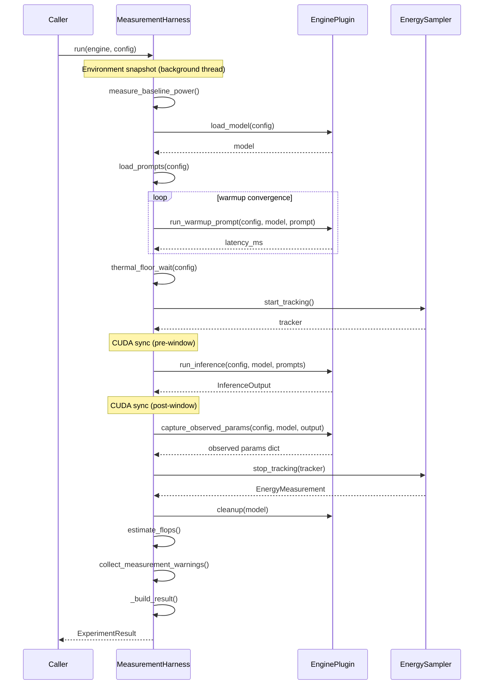

# Harness-plugin model

LLenergyMeasure separates two fundamentally different concerns: running a
language model and measuring the energy consumed while doing so. The
**harness-plugin model** is the architectural boundary that keeps those
concerns apart. This page explains why the separation exists, what each side
owns, and how the two halves communicate.

For a walkthrough of adding a new engine, see
[Engine extensibility](engine-extensibility.md).

## The problem

Measuring inference energy sounds simple: start a counter, run the model, stop
the counter. In practice the two activities have different lifecycle
requirements:

- **Inference** loads weights, warms up kernel caches, runs a batch of prompts,
  and releases GPU memory. The exact steps differ for every inference engine.
- **Measurement** synchronises CUDA around the measurement window, polls the
  energy sampler at a steady rate, subtracts a baseline idle-power reading,
  collects environment metadata, and assembles a structured result. These steps
  are identical regardless of which engine produced the tokens.

Interleaving the two means every engine reimplements the same measurement
infrastructure. A bug in energy accounting then needs fixing in every engine,
and methodology improvements cannot roll out atomically.

## The plugin model

`MeasurementHarness`
([`src/llenergymeasure/harness/__init__.py:220`](https://github.com/henrycgbaker/llenergymeasure/blob/main/src/llenergymeasure/harness/__init__.py#L220))
is the orchestrator. It knows nothing about specific inference frameworks. It
calls methods on an `EnginePlugin` instance and owns everything else.

`EnginePlugin` is a `typing.Protocol` defined in
[`src/llenergymeasure/engines/protocol.py:35`](https://github.com/henrycgbaker/llenergymeasure/blob/main/src/llenergymeasure/engines/protocol.py#L35).
Any class that implements its methods is a valid plugin - no inheritance
required.

## The EnginePlugin Protocol

```python
# src/llenergymeasure/engines/protocol.py:35
@runtime_checkable
class EnginePlugin(Protocol):
    @property
    def name(self) -> str: ...
    @property
    def version(self) -> str: ...

    def load_model(
        self,
        config: ExperimentConfig,
        on_substep: Callable[[str, float], None] | None = None,
    ) -> Any: ...

    def run_warmup_prompt(
        self, config: ExperimentConfig, model: Any, prompt: str
    ) -> float: ...

    def run_inference(
        self, config: ExperimentConfig, model: Any, prompts: list[str]
    ) -> InferenceOutput: ...

    def cleanup(self, model: Any) -> None: ...

    def check_hardware(self, config: ExperimentConfig) -> list[str]: ...

    def capture_observed_params(
        self, config: ExperimentConfig, model: Any, output: InferenceOutput
    ) -> dict[str, Any]: ...
```

The `name` and `version` properties are used for reproducibility metadata in
every `ExperimentResult`. `run_warmup_prompt` returning `0.0` is a signal to
the harness to skip coefficient-of-variation-based convergence and use a
single kernel warmup pass instead - the pattern vLLM and TRT-LLM use.

## What the harness owns

`MeasurementHarness.run()` orchestrates the full lifecycle in a fixed order:

1. **Environment snapshot** - starts a background thread immediately to collect
   hardware and software environment metadata. Collection is hidden behind model
   loading so it does not add wall-clock time.
2. **Baseline power** - optionally measures idle GPU power for the configured
   duration before the model is loaded. The harness caches this at study level
   so multi-experiment sweeps pay the cost once.
3. **Prompt loading** - loads the prompt dataset before the NVML window opens,
   ensuring I/O does not perturb energy measurements.
4. **Warmup convergence** - calls `engine.run_warmup_prompt()` in a loop until
   latency coefficient of variation drops below the configured threshold (or
   delegates to single-pass kernel warmup when the engine returns `0.0`).
5. **Thermal floor wait** - sleeps until GPU temperature stabilises.
6. **Energy sampler selection** - picks the highest-priority available sampler
   (NVML, Zeus, CodeCarbon) based on config.
7. **NVML measurement window** - opens with a CUDA sync, calls
   `engine.run_inference()`, closes with another CUDA sync. The
   `PowerThermalSampler` context manager runs inside this window.
8. **Observed-params capture** - calls `engine.capture_observed_params()` after
   the window closes so capture overhead does not perturb energy measurements.
9. **FLOPs estimation** - PaLM formula applied to token counts, using
   `AutoConfig` first (no weights needed) then the loaded model object if
   available.
10. **Result assembly** - computes energy breakdowns, derived metrics, and
    produces a fully typed `ExperimentResult`.
11. **Timeseries write** - persists the GPU power/temperature timeseries to a
    Parquet sidecar alongside the result JSON.
12. **Warnings collection** - checks sample count, persistence mode, and
    thermal state; emits structured quality warnings in the result.

`engine.cleanup()` is called in a `finally` block so GPU memory is always
released even if inference raises.

## What the plugin owns

A plugin implements exactly six concerns:

- **`load_model`** - load weights into GPU memory (any framework-specific
  loading path). Returns an opaque model object that is threaded through all
  subsequent calls.
- **`run_warmup_prompt`** - run one warmup inference and return latency in
  milliseconds (or `0.0` to opt out of convergence-based warmup).
- **`run_inference`** - run the batch of prompts and return an `InferenceOutput`
  with token counts, timing, and peak memory. The harness provides the prompts;
  the plugin does not load them.
- **`cleanup`** - delete the model and clear CUDA caches.
- **`check_hardware`** - return a list of compatibility errors (empty list when
  compatible). Must never raise; must not allocate GPU resources.
- **`capture_observed_params`** - return a dict of the parameters the engine
  actually used (effective dtype, batch size, etc.) for observed-config
  tracking. Must never raise.

The plugin never touches energy samplers, FLOPs estimators, timeseries writers,
or result models. It receives an `ExperimentConfig` and returns an
`InferenceOutput`. Everything else is the harness's problem.

## Call sequence



The diagram reflects the actual execution order in `MeasurementHarness.run()`
starting at line 229. Note that `cleanup()` is always called in a `finally`
block - the harness guarantees teardown even when inference raises.

## Why this matters

Adding a new engine means implementing the `EnginePlugin` protocol. It does
not mean understanding NVML polling, CUDA synchronisation, or result assembly.
A methodology improvement - say a new energy sampler, a different baseline
strategy, an additional quality warning - lands once in the harness and
applies to every engine.

The existing three engines (`transformers`, `vllm`, `tensorrt`) each fit in a
single file of roughly 200-300 lines. The harness sits at around 650 lines
and does not grow when engines are added.

See [Engine extensibility](engine-extensibility.md) for the full checklist of
what a new engine needs to contribute beyond the plugin class itself.
