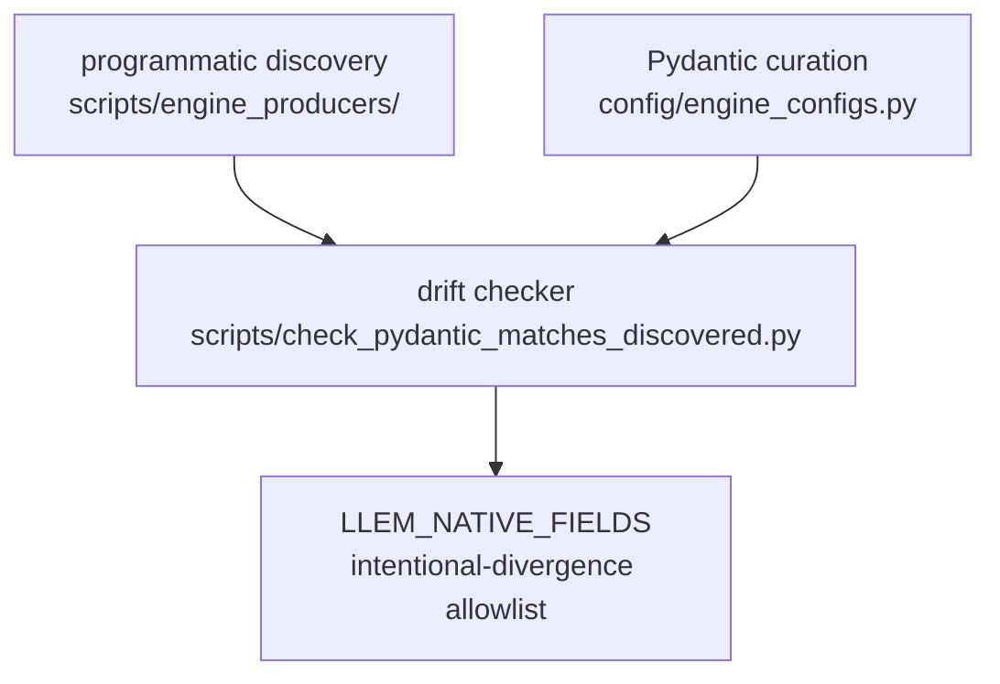

# Parameter Curation

> **Note:** This document covers engine-API-parameter introspection and Pydantic-model curation (what fields each engine accepts, type information, drift detection). For the runtime validation of parameter *values* (how invalid combinations are caught before engine initialisation), see [parameter-discovery.md](/explanation/architecture/parameter-discovery).

---

llem exposes engine parameters to users through hand-authored Pydantic models. This document explains how those models stay in sync with the underlying engines.

---

## Overview



- **Programmatic discovery** introspects engine APIs and writes `engines/*/schema.discovered.json` (the ground truth for "what parameters does this engine accept").
- **Pydantic curation** is the hand-authored set of sub-config models that expose typed, documented fields to users.
- **Drift checker** flags Pydantic fields with no corresponding discovered entry.
- **`LLEM_NATIVE_FIELDS`** is the "yes, this divergence is intentional" allowlist - it suppresses known-good exceptions so the drift checker only reports unexpected divergence.

---

## Programmatic discovery

`scripts/engine_producers/` introspects each engine's public Python API (e.g. `inspect.signature(vllm.LLM.__init__)`, `inspect.signature(AutoModelForCausalLM.from_pretrained)`) and writes the result to `src/llenergymeasure/engines/{engine}/schema.discovered.json`.

These JSON files are the ground truth for "what parameters does this engine version accept". They are stored in the repo and regenerated via the parameter-discovery pipeline when an engine version bumps (see [schema-refresh.md](/contributing/schema-refresh)).

---

## Pydantic curation

`src/llenergymeasure/config/engine_configs.py` contains hand-authored Pydantic models that llem exposes to users. Curation decisions:

- **Field names match native engine names.** A field called `quant_config` maps directly to the engine kwarg `quant_config`. No translation layer, no llem aliases.
- **Sub-configs group related parameters.** e.g. `TensorRTKvCacheConfig` groups all kv-cache knobs under `tensorrt.kv_cache_config.*`. The sub-config name matches the native engine kwarg name.
- **Types may be enriched, not narrowed.** A field typed `str` in discovery may become `Literal["bfloat16", "float16", "float32"]` in curation - llem providing the concrete value set the engine accepts at runtime when the signature said only `str`. But when discovery already exposes an enumerated `Literal[...]`, llem must match it: the engine owns the value contract for fields it has enumerated. A maintainer who wants to drop values from an enumerated set should remove the field or surface the divergence explicitly, not silently shrink the accepted set.
- **Descriptions are added.** Pydantic `Field(description=...)` docs are user-facing; discovery has none.

---

## Schema gate (subset semantics)

`scripts/check_pydantic_matches_discovered.py` compares each Pydantic field against the discovered schema and emits a 3-state classification per (engine, field):

| Classification | Meaning | Effect on gate |
|---|---|---|
| `SUBSET-COMPATIBLE` | Pydantic type is type-enriched but not narrowing (scalar enriched to a concrete Literal value set, concrete type under unconstrained `any`, primitive abstraction over a complex class) | Pass, silent |
| `LLEM-EXTENSION` | Pydantic field absent from discovered, listed in `LLEM_NATIVE_FIELDS` (kwargs passthrough, depth below introspection, llem-orchestration, or pre-transform) | Pass, silent |
| `CONTRADICTION` | Pydantic widens beyond discovered (e.g. discovered `Literal['a']`, Pydantic `str`), narrows an enumerated Literal (engine owns the value contract), OR Pydantic field absent from discovered without a whitelist entry | Fail |

Binary exit: `0` if no contradictions, `1` otherwise. The full 3-state classification is emitted in stdout JSON for downstream consumers (e.g. the audit-bot in #655 surfacing divergence as an informational PR comment).

Run it locally:

```bash
python scripts/check_pydantic_matches_discovered.py
```

CI runs it automatically on every PR.

---

## LLEM_NATIVE_FIELDS

Some Pydantic fields legitimately have no discovered counterpart. Common reasons:

| Reason | Example |
|--------|---------|
| Passed via `**kwargs`, invisible to `inspect.signature` | `transformers.dtype` - `from_pretrained` accepts it as a kwarg alias |
| llem surfaces a sub-config field that the engine accepts as a flat kwarg at a different nesting level | `tensorrt.quant_algo` inside `TensorRTQuantConfig` |
| Beam-search or speculative-decoding params from a separate params class | `vllm.beam_width` (from `BeamSearchParams`, not `LLM.__init__`) |

These are listed in `LLEM_NATIVE_FIELDS` in the drift checker. Each entry suppresses one `pydantic_only` warning for a named `(engine, field_name)` pair.

**When to add an entry:** when the drift checker flags a `pydantic_only` field and you have confirmed it is intentionally in the Pydantic model but unreachable by signature-based discovery. Add a comment explaining why.

**When to remove an entry:** when the corresponding Pydantic field is deleted. Stale entries are harmless but misleading - remove them during the same PR that removes the field.

**Never add an entry to paper over a naming divergence.** If a Pydantic field is named differently from the engine kwarg, rename the field instead.

---

## See also

- [parameter-discovery.md](/explanation/architecture/parameter-discovery) - config validation pipeline (how invalid combinations are caught)
- [schema-refresh.md](/contributing/schema-refresh) - parameter-discovery pipeline (Renovate-driven schema refresh)
- [engines.md](/reference/engines/configuration) - engine configuration reference
