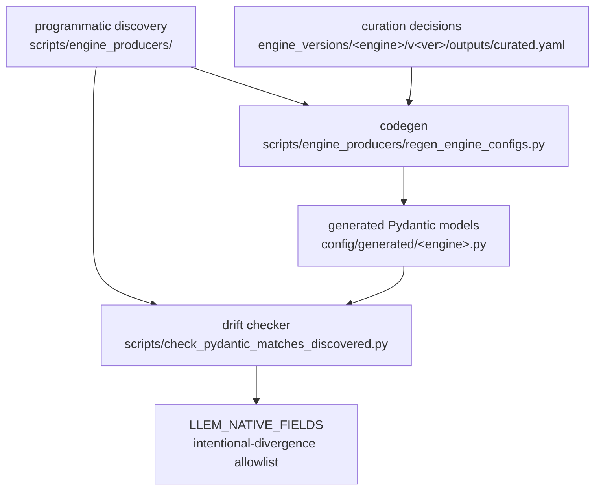

# Parameter Curation

> **Note:** This document covers engine-API-parameter introspection and Pydantic-model curation (what fields each engine accepts, type information, drift detection). For the runtime validation of parameter *values* (how invalid combinations are caught before engine initialisation), see [parameter-discovery.md](/explanation/architecture/parameter-discovery).

---

llem exposes engine parameters to users through generated Pydantic models. This document explains where the curation decisions live and how the generated models stay in sync with the underlying engines.

---

## Overview



- **Programmatic discovery** introspects engine APIs and writes `engines/*/schema.discovered.json` (the ground truth for "what parameters does this engine accept").
- **Curation decisions** are recorded per pinned engine version in `curated.yaml` - which fields the typed surface names explicitly, type narrowing, and user-facing descriptions.
- **Codegen** projects the discovered schema plus the curation decisions into the committed Pydantic models at `src/llenergymeasure/config/generated/<engine>.py`. The generated files must not be hand-edited (each header says so).
- **Drift checker** flags Pydantic fields with no corresponding discovered entry.
- **`LLEM_NATIVE_FIELDS`** is the "yes, this divergence is intentional" allowlist - it suppresses known-good exceptions so the drift checker only reports unexpected divergence.

---

## Programmatic discovery

`scripts/engine_producers/` introspects each engine's public Python API (e.g. `inspect.signature(vllm.LLM.__init__)`, `inspect.signature(AutoModelForCausalLM.from_pretrained)`) and writes the result to `src/llenergymeasure/engines/{engine}/schema.discovered.json`.

These JSON files are the ground truth for "what parameters does this engine version accept". They are stored in the repo and regenerated via the parameter-discovery pipeline when an engine version bumps (see [schema-refresh.md](/contributing/schema-refresh)).

---

## Curation and the generated models

`src/llenergymeasure/config/generated/<engine>.py` holds the Pydantic models llem exposes to users (`engine_params:` and `sampling_params:` per engine). These files are generated: `scripts/engine_producers/regen_engine_configs.py` produces them from the pinned version's `schema.discovered.json` plus `curated.yaml` under `engine_versions/<engine>/v<version>/outputs/`. To change the exposed surface, edit `curated.yaml` and regenerate - never the generated module.

The curation principles the generated surface encodes:

- **Field names match native engine names.** A field called `quant_config` maps directly to the engine kwarg `quant_config`. No translation layer, no llem aliases.
- **Sub-config typing is per-engine.** Where the snapshot models a nested config, it becomes a typed sub-model (e.g. vLLM's `speculative_config` and `compilation_config`); where it does not, the field is a freeform `Any`-typed dict passed through whole (e.g. TensorRT-LLM's `quant_config`, `kv_cache_config`, `scheduler_config` on the current pin).
- **Types may be narrowed.** A field typed `str` in discovery might become `Literal["bfloat16", "float16", "float32"]` in curation - this is intentional and allowed by the drift checker.
- **Descriptions are added.** Pydantic field docs are user-facing; discovery has none.
- **Unmodelled parameters still work.** The generated sub-models set `extra="allow"`, so a parameter the snapshot does not name explicitly is forwarded to the engine unchanged.

---

## Drift checker

`scripts/check_pydantic_matches_discovered.py` compares the set of leaf field names in the Pydantic models against the discovered schemas and reports two kinds of drift:

| Kind | Meaning |
|------|---------|
| `pydantic_only` | Pydantic has a field that discovery doesn't - likely a stale field that was removed from the engine, or a kwargs-passed field invisible to signature inspection |
| `type_mismatch` | Both sides have the field but with different types (beyond intentional narrowing) |

Run it locally:

```bash
python scripts/check_pydantic_matches_discovered.py
```

CI runs it automatically on every PR.

---

## LLEM_NATIVE_FIELDS

Some Pydantic fields legitimately have no discovered counterpart. Common reasons:

| Reason | Example |
|--------|---------|
| Passed via `**kwargs`, invisible to `inspect.signature` | `transformers.dtype` - `from_pretrained` accepts it as a kwarg alias |
| Sub-config nesting differs between llem's surface and the engine API | `tensorrt.max_batch_size` - TRT-LLM accepts it inside a nested build config, not as a flat constructor kwarg |
| Beam-search or speculative-decoding params from a separate params class | `vllm.beam_width` (from `BeamSearchParams`, not `LLM.__init__`) |

These are listed in `LLEM_NATIVE_FIELDS` in the drift checker. Each entry suppresses one `pydantic_only` warning for a named `(engine, field_name)` pair.

**When to add an entry:** when the drift checker flags a `pydantic_only` field and you have confirmed it is intentionally in the Pydantic model but unreachable by signature-based discovery. Add a comment explaining why.

**When to remove an entry:** when the corresponding Pydantic field is deleted. Stale entries are harmless but misleading - remove them during the same PR that removes the field.

**Never add an entry to paper over a naming divergence.** If a Pydantic field is named differently from the engine kwarg, rename the field instead.

---

## See also

- [parameter-discovery.md](/explanation/architecture/parameter-discovery) - config validation pipeline (how invalid combinations are caught)
- [schema-refresh.md](/contributing/schema-refresh) - parameter-discovery pipeline (Renovate-driven schema refresh)
- [engines.md](/reference/engines/configuration) - engine configuration reference
