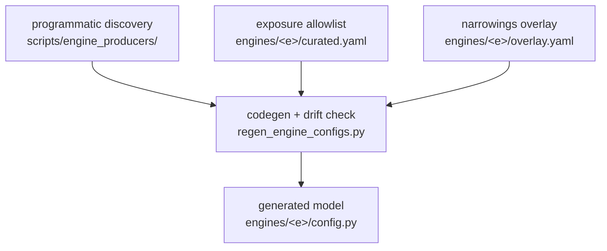

# Parameter Curation

> **Note:** This document covers engine-API-parameter introspection and generated-model curation (what fields each engine accepts, type information, drift detection). For the runtime validation of parameter *values* (how invalid combinations are caught before engine initialisation), see [parameter-discovery.md](/explanation/architecture/parameter-discovery).

---

llem exposes engine parameters to users through per-engine Pydantic models that are **generated** from mined data, not hand-authored. This document explains how those models stay in sync with the underlying engines.

---

## Overview



- **Programmatic discovery** introspects engine APIs and writes `engines/*/schema.discovered.json` (the ground truth for "what parameters does this engine accept").
- **The exposure allowlist** (`engines/<e>/curated.yaml`) names the fields llem exposes as first-class typed fields; everything else stays reachable through the `extra="allow"` passthrough.
- **The narrowings overlay** (`engines/<e>/overlay.yaml`, optional) hand-tightens individual fields (e.g. numeric bounds) the miner surfaced as bare scalars.
- **Codegen** (`regen_engine_configs.py`) projects those three inputs into the generated `engines/<e>/config.py`; its `--check` mode is the drift gate.

---

## Programmatic discovery

`scripts/engine_producers/` introspects each engine's public Python API (e.g. `inspect.signature(vllm.LLM.__init__)`, `inspect.signature(AutoModelForCausalLM.from_pretrained)`) and writes the result to `src/llenergymeasure/engines/{engine}/schema.discovered.json`.

These JSON files are the ground truth for "what parameters does this engine version accept". They are stored in the repo and regenerated via the parameter-discovery pipeline when an engine version bumps (see [schema-refresh.md](/contributing/schema-refresh)).

---

## Curation as data

Curation is an exposure-time decision recorded as data in
`src/llenergymeasure/engines/<engine>/curated.yaml`. Its `exposed_fields`
list names the fields that become first-class typed fields on the generated
`Config` class; everything else stays reachable through the `extra="allow"`
passthrough with soft validation against the full discovered schema. Mining
never narrows, so the allowlist is the only place a field is promoted.
Curation decisions:

- **Field names match native engine names.** A field called `quant_config` maps directly to the engine kwarg `quant_config`. No translation layer, no llem aliases.
- **Sub-configs group related parameters.** e.g. the tensorrt `kv_cache_config` entry groups all kv-cache knobs under `tensorrt.engine_params.kv_cache_config.*`. The sub-config name matches the native engine kwarg name.
- **Types may be narrowed via `overlay.yaml`.** A field surfaced as a bare scalar in discovery can be tightened with hand-authored bounds (e.g. `num_beams >= 1`) or a `Literal` set; the codegen projects these onto the generated `Config` as `Field(ge=..., le=...)` constraints.
- **Descriptions flow from the mined schema.** The generated `Config` carries `use_attribute_docstrings=True`; per-field descriptions come from the discovered schema, not hand-written prose.

---

## Drift check

`scripts/engine_producers/regen_engine_configs.py` regenerates each engine's
typed `config.py` from `schema.discovered.json` + `curated.yaml` (+ optional
`overlay.yaml`) and, in `--check` mode, byte-compares the result against the
committed file. A mismatch means the committed model has drifted from its
SSOT inputs:

| Kind | Meaning |
|------|---------|
| stale exposed field | `curated.yaml` exposes a field the latest discovery no longer reports - likely removed from the engine, or a kwargs-passed field invisible to signature inspection (a "discovery debt" entry) |
| shape change | a field's type, default, or bound changed upstream and the committed model was not regenerated |

Run it locally:

```bash
uv run python scripts/engine_producers/regen_engine_configs.py --check
# or, to regenerate and write:
uv run python scripts/engine_producers/regen_engine_configs.py --write
```

CI runs the `--check` mode automatically on every PR.

---

## Discovery debt

Some exposed fields legitimately have no signature-based discovered
counterpart. Common reasons:

| Reason | Example |
|--------|---------|
| Passed via `**kwargs`, invisible to `inspect.signature` | `transformers.dtype` - `from_pretrained` accepts it as a kwarg alias |
| llem exposes a sub-config field the engine accepts at a different nesting level | `tensorrt.quant_config.quant_algo` |
| Beam-search or speculative-decoding params from a separate params class | `vllm.beam_search.beam_width` (from `BeamSearchParams`, not `LLM.__init__`) |

These stay in `curated.yaml` tagged as "discovery debt" with an inline
comment explaining why the field is exposed despite being missed by
signature-based discovery; they are tracked for miner deepening.

**When to add an entry:** when a field is intentionally exposed but unreachable by signature-based discovery. Add it to `exposed_fields` with a "discovery debt" comment.

**When to remove an entry:** when the corresponding field is no longer exposed. Stale entries are misleading - remove them during the same PR that removes the field.

**Never add an entry to paper over a naming divergence.** If an exposed field is named differently from the engine kwarg, fix the curated name instead.

---

## See also

- [parameter-discovery.md](/explanation/architecture/parameter-discovery) - config validation pipeline (how invalid combinations are caught)
- [schema-refresh.md](/contributing/schema-refresh) - parameter-discovery pipeline (Renovate-driven schema refresh)
- [engines.md](/reference/engines/configuration) - engine configuration reference
