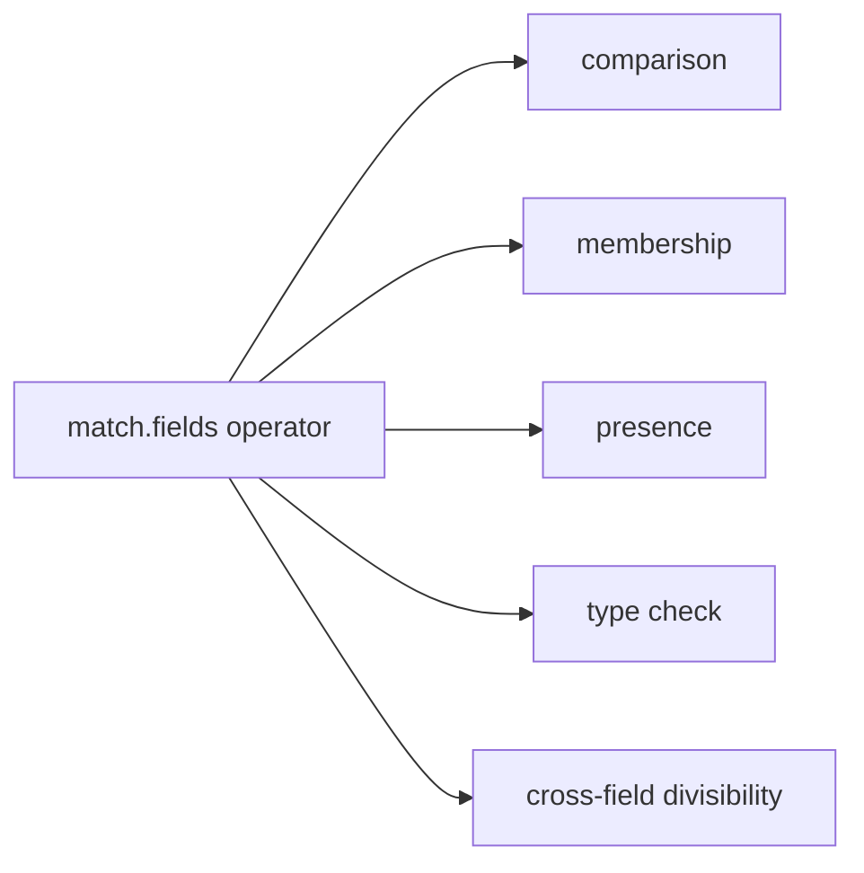

# Parameter Discovery and Config Validation

This document covers the runtime config-validation path: how a user's `ExperimentConfig` is evaluated against the engine's shipped rules, what the loader grammar means, and what happens when a rule fires.

**Audience:** end users debugging a rejected config; contributors writing new rules; anyone wanting to understand the error messages llem produces.

For how the shipped rules are produced, see [Local knowledge production](/contributing/knowledge-production).

---

## Why configs are rejected before engine initialisation

Engine initialisation is expensive: model weights load from disk, CUDA contexts initialise, and TensorRT-LLM may need to compile an engine (minutes). A rejected config discovered after two minutes of initialisation wastes GPU time.

llem evaluates each submitted `ExperimentConfig` against the engine's shipped `rules.yaml` before the engine starts. Invalid combinations are caught at config-parse time - milliseconds, not minutes.

---

## Data flow: user config to validation result

```mermaid
flowchart TB
    user[User submits config<br/>YAML / CLI flags / Python API]
    pydantic[ExperimentConfig parsed by Pydantic]
    apply[_apply_rules &#40;config/models.py&#41;<br/>EngineRulesLoader&#40;&#41;.load_rules&#40;engine&#41;]
    rules[(EngineRules<br/>engine + schema_version + rules&lsqb;&rsqb;)]

    user --> pydantic --> apply --> rules

    rules --> rule[For each Rule:<br/>try_match&#40;config&#41;]
    rule -->|None - predicate did not fire| skip([skip])
    rule -->|RuleMatch fired| match{severity?}

    match -->|error| err["raise ValueError<br/>(Pydantic surfaces as<br/>ValidationError)"]
    match -->|dormant| dormant["record normalised_fields:<br/>the engine will silently ignore<br/>or coerce these fields"]
```



---

## The loader grammar

The `match.fields` section of each rule contains predicates expressed in a small domain-specific grammar. The loader's `evaluate_predicate()` function implements it.

### Grammar tree

`match.fields` accepts two shapes:

- **Bare value** - shorthand for equality. `field: 5` is sugar for `field: {==: 5}`.
- **Dict with operator keys** - one of the families below.



| Family | Operator | Fires when |
|---|---|---|
| comparison | `==` / `equals` | `field == value` |
| comparison | `!=` / `not_equal` | `field != value` |
| comparison | `<` | less-than |
| comparison | `<=` | less-than-or-equal |
| comparison | `>` | greater-than |
| comparison | `>=` | greater-than-or-equal |
| membership | `in` | `value in [v1, v2, ...]` |
| membership | `not_in` | `value not in [v1, v2, ...]` |
| presence | `present` | field is not `None` |
| presence | `absent` | field is `None` |
| type check | `type_is` | `type(field).__name__ in name_set` |
| type check | `type_is_not` | `type(field).__name__ not in name_set` |
| cross-field divisibility | `divisible_by` | `a % b == 0` |
| cross-field divisibility | `not_divisible_by` | `a % b != 0` (`b=0` -> False, no rule fires) |

### Field path resolution

Field paths are dotted strings resolved against the config model attribute by attribute:

```yaml
match:
  fields:
    transformers.engine_params.num_beams:
      "==": 1
    transformers.sampling_params.num_return_sequences:
      ">": 1
```

- `transformers.engine_params.num_beams` resolves as `config.transformers.engine_params.num_beams`.
- Pydantic models, dataclasses, and plain dicts are all supported.
- A missing attribute at any path segment yields `None` - the predicate does not fire (rules do not produce false positives on configs that simply lack a field).

### `@field_ref` cross-field references

Operator values may be `@field_path` strings, which are resolved against the same config before evaluation. This is how cross-field constraints are expressed:

```yaml
match:
  fields:
    transformers.engine_params.num_beams:
      not_divisible_by: "@transformers.sampling_params.num_return_sequences"
```

Bare refs (e.g. `@max_num_seqs`) resolve as sibling fields, relative to the anchor field's parent namespace. Dotted refs (as above) resolve from the config root - required whenever the target lives in a different section than the anchor (here the anchor sits under `engine_params` while the target sits under `sampling_params`); a bare ref would look for the target in the anchor's own section and silently resolve to `None`.

### Loader grammar examples

```yaml
# Single-field range: temperature must be positive
match:
  fields:
    vllm.sampling_params.temperature:
      ">": 0.0

# Value allowlist: cache_implementation must be one of these
match:
  fields:
    transformers.engine_params.cache_implementation:
      in: ["static", "sliding_window", "hybrid"]

# Cross-field divisibility: num_beams must divide evenly by num_return_sequences
match:
  fields:
    transformers.engine_params.num_beams:
      not_divisible_by: "@transformers.sampling_params.num_return_sequences"

# Multi-field gate: rule fires only when both conditions hold
match:
  fields:
    transformers.sampling_params.num_return_sequences:
      ">": 1
    transformers.sampling_params.do_sample:
      "==": false

# Type check: field must be a float, not an int
match:
  fields:
    transformers.sampling_params.temperature:
      type_is_not: "int"
```

---

## Severity levels

Each rule has a severity that determines how the loader responds when the predicate fires. Severity is a closed two-value enum.

| Severity | Engine behaviour | Loader behaviour | Example |
|---|---|---|---|
| `error` | The engine raises if the config is submitted as-is. | Raises `ValueError` before engine initialisation. Pydantic surfaces it as a `ValidationError`. The message template is rendered with `declared_value` substituted. | `num_beams (5) is not divisible by num_return_sequences (2)` |
| `dormant` | The engine silently normalises or ignores the field. The user's declared value is not the effective value. | Records the rule's `normalised_fields` so the study planner can deduplicate configs that resolve to the same effective configuration. | `seed=-1 is normalised to None by the engine` |

There is no `warn` severity: the study workflow records effective parameters separately, so a rule either changes what runs (rejects the config, or drives dedup) or it does not exist. Provenance metadata (`source`, `verified`) is carried per rule but never influences runtime behaviour.

### Dormant rules: the "silent surprise" class

`dormant` rules describe configurations where the engine accepts the value but silently normalises it to something else. Without a rule, the user would submit `seed=-1`, see no error, and later discover the seed was ignored.

The `normalised_fields` list on a dormant rule names the canonical paths the engine drives back to their default. The sweep library-resolution dedup uses this to canonicalise field-inert configs: two configs that differ only in a dormant field resolve to the same effective configuration, so the GPU runs the cell once instead of twice.

---

## Error messages

When a rule fires at `error` severity, the loader renders the rule's `message_template` using values from the matched config.

Template substitution variables:
- `{declared_value}` - the value of the triggering (subject) field.
- `{effective_value}` - the normalised value (reserved for value-aliasing dormant cases; `None` otherwise).
- `{invariant_id}` - the rule's identifier.
- Any `match.fields` key - the actual field value.

Example error message rendered from a rule:

```
ValidationError: `diversity_penalty` is not 0.0 or `num_beam_groups` is
not 1, triggering group beam search. In this generation mode,
`diversity_penalty` should be greater than `0.0`, otherwise your groups will
be identical.
```

If a template references a missing key, the loader falls back to `[{invariant_id}] <template>` rather than raising at user-facing time.

---

## Schema version resolution

Each `rules.yaml` carries a `schema_version` and the `engine_version` it was verified against. When the loader parses the file:

1. It checks the `schema_version` major against the loader's supported major. A mismatch raises `UnsupportedSchemaVersionError` (the installed package is incompatible with the shipped rules format).
2. It parses all rules with strict enum validation: an unknown `severity` raises `UnknownSeverityError`, and unknown provenance values (`source` / `verified`) raise `UnknownSourceError` / `UnknownVerifiedError`.

The loader does not check whether the installed engine library version matches the rules' `engine_version`. That alignment is verified at production time (the rules are absorbed against the pinned source) and enforced at runtime by the engine's own constructor validation.

---

## Gap reporting

When a user submits a config combination that no rule addresses, no validation fires - the combination passes through. This is by design (the rule set is recall-first, not exhaustive), so some invalid combinations are caught only by the engine constructor.

The `rules-coverage` advisory (see [CI architecture](/explanation/architecture/ci-architecture#engine-rules-check)) reports validator sites in the engine source that no shipped rule covers, so maintainers can see where the rule set is thin. Closing a gap means absorbing the missing constraint into `rules.yaml` (see [Local knowledge production](/contributing/knowledge-production)).

---

## Loader API

The loader is in `src/llenergymeasure/config/engine_rules/loader.py`.

```python
from llenergymeasure.config.engine_rules.loader import (
    EngineRules,
    EngineRulesLoader,
    Rule,
    RuleMatch,
)

# Load the shipped rules for an engine
loader = EngineRulesLoader()
engine_rules = loader.load_rules("transformers")

# Match against a config
for rule in engine_rules.rules:
    match = rule.try_match(config)
    if match is not None:
        print(rule.severity, rule.render_message(match))
```

At runtime, `_apply_rules` in `src/llenergymeasure/config/models.py` does exactly this for the config's own engine. `EngineRulesLoader` caches per engine, so `rules.yaml` is parsed once per engine per process; tests can construct a fresh loader for isolation.

---

## Troubleshooting: common error messages

### "ValidationError: `num_beams` is not divisible by `num_beam_groups`"

Rule: `transformers_beam_search_num_beams_not_divisible_by_num_beam_groups`

The transformers engine requires `num_beams` to be an exact multiple of `num_beam_groups` for group beam search. Set both to compatible values: e.g. `num_beams=4, num_beam_groups=2`.

### "ValidationError: `diversity_penalty` is not 0.0 or `num_beam_groups` is not 1..."

Rule: `transformers_beam_search_diversity_penalty_eq_0p0`

When `num_beams > 1` and `num_beam_groups > 1` (group beam search mode), `diversity_penalty` must be greater than 0.0. Set `diversity_penalty` to a positive value, or disable group beam search.

### "UnsupportedSchemaVersionError"

The shipped `rules.yaml` in the installed package uses a schema major version the current loader does not understand. This indicates a library/package version mismatch. Update LLenergyMeasure to the version that matches your installed engines.

---

## See also

- [architecture-overview.md](/explanation/architecture/architecture-overview) - system overview
- [Local knowledge production](/contributing/knowledge-production) - how the rules are produced
- [CI architecture](/explanation/architecture/ci-architecture) - what CI verifies
- [engines.md](/reference/engines/configuration) - engine configuration reference
- [troubleshooting.md](/how-to/troubleshoot) - general troubleshooting guide
```
