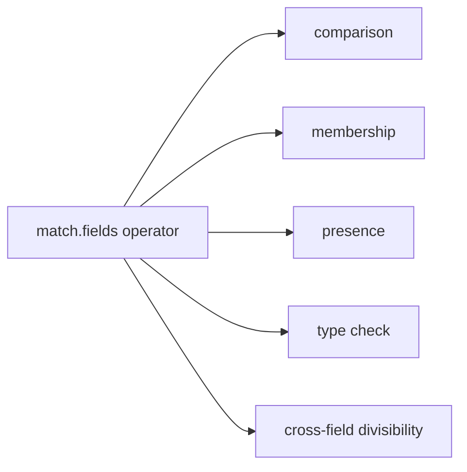

# Parameter Discovery and Config Validation

This document covers the runtime config-validation pipeline: how a user's `ExperimentConfig` is evaluated against the validated invariant corpus, what the loader grammar means, and what happens when a rule fires.

**Audience:** end users debugging a rejected config; extenders writing new corpus rules; anyone wanting to understand the error messages llem produces.

For the compile-time side (how the corpus is built), see [miner-pipeline.md](/contributing/miner-pipeline).

---

## Why configs are rejected before engine initialisation

Engine initialisation is expensive: model weights load from disk, CUDA contexts initialise, and TensorRT-LLM may need to compile an engine (minutes). A rejected config discovered after two minutes of initialisation wastes GPU time.

llem evaluates each submitted `ExperimentConfig` against a pre-computed corpus of validation rules before the engine starts. Invalid combinations are caught at config-parse time - milliseconds, not minutes.

---

## Data flow: user config to validation result

```mermaid
flowchart TB
    user[User submits config<br/>YAML / CLI flags / Python API]
    pydantic[ExperimentConfig parsed by Pydantic]
    apply[_apply_invariants &#40;config/models.py&#41;<br/>EngineInvariantsLoader&#40;&#41;.load_invariants&#40;engine&#41;]
    inv[(EngineInvariants<br/>engine + schema_version + invariants&lsqb;&rsqb;)]

    user --> pydantic --> apply --> inv

    inv --> rule[For each Invariant:<br/>try_match&#40;config&#41;]
    rule -->|None - predicate did not fire| skip([skip])
    rule -->|RuleMatch fired| match{severity?}

    match -->|error| err["raise ValueError<br/>(Pydantic surfaces as<br/>ValidationError)"]
    match -->|warn| warn[emit warning to user]
    match -->|dormant| dormant["annotate config<br/>log: field X will be silently<br/>ignored / normalised"]
```



---

## The loader grammar

The `match.fields` section of each corpus rule contains predicates expressed in a small domain-specific grammar. The loader's `evaluate_predicate()` function implements it.

### Grammar tree

`match.fields` accepts two shapes:

- **Bare value** - shorthand for equality. `field: 5` is sugar for `field: {==: 5}`.
- **Dict with operator keys** - one of the families below.



| Family | Operator | Fires when |
|---|---|---|
| comparison | `==` / `equals` | `field == value` |
| comparison | `!=` / `not_equal` | `field != value` |
| comparison | `<` | less-than |
| comparison | `<=` | less-than-or-equal |
| comparison | `>` | greater-than |
| comparison | `>=` | greater-than-or-equal |
| membership | `in` | `value in [v1, v2, ...]` |
| membership | `not_in` | `value not in [v1, v2, ...]` |
| presence | `present` | field is not `None` |
| presence | `absent` | field is `None` |
| type check | `type_is` | `type(field).__name__ in name_set` |
| type check | `type_is_not` | `type(field).__name__ not in name_set` |
| cross-field divisibility | `divisible_by` | `a % b == 0` |
| cross-field divisibility | `not_divisible_by` | `a % b != 0` (`b=0` -> False, no rule fires) |

### Field path resolution

Field paths are dotted strings resolved against the config model attribute by attribute:

```yaml
match:
  fields:
    transformers.sampling.num_beams:
      ">": 1
    transformers.sampling.num_beam_groups:
      ">": 1
```

- `transformers.sampling.num_beams` resolves as `config.transformers.sampling.num_beams`.
- Pydantic models, dataclasses, and plain dicts are all supported.
- A missing attribute at any path segment yields `None` - the predicate does not fire (rules do not produce false positives on configs that simply lack a field).

### `@field_ref` cross-field references

Operator values may be `@field_path` strings, which are resolved against the same config before evaluation. This is how cross-field constraints are expressed:

```yaml
match:
  fields:
    transformers.sampling.num_beams:
      not_divisible_by: "@num_beam_groups"
```

`@num_beam_groups` resolves as a sibling field (relative to `transformers.sampling.num_beams`'s parent namespace). Dotted refs (e.g. `@transformers.sampling.num_beam_groups`) resolve from the config root.

### Loader grammar examples

```yaml
# Single-field range: temperature must be positive
match:
  fields:
    vllm.sampling.temperature:
      ">": 0.0

# Value allowlist: cache_implementation must be one of these
match:
  fields:
    transformers.sampling.cache_implementation:
      in: ["static", "sliding_window", "hybrid"]

# Cross-field divisibility: num_beams must divide evenly by num_beam_groups
match:
  fields:
    transformers.sampling.num_beams:
      not_divisible_by: "@num_beam_groups"

# Multi-field gate: rule fires only when both conditions hold
match:
  fields:
    transformers.sampling.num_beams:
      ">": 1
    transformers.sampling.diversity_penalty:
      "==": 0.0

# Type check: field must be a float, not an int
match:
  fields:
    transformers.sampling.temperature:
      type_is_not: "int"
```

---

## Severity levels

Each rule has a severity that determines how the loader responds when the predicate fires.

| Severity | Engine behaviour | Loader behaviour | Example |
|---|---|---|---|
| `error` | The engine raises if the config is submitted as-is. | Raises `ValueError` before engine initialisation. Pydantic surfaces it as a `ValidationError`. Message template is rendered with `declared_value` substituted. | `num_beams (2) is not divisible by num_beam_groups (3)` |
| `warn` | The engine announces a suboptimal setting but still proceeds. | Emits a warning to the user. | `temperature=0 with do_sample=True; engine will warn` |
| `dormant` | The engine silently normalises or ignores the field. The user's declared value is not the effective value. | Annotates the config: "field X will be silently coerced by the engine to Y". | `seed=-1 will be normalised to None by the engine` |

### Dormant rules: the "silent surprise" class

`dormant` rules are the most subtle. They describe configurations where the engine accepts the value but silently normalises it to something else. Without the corpus, the user would submit `seed=-1`, not see any error, and later discover the seed was ignored.

The `expected_outcome.normalised_fields` list in a dormant rule tells the loader which fields are affected. The fixpoint contract (`_fixpoint_test.py`) asserts that applying dormant rules to a config converges to a stable state - no two dormant rules should conflict by normalising the same field to different values under the same conditions.

---

## Error messages

When a rule fires at `error` severity, the loader renders the rule's `message_template` using field values from the matched config.

Template substitution variables:
- `{declared_value}` - the value of the triggering field.
- `{effective_value}` - the normalised value (dormant rules only).
- `{rule_id}` - the rule's identifier.
- Any `match.fields` key - the actual field value.

Example error message from the corpus:

```
ValidationError: `diversity_penalty` is not 0.0 or `num_beam_groups` is
not 1, triggering group beam search. In this generation mode,
`diversity_penalty` should be greater than `0.0`, otherwise your groups will
be identical.
```

If no template is available, the loader falls back to `[{rule_id}] <no message template>` rather than raising silently.

---

## Library version resolution

The validated YAML carries the engine version the corpus was validated against. When the loader loads the validated YAML:

1. It checks `schema_version` major against `SUPPORTED_MAJOR_VERSION`. A major-version mismatch raises `UnsupportedSchemaVersionError` (the package is incompatible with the installed corpus version).
2. It parses all rules with strict enum validation: unknown `added_by` values raise `UnknownAddedByError`; unknown severity values raise `UnknownSeverityError`.

The loader does not check whether the currently installed engine library version matches the corpus version. That alignment is enforced at corpus-build time (the miner's SSOT-pinned envelope from `engine_versions/{engine}/current.yaml miner_pins.{producer}` + `check_installed_version`) and at runtime via the engine's own constructor validation.

---

## Gap reporting

When a user submits a config combination that no rule in the corpus addresses, no validation fires - the combination passes through. This is by design (the corpus is recall-first, not exhaustive), but it means some invalid combinations are caught only by the engine constructor.

Gap reporting surfaces these at the `dormant` level or via a separate gap-detection pipeline. When a `gap_detected: true` group appears in experiment results, it indicates the config combination triggered a library-side normalisation that the corpus did not yet describe.

Extending the corpus to cover new gap classes is done by adding a miner cluster or a `manual_seed` rule. See [extending-miners.md](/contributing/extending-miners).

---

## Proposed vs validated: the two-file structure

Each engine ships two YAML files:

- **`invariants.proposed.yaml`** - the human-reviewable source of truth
  (git-tracked), regenerated by the miners. Declares `expected_outcome`.
- **`invariants.validated.yaml`** - the CI-validated overlay produced by
  replaying each invariant against the live library. Records observed outcomes.

| Aspect | Proposed YAML corpus | Validated YAML corpus |
|---|---|---|
| Audience | Human-reviewable | Machine-parsed only |
| Status | Source of truth (git-tracked) | Output of `validate_invariants.py` |
| Carries | Declared `expected_outcome` | Observed outcomes (CI run) |
| Read by | `validate_invariants.py` | `loader.py` at runtime |
| Regenerated by | Miners | `validate_invariants.py` |
| Path | `src/llenergymeasure/engines/{engine}/invariants.proposed.yaml` | `src/llenergymeasure/engines/{engine}/invariants.validated.yaml` |

The loader overlays validated observations onto the proposed corpus so downstream consumers see CI-validated truth. When the validated YAML is absent (e.g. in a local development environment without a validation run), the loader falls back to the proposed corpus alone.

---

## Loader API

The loader is in `src/llenergymeasure/config/engine_invariants/loader.py`.

```python
from llenergymeasure.config.engine_invariants.loader import (
    EngineInvariants,
    EngineInvariantsLoader,
    Invariant,
    InvariantMatch,
)

# Load the corpus for an engine
loader = EngineInvariantsLoader()
corpus = loader.load_invariants("transformers")

# Match against a config
for inv in corpus.invariants:
    match = inv.try_match(config)
    if match is not None:
        print(inv.severity, inv.render_message(match))
```

For higher-level use cases, see `llenergymeasure.api.report_gaps.load_engine_invariants`, which loads all configured engines via a shared loader. Per-instance caching in `EngineInvariantsLoader` ensures the corpus JSON is parsed once per engine per process; tests can construct a fresh loader for isolation.

---

## Troubleshooting: common error messages

### "ValidationError: `num_beams` is not divisible by `num_beam_groups`"

Invariant: `transformers_beam_search_num_beams_not_divisible_by_num_beam_groups`

The transformers engine requires `num_beams` to be an exact multiple of `num_beam_groups` for group beam search. Set both to compatible values: e.g. `num_beams=4, num_beam_groups=2`.

### "ValidationError: `diversity_penalty` is not 0.0 or `num_beam_groups` is not 1..."

Invariant: `transformers_beam_search_diversity_penalty_eq_0p0`

When `num_beams > 1` and `num_beam_groups > 1` (group beam search mode), `diversity_penalty` must be greater than 0.0. Set `diversity_penalty` to a positive value, or disable group beam search.

### "Warning: field `seed` will be silently normalised to None by the engine"

Invariant: a dormant rule matching `seed=-1`. The engine treats -1 as "no seed" and normalises it to `None`. Set an explicit non-negative seed, or leave the field unset.

### "UnsupportedSchemaVersionError"

The validated YAML in the installed package was built with a schema major version the current loader does not understand. This indicates a library/package version mismatch. Update LLenergyMeasure to the version that matches your installed engines.

---

## See also

- [architecture-overview.md](/explanation/architecture/architecture-overview) - system overview
- [invariants-corpus-format.md](/reference/invariants-corpus-format) - corpus YAML format reference
- [miner-pipeline.md](/contributing/miner-pipeline) - how the corpus is built
- [extending-miners.md](/contributing/extending-miners) - adding new rules
- [engines.md](/reference/engines/configuration) - engine configuration reference
- [troubleshooting.md](/how-to/troubleshoot) - general troubleshooting guide
