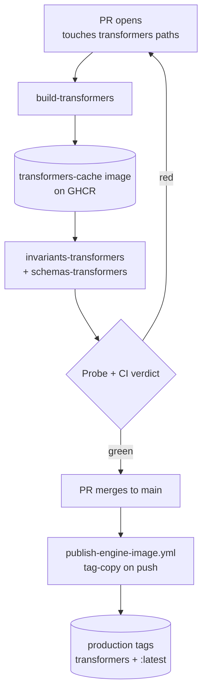
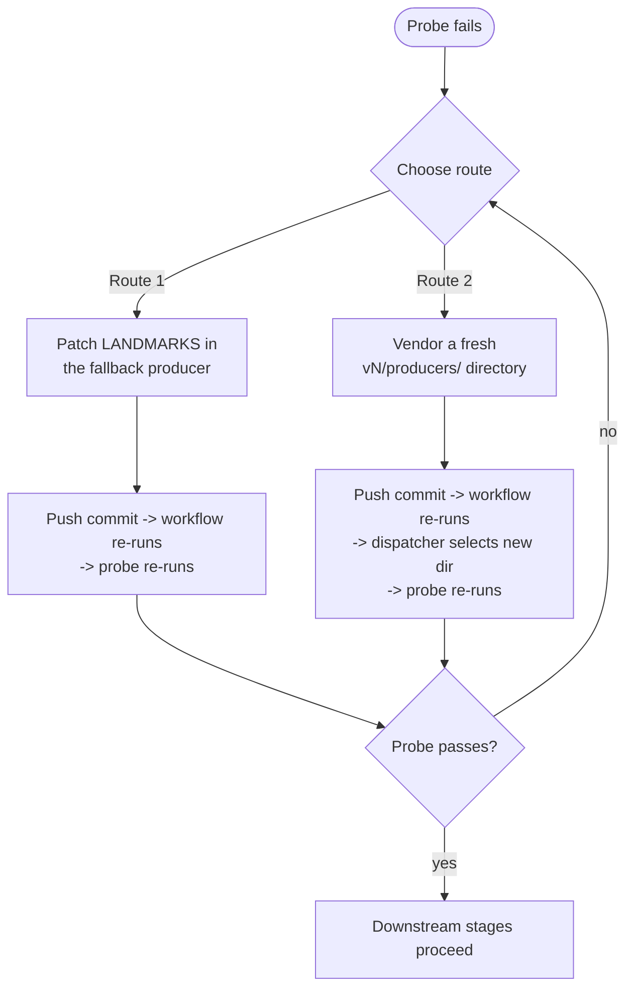

# Pipeline Architecture

This doc is the chain-diagram reference for the engine-coupling pipeline. SSOT-driven Renovate cycles flow through these stages: trigger, two per-concern CI workflows, validated artefacts, and the human curation checkpoint before merge.

## Asymmetric engine architecture (locked design choice)

The three engines run different pipelines in CI for a load-bearing reason. **Don't undo this asymmetry without re-reading [`#518`](https://github.com/henrycgbaker/llenergymeasure/issues/518) - the conclusion has held across re-litigations 2026-04-30, 2026-05-01, and 2026-05-05.**

| Engine | Image source | CI flow on PR |
|---|---|---|
| **transformers** | First-party `docker/Dockerfile.transformers` (FA3-included; no upstream provides this) | `engine-pipeline :: build-transformers` (rebuild) → `engine-pipeline :: invariants-transformers + schemas-transformers` (probe + mine/introspect) → [merge] → `publish-engine-image` (mirror to production tag) |
| **vllm** | Upstream `vllm/vllm-openai:v<VER>` directly + bind-mount llem source | `engine-pipeline :: invariants-others + schemas-others` matrix cells fire on `pull_request: paths` (no first-party build) |
| **tensorrt** | Upstream `nvcr.io/nvidia/tensorrt-llm/release:<VER>` directly + bind-mount llem source | Same shape as vllm |

**Why asymmetric.** vllm + tensorrt's upstream images empirically contain everything llem needs at runtime (PoC verified 2026-04-30: `pydantic`, `typer`, `pyarrow`, `rich`, `dotenv`, `pyyaml` all present transitively). Transformers' upstream images don't include FA3, which is non-negotiable for production-equivalent CI runs. So transformers gets a first-party Dockerfile; the others stay upstream-direct.

**Drift safety.** The only argument for first-party-everywhere is "what if upstream drops a transitive dep llem needs?" The migration cost from upstream-direct → first-party is bounded (~1 day, well-defined recipe per `#518`). The actual cost of running first-party-everywhere is the FA3 build for two extra engines that don't need it.

### Transformers PR-time CI flow (rebuild + probe/mine/introspect chain)



1. **PR trigger.** `engine-pipeline.yml` fires when a PR touches any of the path-filter inputs: `engine_versions/transformers/current.toml`, `docker/Dockerfile.transformers`, or `.github/workflows/engine-pipeline.yml`.
2. **build-transformers.** Builds the transformers runtime image. Cache hits land in ~10-15 min; cold FA3 builds ~60-90 min. Pushes to `ghcr.io/<repo>/transformers-cache:transformers-<VER>`.
3. **invariants-transformers + schemas-transformers cells.** Orchestrator's `needs:` graph fires these on build success. Each cell pulls the transformers-cache image, runs probe -> mine/introspect -> validate, and uploads a writeback artefact.
4. **Probe + CI verdict.** A probe failure turns CI red. The `accept-probe-fail` PR label bypasses the gate for known-drift cases (admin escalation; see [#547](https://github.com/henrycgbaker/llenergymeasure/issues/547)).
5. **publish-engine-image.yml.** Fires directly on push to `main` (no rebuild). Tag-copy via `docker buildx imagetools create`: `transformers-cache:transformers-<VER>` -> `transformers:transformers-<VER>` and `transformers:latest`. Registry-side metadata op only; seconds, no build infrastructure. The production image is bit-identical to the cache image that CI validated on the PR.

### vllm + tensorrt PR-time CI flow (no rebuild; upstream-direct)

The diagram below applies to vllm + tensorrt only - `engine-pipeline.yml`'s `invariants-others` + `schemas-others` matrix cells fire on `pull_request: paths` (no `build-transformers` dependency). They pull the upstream image at the SSOT-pinned version, bind-mount llem source, and probe/mine/introspect inside the upstream container.

### Pipeline shape: Renovate -> per-concern workflows -> writeback -> human curation

The vllm + tensorrt cycle uses two per-concern workflow cells (engine-invariants + engine-schemas) coordinating via sibling-wait. Each cell runs its own probe -> producer -> diff -> comment + label sequence; the last-finishing cell performs an atomic writeback. Cross-pipeline rollup state lives on PR labels.

The diagram captures the high-level flow; per-step detail follows below.

```mermaid
flowchart TD
    renovate[Renovate scans upstream releases<br/>on configured schedule]
    bump[Custom regex manager bumps SSOT<br/>engine_versions/&lt;engine&gt;/current.toml + Dockerfile ARG]
    pr[Renovate PR opens<br/>fix&#40;deps&#41;: bump vllm to 0.10.2]

    renovate --> bump --> pr

    subgraph parallel["Path-filtered fan-out: two pipelines run in parallel"]
        direction LR
        inv[engine-invariants cell<br/>per-engine matrix]
        sch[engine-schemas cell<br/>engines matrix]
    end

    pr --> parallel
    parallel --> wait[Sibling-wait + atomic writeback<br/>last cell to finish writes one commit]
    wait --> summary[PR state after cycle:<br/>2 check statuses + up to 2 comments<br/>+ 1 bot commit + rollup label]
    summary --> human([HUMAN CURATION CHECKPOINT])
    human --> merge[squash-merge]
    merge --> closed[PR closes;<br/>engine version + validated artefacts +<br/>curated Pydantic pinned at this commit]

    classDef chk fill:#fffae6,stroke:#b58900,stroke-width:2px;
    class human chk;
```



#### Trigger contract

- **Renovate.** Scans upstream library releases on the configured schedule. Custom regex manager bumps two file targets together: `engine_versions/{engine}/current.toml:library.current_version` (the SSOT, canonical) and `docker/Dockerfile.{engine}` ARG (derived, auto-templated from SSOT).
- **Path-filtered fan-out.** When Renovate's PR opens, paths-filter routes the change to two workflows in parallel: the engine-invariants pipeline and the engine-schemas pipeline.

#### engine-invariants cell (per-engine matrix)

Layers over: invariant-miner + invalidity-miner + lift modules + validation-CI gate.

1. **PROBE** - inline `python -m scripts._drift --producer invariants`; verdict `pass` or `fail`.
2. **MINE** (only if probe passes) - `build_corpus.py` writes `src/llenergymeasure/engines/{engine}/invariants.proposed.yaml`.
3. **VALIDATE-REPLAY** - `validate_invariants.py` plus the `compare_expected_vs_observed` contract from `_invariant_validation_common.py`. Replays `kwargs_positive` + `kwargs_negative` against the live library; classifies outcomes (`positive_confirmed`, `negative_confirmed`, `divergence`). Writes `src/llenergymeasure/engines/{engine}/invariants.validated.yaml`.
4. **DIFF vs HEAD** for both `proposed.yaml` and `validated.yaml` artefacts.
5. **REGENERATE** `docs/reference/engines/invariants-{engine}.md` (Invariants section - fact base, encompasses dormancy + invalidity + miner output + introspection + runtime catch-all).
6. **COMMENT + LABEL** (suppress on empty).
7. **Probe-fail branch** - same 3-route handling as the schemas pipeline below; apply `probe-blocked` label; `exit 0` (not a CI failure).

#### engine-schemas cell (engines matrix)

Layers over: parameter-discovery + typed-schema-discovery.

1. **PROBE** - inline `python -m scripts._drift --producer schemas`; verdict `pass` or `fail`.
2. **DISCOVER** (only if probe passes) - `engine_producers` writes `src/llenergymeasure/config/discovered_schemas/{engine}/schema.discovered.json`.
3. **DIFF vs HEAD**.
4. **REGENERATE** `docs/reference/engines/curation-{engine}.md` (Parameters section - fact base for the human curator; pre-existing behaviour preserved).
5. **COMMENT + LABEL** (suppress on empty).
6. **Probe-fail branch** - post probe-fail comment with two routes (patch LANDMARKS in the fallback producer, or vendor a fresh `vN/producers/` directory) and the diagnostic counts (missing landmarks, fingerprint drift, aliased landmarks). Apply `probe-blocked` label; `exit 1` (red CI gate).

#### Per-cell artefact contract

Each cell:

- Uploads `engine-step-diff-{engine}-{concern}.yaml`.
- Posts its OWN per-pipeline comment (suppress on empty).
- Applies its own per-pipeline label (`invariants/schemas-changed`, `invariants/schemas-breaking`, `corpus-changed`, `probe-blocked`).
- Waits for the sibling pipeline to complete (`lewagon/wait-on-check-action`; an already-finished sibling exits immediately).

#### Atomic writeback

The last-finishing workflow performs an in-line atomic writeback:

```
git add src/llenergymeasure/engines/{engine}/invariants.proposed.yaml
        src/llenergymeasure/engines/{engine}/invariants.validated.yaml
        src/llenergymeasure/engines/{engine}/schema.discovered.json
        docs/reference/engines/curation-{engine}.md
        docs/reference/engines/invariants-{engine}.md
        engine_versions/{engine}.compat.json
git commit && git push --force-with-lease
```

`engine_versions/{engine}/current.toml` is Renovate-writable input only and is **never** part of the bot writeback bundle.

The same workflow then applies the cross-pipeline rollup label (`safe-bump` or `probe-blocked`).

:::note No summariser workflow
There is no summariser workflow file and no composite action. Cross-pipeline state lives on labels - a GitHub-native primitive. "Did the cycle run?" reads off the check-status badge. "Anything change?" reads off the per-pipeline comments and commits. "What's the rollup state?" reads off the label.
:::

#### PR state after a Renovate cycle

- 2 per-concern check statuses.
- Up to 2 comments per cycle (suppress-on-empty): engine-invariants pipeline and engine-schemas pipeline.
- 1 atomic bot commit (all artefacts; written by whichever workflow finished last).
- Cross-pipeline rollup label (`safe-bump` or `probe-blocked`).

### Human curation checkpoint

This is the only crossing of the human-as-final-checkpoint boundary (P6) inside the otherwise-automated validated half. Bots **never** edit `src/llenergymeasure/config/engine_configs.py`.

The dev consumes auto-generated digests:

- `docs/reference/engines/curation-{engine}.md` - **Section 1: Parameters** (discovered fields with Pydantic-curated yes/no, deltas vs previous SSOT version).
- `docs/reference/engines/invariants-{engine}.md` - **Section 1: Invariants** (corpus rules added/changed/removed, classified by `added_by`; encompasses dormancy + invalidity + miner output + introspection + runtime catch-all).

The dev manually edits `engine_configs.py`:

- which discovered params to expose in Pydantic;
- which `Literal` narrowings to pin;
- which sub-config taxonomy to use;
- which custom `@model_validator` decorators to add.

A push triggers a re-run of the CI cycle; the updated summary comment supersedes the prior one (edited via comment-id key, no proliferation).

#### Decision routes after digest review

| Route | Action |
|---|---|
| `safe-bump` + green CI | squash-merge |
| `corpus-changed` + mechanical | squash-merge |
| `invariants-breaking` | edit `engine_configs.py` |
| `schemas-breaking` | edit `engine_configs.py` |
| `probe-blocked` | patch LANDMARKS in the fallback producer, or vendor a fresh `engine_versions/{engine}/v<safe(N)>/producers/` directory |

:::note Guided curation UX is deferred
The guided curation UX (RFC-style YAML decision file + libcst applier) is deferred to [issue #475](https://github.com/henrycgbaker/llenergymeasure/issues/475). The current redesign ships self-serve curation only: devs hand-edit `engine_configs.py` based on the digest. After 2-3 Renovate cycles of operational data, the #475 reactivation will evaluate whether the guided UX pays off.
:::

### Probe-fail human checkpoint

This is the OTHER human touchpoint (per P6) - inside the otherwise-automated CI half. When a probe fails (inline step 1 of either workflow), the maintainer has two resolution routes.



**Route 1 - Patch LANDMARKS in the fallback producer.** The dispatcher's stderr log (in the probe step output) names which `v<safe>/producers/` archive it used. The dev edits the LANDMARKS tuple (and any related `_CLASS_TARGETS` / `_ASTTarget` definitions) to follow the upstream rename. One set of producer code can cover multiple adjacent library versions when the symbols still resolve under both. Push the commit; the workflow re-runs; the probe verifies the patched landmarks under the live library.

**Route 2 - Vendor a fresh `vN/producers/` directory.** When the library API has genuinely diverged from the prior version (refactor, removal, new subpackage layout), the maintainer creates a new `engine_versions/{engine}/v<safe(N)>/producers/` directory by copying the fallback dir and patching against the new API. The dispatcher's exact-match path then selects the new directory at the bumped version.

No slash commands exist for bypassing the probe. The dispatcher + probe pair is the contract; manual maintainer intervention is patching landmarks or vendoring a fresh `vN/producers/` directory.

### Adjacent pipelines

These pipelines run independent of the per-PR Renovate cycle.

#### `engine-versions-sweep.yml` (scheduled, advisory)

Runs `scripts/_drift.py` over a curated version range (e.g. `vllm v0.9..v0.12`) on a weekly schedule. Updates `engine_versions/{engine}.compat.json` (probe cache + compat-matrix in one file; closes [#470](https://github.com/henrycgbaker/llenergymeasure/issues/470)). Populates the probe-result cache so per-PR probes hit a warm cache.

#### Runtime side-products (study-local, not CI)

`runtime_observations.jsonl` and `equivalence_groups.json` are emitted at study-runtime, not by CI.

`runtime_observations.jsonl`:

- **Producer:** `src/llenergymeasure/study/runtime_observations.py` (`warnings.catch_warnings` + logger handler wrapping each worker body); wired in `worker.py`.
- **Schema:** `schema_version=1`; one record per `(study_run_id, config_hash, cycle)`; outcome in `{success, exception, subprocess_died}`.
- **Consumer (today):** `llem report-gaps` with `--source runtime-warnings` (the only wired source). Output is a YAML fragment for manual append to the corpus, with `# TODO: human` markers on placeholder fields. Preserved as an escape-hatch.
- **Consumer (long-term):** subsume into curation digest Section 3 ("Runtime gaps observed"). Deferred to [#475](https://github.com/henrycgbaker/llenergymeasure/issues/475); reactivate after 2-3 Renovate cycles of operational data.

`equivalence_groups.json`:

- Detects `observed_config_hash` collisions across configs: configs that Pydantic distinguishes (resolved_config_hash differs) but the engine collapses (observed_config_hash matches). Flagged as `gap_detected: true` - a dormancy signal.
- The `proposed_invariant_id` field is currently always `None`; the consumer is deferred until a researcher hits a real `gap_detected: true` group and asks for tooling. Tracked in [#405](https://github.com/henrycgbaker/llenergymeasure/issues/405) and [#474](https://github.com/henrycgbaker/llenergymeasure/issues/474).

### Legend

| Marker | Meaning |
|---|---|
| `[auto]` | fully automated, no human action |
| `[chk]` | human checkpoint - required dev input |
| `[info]` | informational artefact, advisory |

For the full design rationale (including the resolution of the per-engine vs per-concern split, the wait-for-sibling coordination decision, and the rejected summariser-workflow alternative), see the engine-coupling design discussion captured across PRs [#477](https://github.com/henrycgbaker/llenergymeasure/pull/477)-[#492](https://github.com/henrycgbaker/llenergymeasure/pull/492).
