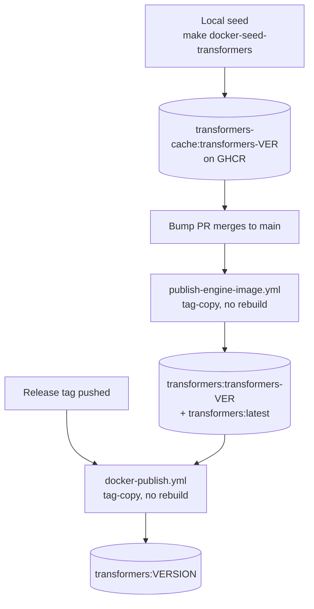
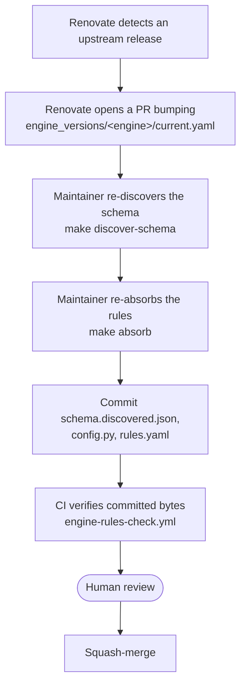

# Pipeline Architecture

This doc covers per-engine ordering: the asymmetric image architecture, the transformers image lifecycle, and how a version bump flows from an upstream release to committed, verified engine knowledge. For the CI workflow shapes themselves see [CI architecture](/explanation/architecture/ci-architecture); for the knowledge products (schema, config, rules) see [Architecture overview](/explanation/architecture/architecture-overview).

## Asymmetric engine architecture (locked design choice)

The three engines run through different image paths for a load-bearing reason. **Don't undo this asymmetry without re-reading [`#518`](https://github.com/henrycgbaker/llenergymeasure/issues/518).**

| Engine | Image source | How it runs |
|---|---|---|
| **transformers** | First-party `docker/Dockerfile.transformers` (flash-attention included; no upstream image provides this) | Built locally, promoted to a canonical tag at merge time, rebuilt for releases |
| **vllm** | Upstream `vllm/vllm-openai:v<VER>` directly, with the llem source bind-mounted | Pulled upstream; no first-party build |
| **tensorrt** | Upstream `nvcr.io/nvidia/tensorrt-llm/release:<VER>` directly, with the llem source bind-mounted | Same shape as vllm |

**Why asymmetric.** vLLM and TensorRT-LLM upstream images already contain everything llem needs at runtime (`pydantic`, `typer`, `pyarrow`, `rich`, `dotenv`, `pyyaml` are all present transitively), so bind-mounting the llem source into the upstream image is enough. Transformers upstream images do not include flash-attention, which is non-negotiable for production-equivalent runs, so transformers gets a first-party Dockerfile; the others stay upstream-direct.

**Drift safety.** The only argument for first-party-everywhere is "what if upstream drops a transitive dependency llem needs?" The migration cost from upstream-direct to first-party is bounded (a well-defined recipe per `#518`). The standing cost of first-party-everywhere is the flash-attention build for two engines that do not need it.

## Transformers image lifecycle

Because the flash-attention compile needs far more memory than hosted CI runners have, CI never builds the transformers image on the PR or merge path. The image follows the same production split as the knowledge artifacts: built locally, promoted and published by CI.

1. **Local seed.** During a transformers bump session the maintainer runs `make docker-seed-transformers`, which builds the runtime image on a machine with enough memory and pushes it to `transformers-cache:transformers-<VER>` (`<VER>` is `library.current_version` from `engine_versions/transformers/current.yaml`).
2. **Merge-time promotion.** When the bump lands on main, `publish-engine-image.yml` tag-copies the seeded image to the canonical `transformers:transformers-<VER>` and `transformers:latest` tags. There is no rebuild - production gets the bit-identical seeded image.
3. **Release-time tag-copy.** `docker-publish.yml` (called by `release.yml`) tag-copies the promoted `transformers:transformers-<VER>` image to the package-versioned `transformers:<VERSION>` release tag via `docker buildx imagetools create`. No rebuild: the released version is a registry-side pointer to the promoted digest, bit-identical to the seed.

A missing seed fails promotion loudly: the tag-copy step finds no source manifest at `transformers-cache:transformers-<VER>`. Recovery is to run the seed locally, then re-run the promotion.

## How a version bump flows

Upstream engines ship frequently. A bump moves through detection, local production, and CI verification before it merges.

- **Detection is automatic.** A self-hosted Renovate cron (`renovate.yml`) watches upstream releases and opens a PR that bumps the pin (and, for transformers, the Dockerfile `ARG`).
- **Production is local.** Reading the new engine source into an updated schema and rule set needs the engine source - and sometimes a GPU - so it runs on a maintainer's machine, not in CI. See [Schema refresh](/contributing/schema-refresh) and [Local knowledge production](/contributing/knowledge-production).
- **Verification is CI.** Once the regenerated artifacts are committed, `engine-rules-check.yml` checks they are internally consistent - the generated config matches the committed one, and uncovered validator sites are reported as advisory. No GPU, no containers, no self-hosted runners, and nothing writes back to the branch. See [CI architecture](/explanation/architecture/ci-architecture).

## See also

- [Architecture overview](/explanation/architecture/architecture-overview) - the engine-knowledge products
- [CI architecture](/explanation/architecture/ci-architecture) - the workflow shapes and what each check does
- [Engine extensibility](/explanation/architecture/engine-extensibility) - adding a new engine
- [Schema refresh](/contributing/schema-refresh) - schema-side operations guide
