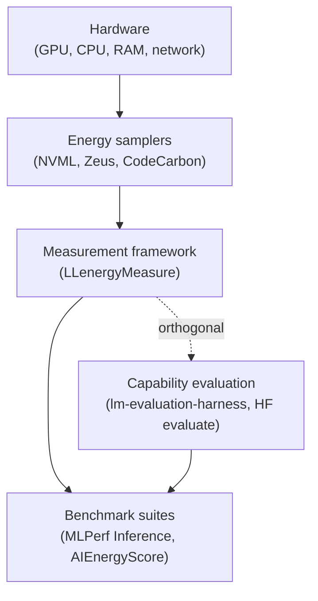

# Ecosystem

LLenergyMeasure is interstitial - it stitches together tools that sit at
adjacent layers in the LLM-inference measurement stack into a coherent
research instrument. This page sets out where the tool sits, what it
integrates as plugins, what it stays orthogonal to, what it most
resembles among existing peers, and the explicit boundaries that
separate it from benchmarks. The framing is integration-first and
non-defensive: most of the named tools are upstream of this one, beside
this one, or operate on a different question entirely.

For the research-direction case behind these positions, see [Why
LLenergyMeasure](why.md).

---

## Where we sit

The LLM-inference measurement stack is a layered system. Each layer has
its own established projects, and each layer addresses a different
question.

The framework layer - between the samplers that report joules and watts,
and the benchmark suites that fix rules to compare submitters - is the
layer at which an instrument can take a researcher's specification of an
inference experiment and turn it into a structured, methodology-rigorous
measurement. Without this layer, researchers either reimplement a
measurement harness per project (as the master's thesis behind this tool
originally did) or pull harness scaffolding out of a benchmark suite
that is shaped for fixed-rule comparison rather than open exploration.

LLenergyMeasure occupies that framework layer. The samplers below remain
authoritative for the underlying physical measurement; the benchmarks
above remain authoritative for fixed-rule comparison. The framework is
the missing connective tissue.

---

## What we integrate (samplers, as plugins)

Energy samplers are the source of truth for power and energy on the
hardware. LLenergyMeasure does not reimplement them; it depends on them
through a sampler-plugin contract, and exposes the sampler choice
explicitly in every result so that consumers know which instrument
produced each number.

### NVML

[NVIDIA Management Library](https://developer.nvidia.com/nvidia-management-library-nvml)
is NVIDIA's GPU-internal telemetry API. It exposes power draw and
cumulative energy counters (where available) at roughly 100 ms
granularity. It is the default sampler in LLenergyMeasure: it has the
lowest overhead, it requires no additional install (the NVIDIA driver
is already required for GPU inference), and it is the closest to the
hardware of the three samplers.

Use NVML when you want low-overhead default measurement and your
experiments run for tens of seconds or longer. For experiments under a
few seconds, the 100 ms granularity introduces non-trivial sampling
error; consider Zeus.

### Zeus

[Zeus](https://ml.energy/zeus/)
([Chung et al., 2023](https://www.usenix.org/conference/nsdi23/presentation/you))
is a research-cited GPU energy measurement library from the
ML.ENERGY group at the University of Michigan. It samples energy more
continuously than NVML and is the most-cited energy measurement library
in academic LLM-energy work.

Use Zeus when reproducibility against other Zeus-based papers matters,
when measurement granularity matters (short experiments), or when
research norms in your sub-field expect Zeus reporting. The plugin
contract makes this a configuration choice, not a code change.

### CodeCarbon

[CodeCarbon](https://codecarbon.io/) is a Python library that estimates
energy use across the whole system (CPU, GPU, RAM) and converts it to a
CO2-equivalent figure using regional electricity carbon-intensity data.

Use CodeCarbon when carbon reporting (not just joules) is needed - for
sustainability reporting, for comparisons across regions, or for
publications that require carbon estimates. The system-wide scope
trades off against GPU specificity: for like-for-like comparison of
inference configurations on a single GPU, NVML or Zeus is preferable.

### Honest framing

These three tools are not competitors; the project depends on them. The
plugin contract is the integration mechanism. Improvements upstream
benefit LLenergyMeasure users at the next version pin.

For sampler-by-sampler methodology detail, see
[Energy measurement](methodology/energy-measurement.md).

---

## Orthogonal tools (capability evaluation)

A second category of tools measures model quality rather than
efficiency. They are routinely used alongside efficiency measurement
because the two questions interact: a more efficient configuration is
only useful if it preserves the model's capability.

### lm-evaluation-harness

[lm-evaluation-harness](https://github.com/EleutherAI/lm-evaluation-harness)
(EleutherAI) is the standard harness for capability evaluation -
perplexity, accuracy on reasoning tasks, and the broad suite of
academic benchmarks. It does not measure energy.

Researchers comparing inference configurations typically want both: lm-eval
for capability under each configuration, LLenergyMeasure for energy and
throughput under each configuration. The two address different questions
on the same experimental cell, and integration with lm-eval is on the
project roadmap.

### HuggingFace evaluate

[HuggingFace evaluate](https://huggingface.co/docs/evaluate/index)
provides metrics for model output quality (BLEU, ROUGE, exact match,
and so on). It operates at a different abstraction layer from lm-eval
but plays the same role in the ecosystem: a quality-side counterpart to
the efficiency side.

LLenergyMeasure does not aim to replace either of these or compete with
them. The questions are different.

---

## Adjacent peers (similar layer, different focus)

A third category is the most useful one to position against, because
these are projects at the same layer of the stack with different design
choices. The contrasts here are about shape, not relative quality.

### MLPerf Inference

[MLPerf Inference](https://mlcommons.org/benchmarks/inference-datacenter/)
is the industry-standard fixed-rule benchmark. It defines models,
datasets, and accuracy thresholds; submitters run their hardware
through the rule set and submit results for public comparison.

Where the contrast lies: MLPerf is intentionally constrained, because
fair cross-vendor comparison requires constraint. LLenergyMeasure is
intentionally open, because researcher-led investigation of
implementation effects requires the configuration surface to vary.
Different audiences, different rule-sets. MLPerf Power addresses energy
explicitly under the same fixed-rule shape.

LLenergyMeasure outputs can inform future MLPerf rule design (for
example by quantifying which axes drive variance and should therefore
be fixed in benchmark cells), but the two projects are not substitutes.

### HuggingFace optimum-benchmark

[optimum-benchmark](https://github.com/huggingface/optimum-benchmark) is
the closest functional peer for measurement infrastructure. It supports
multiple inference targets (transformers, ONNX Runtime, OpenVINO, and
others) and sweeps configurations for throughput and latency.

Where the contrast lies: optimum-benchmark is throughput-leaning - the
default reported metrics are latency and tokens-per-second, with energy
as a secondary axis (recently added). LLenergyMeasure makes energy a
first-class output and pairs it with the discovery and invariant-mining
pipelines that optimum-benchmark does not have. Methodology rigour
(baseline subtraction, warmup convergence, thermal stabilisation,
sampler lifecycle) is more explicit on the LLenergyMeasure side.

These projects could in principle converge; they currently target
different communities.

### llmperf

[llmperf](https://github.com/ray-project/llmperf) (Anyscale) measures
throughput and latency under load, with a production-deployment focus.
The shape is closer to a load-tester for serving stacks than to a
research instrument.

Where the contrast lies: llmperf is shaped for "is my deployed serving
stack fast enough under realistic load?". LLenergyMeasure is shaped for
"how does this implementation choice affect energy and throughput,
controlled, reproducible?". Different audience, different question,
overlapping mechanism.

### AIEnergyScore

[AIEnergyScore](https://huggingface.github.io/AIEnergyScore/) (HuggingFace,
[Luccioni et al.](https://huggingface.co/blog/sasha/ai-energy-score-leaderboard))
is the benchmark initiative that standardises energy-efficiency ratings
for AI models. The bundled prompt corpus that LLenergyMeasure uses by
default is from this project; the methodology DNA is shared.

Where the contrast lies: AIEnergyScore produces ratings on a fixed
prompt set for a fixed task class, oriented toward standardised model
comparison. LLenergyMeasure produces absolute measurements across
researcher-controlled sweeps and multiple engines, oriented toward
investigation rather than rating. The lineage is direct, the scope
extends, and the boundary is honest.

For dataset-context detail, see
[Dataset context](methodology/dataset-context.md). For broader benchmark
positioning, see
[Comparison context](methodology/comparison-context.md).

---

## Boundary: not a benchmark, informs benchmarks

The most important boundary in this whole picture is between
"benchmark" and "measurement infrastructure". They are different
artefacts that serve different communities.

A benchmark produces headline numbers ranking submitters under a fixed
rule set. The rule-fixing is the value: it is what makes results fair
across vendors, models, or papers. MLPerf and AIEnergyScore are
benchmarks.

LLenergyMeasure produces measurement infrastructure: a tool researchers
use to study how implementation choices affect energy and throughput,
under conditions the researcher specifies. There is no headline ranking
because the rules vary by definition.

The two roles complement each other. Outputs from LLenergyMeasure can
inform benchmark design - for example, if engine choice contributes a
large share of the variance for a given model class, benchmark cells
should fix the engine when comparing models. Conversely, benchmarks
provide the shared reference points that give individual measurements
broader meaning. The boundary protects both projects: benchmarks stay
fair-rule, the framework stays open-rule, and the stack as a whole
covers both needs.

---

## Where the picture goes next

Inference workloads are shifting. Single-pass generation against a
fixed prompt is giving way to reasoning models doing multi-pass under
uncertainty, agentic harnesses chaining tool-use over many model calls,
and scaffolds adding re-prompting, verifier passes, and
sampling-strategy variation as first-class workload features. The
measurement infrastructure layer will need to extend with these
workloads.

Likely future plug-in points include: agent-framework wrappers
(LangChain agents, ReAct loops, multi-step tool-use); sampling-strategy
plugins for OSS reasoning harnesses; per-call energy attribution that
preserves the distributional shape of agentic loops rather than
flattening to a single mean; harness-aware metrics that report tail
behaviour rather than just centre.

These are forward-looking and the project takes no commitment to a
specific delivery here. The plugin architecture is sized for them; the
research-direction case is in [Why LLenergyMeasure](why.md).
