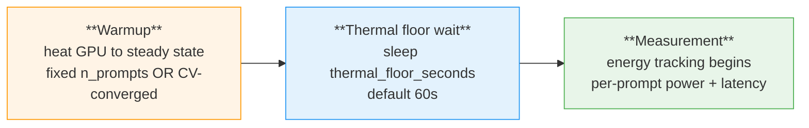
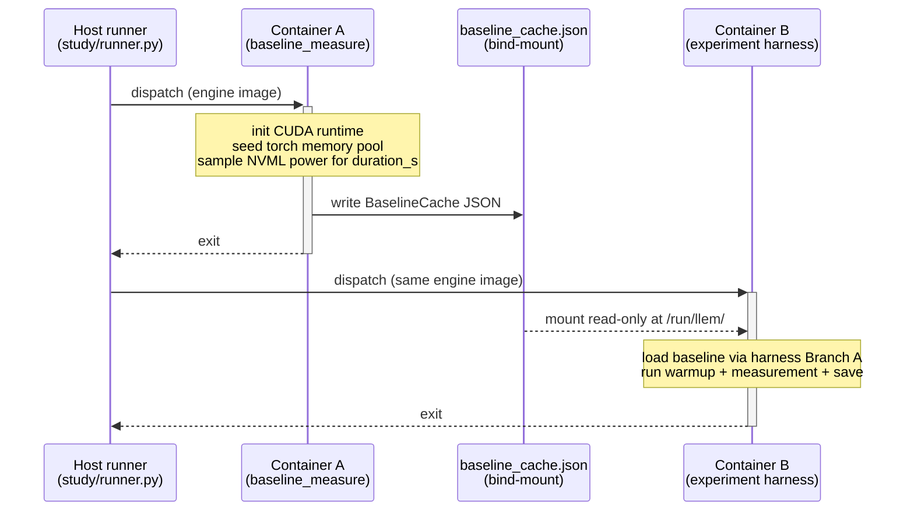

# Measurement Methodology

How LLenergyMeasure ensures reproducible, reliable energy measurements.

---

## Warmup

**Purpose:** GPU thermal state, driver caches, and JIT compilation warm-up all affect
first-run measurements. The first few inferences with a freshly loaded model are
consistently slower and higher-energy than subsequent inferences. Warmup discards
these initial measurements.

### Two warmup modes

LLenergyMeasure has two warmup modes, controlled by `convergence_detection` (default: `false`):

#### Fixed mode (default)

Runs exactly `n_prompts` prompts (default 5). The coefficient of variation (CV) is
computed for informational purposes but does not affect iteration count. Always reports
`converged: true`. Simple, predictable, and sufficient for most use cases.

```yaml
offline:
  warmup:
    enabled: true                    # default: true
    n_prompts: 5                     # default: 5
    thermal_floor_seconds: 60.0     # default: 60.0
```

#### CV convergence mode (opt-in)

Runs warmup prompts until the **coefficient of variation** (CV = std_dev / mean) of
recent latencies drops below `cv_threshold`. This mode replaces fixed iteration
count - `n_prompts` is ignored when convergence detection is active.

```yaml
offline:
  warmup:
    enabled: true
    convergence_detection: true      # enable CV-based warmup
    cv_threshold: 0.05              # stop when CV < 5% (default: 0.05)
    window_size: 3                  # sliding window for CV calc (default: 3)
    min_prompts: 5                  # minimum prompts before checking CV (default: 5)
    max_prompts: 20                 # safety cap (default: 20)
```

CV convergence mode checks `len(latencies) >= max(min_prompts, window_size)` before
evaluating the threshold. The safety cap (`max_prompts`) prevents infinite loops if
the system never stabilises.

### Execution order



1. **Warmup prompts** - heat the GPU to steady state (fixed or CV mode).
2. **Thermal floor wait** - sleep `thermal_floor_seconds` (default 60s) for GPU
   temperature to plateau after warmup.
3. **Measurement** - energy tracking begins.

The thermal floor wait occurs *after* warmup, not before. This ensures the GPU has
reached operating temperature from warmup but has stabilised before measurement starts.

### Rationale for the thermal floor wait

Warmup raises the GPU to operating temperature but does not stabilise it. Within
the warmup phase the device remains on a temperature ramp: temperature,
instantaneous power, and clock frequency continue to change between prompts.
A measurement window opened immediately after warmup would therefore sample
across this transient, with each successive prompt observing a different thermal
state. Between-prompt variance under this regime is dominated by position on the
warmup curve rather than by workload properties.

During the wait, the temperature curve plateaus: heat dissipation matches the
heat input from the warmup phase, fan speed reaches a steady state for that
thermal load, and clocks settle at the sustainable boost level. Measurement then
proceeds against a stable thermal state, and observed between-prompt variance
reflects workload variation rather than residual warmup transient.

The 60 s default is empirical: this is the approximate timescale on which
datacenter-class GPUs settle after a step change in load - long enough that
residual drift falls below the noise floor of NVML's ~5% power-sample accuracy,
short enough not to dominate experiment runtime.

### Engine-specific behaviour

For **vLLM** and **TRT-LLM** engines, warmup is a single kernel warmup call that
returns `first_latency=0.0`. These engines perform their own internal warmup during
server startup (CUDA graph capture, kernel compilation). The warmup phase for these
engines confirms the engine is ready, rather than iterating multiple inference passes.

### Default values

- `n_prompts: 5` is consistent with DeepSpeed, Zeus, and AI Energy Score benchmarks
  (which use 5-10 warmup rounds)
- `thermal_floor_seconds: 60.0` meets the MLPerf Power minimum (60s mandatory)

**For quick testing:** disable warmup to skip the warmup phase and thermal floor wait:

```yaml
offline:
  warmup:
    enabled: false
```

This significantly reduces total experiment time at the cost of measurement quality.
Do not use `enabled: false` for published results.

---

## Baseline Power {#baseline-power}

**Purpose:** Measures idle GPU power draw before inference to enable baseline-adjusted
energy attribution. The adjusted figure isolates the energy cost of the inference work
itself, removing constant background power draw.

Configure via the `baseline:` section:

```yaml
baseline:
  enabled: true           # default: true
  duration_seconds: 30    # default: 30.0, range: 5-120
```

**What happens:**
1. Before the first experiment, the GPU power sampler runs for `duration_seconds` with
   no inference work.
2. The mean power over this period is stored as `baseline_power_w`.
3. For each subsequent measurement, `energy_adjusted_j = total_energy_j - (baseline_power_w * duration_s)`.
4. The baseline result is cached per-session (default 2-hour TTL, configurable via
   `baseline.cache_ttl_seconds`) - subsequent experiments in a study reuse the
   cached baseline without measuring again.

**In results:**
- `baseline_power_w` - measured idle power in watts
- `total_energy_j` - total GPU energy during inference
- `energy_adjusted_j` - total energy minus baseline (inference-attributable only)
- `energy_per_token_mj_adjusted` - the per-token form of the adjusted figure (preferred for
  cross-experiment comparison)

For publication-quality results, always include baseline in your reported energy.
`energy_adjusted_j` (and its per-token form `energy_per_token_mj_adjusted`) is the preferred
metric for comparing configurations.

### Where baselines are measured

Baseline idle power is measured in the same CUDA environment as the inference
work it will be subtracted from. For local (host) runs that is the host
process itself. For Docker runs, the baseline is measured inside a short-lived
container of the same engine image, with the CUDA runtime initialised and
the torch memory pool seeded - matching the state the experiment container
will be in just before inference starts.

**Why this matters:** a host-measured baseline underestimates the container's
idle power by ~8.7 W per A100 because the host has no CUDA context and no GPU
memory pool allocated. On a 4-GPU 120 s A100 experiment this is a ~4.2 kJ
under-subtraction (~19 % of typical adjusted energy). Measuring in the
matching CUDA environment eliminates this bias. The figures above come from
a controlled host-vs-container comparison on A100-PCIE-40GB hardware.

**Baseline strategies and where they run:**

| Strategy    | Where measured (local runner)     | Where measured (Docker runner)                |
|-------------|-----------------------------------|-----------------------------------------------|
| `fresh`     | Host, per experiment              | Inside experiment container (per-experiment) |
| `cached`    | Host, once per TTL window         | Short-lived baseline container, once          |
| `validated` | Host, once + periodic spot-check  | Short-lived baseline / spot-check containers  |

**Cross-engine comparisons:** each engine image gets its own baseline cache.
If your study mixes engines, each engine's adjusted energy is computed
against a baseline measured in that engine's environment - cross-engine
energy comparisons remain apples-to-apples.

### Multi-engine studies: per-engine scoping

Baseline caches, TTL expiry, and the `validated` strategy's spot-check
counter are all keyed per engine target (``local_<engine>`` for host runs,
``image:<sanitised-tag>`` for each Docker image). In a mixed-engine
study - for example 300 experiments randomly interleaving Transformers, vLLM,
and TensorRT-LLM - each engine behaves as if it had its own independent
baseline session:

- **`cached` TTL:** each engine's baseline ages out independently after
  `baseline.cache_ttl_seconds`. A stale transformers cache does not force a
  re-measure of vllm, and vice versa. Cache files live at
  `{study_dir}/_study-artefacts/baseline_cache_{key}.json`.
- **`validated` interval:** `baseline.validation_interval` counts
  experiments *per engine*, not across the whole study. If the interval
  is 50 and the study interleaves three engines, each engine triggers
  its own drift check after 50 experiments against *that* engine's
  cached baseline - regardless of how many experiments ran against the
  other engines in between.
- **Drift threshold:** a drift detected on one engine only re-measures
  that engine's baseline. The other engines' caches are untouched.

This scoping makes randomised Multi-engine studies safe to run without
baseline interference - interleaving does not corrupt the statistical
independence of each engine's adjusted energy figures.

### Two-container architecture (Docker runs)

For `cached` / `validated` strategies, a Docker experiment is dispatched
as **two sequential containers** of the same engine image:



**Key properties:**

- **Strictly sequential.** Container A runs to completion (`subprocess.run`
  is blocking) before Container B is started. The two containers never
  execute concurrently, even though the CLI display may briefly show
  overlapping updates during the ~100 ms handover.
- **Same image, same CUDA state.** Using the engine image for Container A
  guarantees the baseline is measured in the same CUDA runtime, same
  Python interpreter, and same torch allocator footprint that Container B
  will inherit. This is what eliminates the ~8.7 W/GPU host-vs-container
  bias documented above.
- **No shared process state.** Information crosses the container boundary
  only through a single JSON file (`baseline_cache.json`) bind-mounted
  into Container B under `/run/llem/`. No stdin pipes, no long-lived
  sidecars, no shared volumes beyond the read-only cache.
- **`fresh` strategy is single-container.** The harness measures its own
  baseline inside Container B (Branch B of `harness/measurement.py`). No
  Container A is dispatched. This is the simplest path but pays the
  baseline cost on every experiment.

**Why not measure baseline inside Container B in all cases?** Doing so
would force every experiment in a cached or validated study to pay the
full `duration_seconds` (typically 30 s) up front, cancelling the main
benefit of caching. The two-container design pays that cost once per
engine per TTL window and then reuses the result - a 300-experiment
mixed-engine study pays ~3 × 30 s of baseline measurement instead of
300 × 30 s.

---

## Multi-Cycle Execution

**Purpose:** Single measurements have variance from thermal drift, system load, and
caching effects. Repeating experiments across multiple cycles produces a distribution
of measurements that supports statistical analysis and confidence intervals.

Configure via the `study_execution:` section in a study YAML:

```yaml
study_execution:
  n_cycles: 3               # default (CLI): 3
  experiment_order: shuffle  # default (CLI): shuffle
```

**CLI effective defaults** for `llem run study.yaml` (if not set in the YAML):
- `n_cycles = 3`
- `experiment_order = shuffle`

### Why n_cycles >= 3?

With 3 or more cycles per experiment, you can report median and inter-quartile range,
detect outliers, and assess measurement stability. A single measurement cannot distinguish
true energy cost from transient effects (thermal spike, background process, cache miss).

For publication, use `n_cycles >= 5` to support confidence interval estimation.

### Experiment Ordering

For experiments A and B with 3 cycles:

**`sequential`** → `A, A, A, B, B, B`

All cycles of each experiment run together. Minimises model-load overhead (model stays
loaded across cycles). May introduce temporal bias if system state changes over time.

**`interleave`** → `A, B, A, B, A, B`

One cycle of each experiment per round, repeated. Balances temporal effects across
configurations - both A and B experience similar system conditions per round.
Good for comparisons where temporal fairness matters.

**`shuffle`** → random per-cycle order, seeded from study design hash

The execution order is randomised independently for each cycle. The seed is derived from
the study design hash (SHA-256 of the resolved experiment list), so the same study YAML
always produces the same shuffle sequence - reruns are reproducible.

`shuffle` is the CLI default. It eliminates systematic ordering bias while maintaining
reproducibility.

**`reverse`** → `A, B, B, A, A, B`

Alternates forward and backward experiment order each cycle. Even-numbered cycles run
experiments in the original order; odd-numbered cycles run them in reverse. Counterbalances
temporal drift (e.g. thermal ramp) without introducing randomness.

**`latin_square`** → Williams balanced design

Uses a Williams balanced latin square where each experiment follows every other experiment
exactly once across rows, cancelling first-order carryover effects (e.g. thermal residue
from the previous model). When `n_cycles > k` (number of experiments), the square rows
repeat; when `n_cycles < k`, the first `n_cycles` rows are used.

Best for studies where carryover effects between experiments are a concern.

Set the cycle count and experiment order in the study YAML:

```yaml
study_execution:
  n_cycles: 5
  experiment_order: interleave
```

---

## Server-Mode Measurement

**Purpose:** Offline mode measures a batch ceiling - one engine lifetime run
flat out over a fixed prompt set. Server mode measures a running service:
requests arrive over time at a target rate, and energy and latency are
attributed over measurement windows once the server reaches steady state. The
two modes share their energy-per-token definition so their results can be
compared, but the measurement protocol differs in ways that must be understood
before putting them side by side.

### Measurement windows

A **window** is the first-class unit of server-mode measurement: a fixed span
during which the server is held at a target arrival rate and steady state.
A rate sweep produces one *level* per rate, and each level measures three
consecutive windows (the default) so a per-level stability gate can confirm the
per-window energy per token is stable across them before the level is credited.

Two boundary policies coexist within a window and are never conflated:

- **Energy** is amortised over the steady-state span. Energy per token is the
  window's integrated GPU energy divided by the tokens attributed to the span,
  with the ramp excluded. The ramp is excluded *prospectively* - the span
  simply starts a fixed interval after load begins - not trimmed retroactively.
- **Latency** percentiles use a drain-before-close policy: every request issued
  within the span contributes its real end-to-end latency, even when it
  completes after the span closes, because the harness drains all in-flight
  requests to completion after energy accounting stops.

At v0.7 there is one attribution policy, and it is a disclosed field in the
result: the energy denominator is the client-counted output tokens received in
the steady-state span `[start + ramp, stop]`, across all requests regardless of
terminal status. Because the per-window request log stores the span bounds and
the receipt-unclipped per-request token series, an alternative attribution can
be re-derived offline without re-running the study.

The measured-span duration (default 240 s) and the excluded ramp (default 30 s)
are config-exposed on `server.traffic` and grounded in the
minimum-window-duration study.

### Server warmup

Server warmup has three stages. First, **readiness**: a liveness poll of the
server's health endpoint is necessary but never sufficient, so readiness is
satisfied only once a real inference request driven through the serving path
returns successfully - the tool warms and probes the same path it measures.
Second, **warmup traffic**: the harness drives issuer traffic at the level's
target rate, drawn from the same request-shape distribution the measurement
window will use, never a canned prompt loop. Third, the window opens.

In the default composite mode, the window opens only once a convergence gate of
three observables holds together - GPU power plateaued (stable through the end
of a trailing sample window), temperature settled (the trailing-window
temperature range within a small delta on every monitored GPU, i.e. dT/dt near
zero), and no active thermal throttle bits. This gate is grounded in the
warmup study. A hard `timeout_seconds` failsafe (default 900 s) prevents a
hang: at the timeout the harness proceeds and stamps a timed-out flag rather
than silently passing. `mode: fixed` is the explicit opt-out - the same
issuer-driven traffic path with no gate, for a fixed `duration_seconds`
(default 300 s); a duration of 0 skips warmup traffic entirely.

Warmup re-runs before *every* rate level. This fails safe: a level that is
already at equilibrium from the previous level exits the gate quickly, while a
level that shifted the operating point re-converges before it is measured.

:::caution Comparing offline and server side by side
Server mode inserts **no idle cooldown before a measurement window**, by
design. In offline mode the pre-window thermal-floor wait settles the GPU from an
idle state; in server mode the analogue is the *loaded* warmup to equilibrium,
because a running service's steady thermal posture under load is exactly what
should be measured. Inserting an idle wait would let the GPU cool below its
loaded operating point and bias energy per token favourably. This offline
(idle-settled) versus server (loaded-equilibrium) divergence in the pre-window
protocol is deliberate, and it must be labelled in any report that puts an
offline figure next to a server figure for the same model.
:::

:::caution Within-engine offline-vs-server deltas
For vLLM and TensorRT-LLM the same engine core serves both offline and server
runs, so a within-engine offline-to-server delta compares like with like. For
Transformers this would not hold - offline `generate()` and a serving adapter
are different runtime paths - so a Transformers offline-to-server delta would
not be apples-to-apples. At v0.7 this is a forward-looking caveat: Transformers
`serving_mode: server` is rejected at config validation (the server engines are
vLLM and TensorRT-LLM), so the mismatch cannot arise yet. It is documented here
for when a Transformers server adapter ships.
:::

### Open-loop issuance

Arrivals are **open-loop**: request issue times follow an arrival process
(Poisson by default; Gamma with a tunable burstiness coefficient optionally),
and a client-side sidecar issues each request on schedule without waiting for
prior requests to complete. Open-loop issuance is non-negotiable for any run
that reports latency, because closed-loop issuance (issue the next request only
when the last returns) hides queueing delay under load - the classic
coordinated-omission error, where the requests that would have observed the
worst latency are simply never issued.

Offline mode has **no traffic axis** by design. Offline measures a batch
ceiling, and arrival timing is meaningless without a serving queue to arrive
into, so there is no rate, no arrival process, and no window sweep in offline
mode.

### Shared metric core

Energy per token, energy per request, tokens per second, and the gross / idle /
net energy figures have **identical definitions in both modes**, which is what
makes cross-mode comparison of those figures legitimate. Server-distinct
metrics - TTFT and ITL percentiles under load, goodput, and SLO attainment -
exist only for server windows. Fields that do not apply to a mode are `null`
rather than zero, and the `serving_mode` field on every result is the
discriminator that says which reading applies. The
[results schema](/reference/results-schema#server-mode-results) documents the
server-mode result surfaces field by field.

---

## Thermal Management

**Purpose:** GPU temperature affects power draw and throughput. A GPU running at 85°C
performs differently from one at 60°C. Without thermal gaps between experiments, earlier
experiments heat the GPU, causing later experiments to run at a higher baseline
temperature - introducing a systematic bias across sweep positions.

By default, LLenergyMeasure inserts thermal gaps between experiments in a study. These
gaps allow the GPU to return toward its baseline temperature before the next experiment
starts.

Disable thermal gaps for speed-oriented testing (at the cost of measurement quality)
by zeroing the gaps in the study YAML:

```yaml
study_execution:
  experiment_gap_seconds: 0
  cycle_gap_seconds: 0
```

LLenergyMeasure also monitors thermal and power throttle events during measurement. If
the GPU throttled during an experiment, `throttle.detected: true` is set in that
experiment's result, and the throttle duration and trigger reason are recorded.

---

## Reproducibility

### Seeding model

LLenergyMeasure uses two independent seeds that control reproducibility at different
scopes:

**`random_seed`** (ExperimentConfig) - per-experiment stochasticity:

- Engine inference RNG (`torch.manual_seed`, vLLM `seed=`, TRT-LLM `random_seed=`)
- Dataset prompt ordering (when `dataset.order: shuffled`)

**`shuffle_seed`** (ExecutionConfig) - study-level scheduling:

- Cycle shuffle order (which experiment runs when)
- Default: derived from `study_design_hash` (same YAML always produces the same order)

These are orthogonal by design. Changing `random_seed` does not affect experiment
scheduling, and changing `shuffle_seed` does not affect inference outputs. This lets you
test sampling variance (vary `random_seed`) independently from ordering effects (vary
`shuffle_seed`).

### Reproducibility checklist

To maximise reproducibility across runs and machines:

1. **Fix the random seed.** The default `random_seed: 42` controls all per-experiment
   stochasticity - inference RNG and dataset ordering:
   ```yaml
   random_seed: 42
   ```

2. **Use shuffle experiment ordering with n_cycles >= 3.** Shuffle ordering is seeded from
   the study design hash - identical study YAML always produces identical shuffle order.
   To override the shuffle seed explicitly:
   ```yaml
   study_execution:
     experiment_order: shuffle
     shuffle_seed: 123  # null = derived from study_design_hash
   ```

3. **Enable warmup and baseline.** Both are enabled by default. Disabling either reduces
   reproducibility by introducing thermal and background-power variance.

4. **Control system load.** External processes sharing the GPU affect energy readings.
   For the most reproducible results, run on a dedicated GPU with no other CUDA processes.

5. **Report the effective config.** LLenergyMeasure writes the full resolved experiment
   config to the `config.json` sidecar next to each `result.json` (`declared_config` plus
   per-field provenance). This captures every parameter value used, including engine
   defaults. Share both files (or the experiment directory) for full reproduction.

6. **Pin model revision.** HuggingFace models update. To ensure the same weights across
   runs, pin the model revision:
   ```yaml
   transformers:
     engine_params:
       revision: "abc1234"   # commit hash or tag from HuggingFace Hub
   ```

### What is stored in results

Each experiment directory includes:
- `result.json` - measurement metrics: `baseline_power_w`, thermal throttle info,
  latency stats, and more (see [Results schema](/reference/results-schema) for the
  full field list)
- `config.json` - the fully resolved `declared_config` (all defaults filled in) plus
  per-field provenance and observed engine state
- `timeseries.parquet` - GPU power/thermal/memory samples at 100 ms resolution (when
  `output.save_timeseries` is enabled)

The study-level `manifest.json` carries `study_design_hash` - a SHA-256[:16] of the
resolved experiment list, so identical study YAML always produces the same hash.

---

## Universal-to-Engine Parameter Mapping

LLenergyMeasure uses engine-native field names wherever possible. Each engine library
(HuggingFace Transformers, vLLM, TensorRT-LLM) has its own naming conventions. A thin
mapping layer translates the handful of universal `ExperimentConfig` and `DecoderConfig`
fields to each engine's native API parameters.

### Design principle

Engine-specific configuration sections (`transformers:`, `vllm:`, `tensorrt:`) always use the
engine library's native names directly - no translation. The mapping layer only applies to
shared (universal) fields that have identical semantics across all engines but different
API names.

### Complete mapping table

| Universal field | Transformers native | vLLM native | TensorRT native | Notes |
|---|---|---|---|---|
| `dtype` | `torch_dtype` (torch.float16, etc.) | `dtype` (passthrough) | `dtype` (passthrough) | Direct mapping in PyTorch; passthrough for vLLM/TRT |
| `random_seed` | `torch.manual_seed()` | `seed=` in LLM() | `random_seed=` in SamplingParams | Different API surfaces |
| `max_input_tokens` | `max_length` in tokeniser | (pre-truncated by harness) | `max_input_len` (compile-time) | Transformers truncates at tokenisation; TRT-LLM uses it as a compile-time engine constraint |
| `max_output_tokens` | `max_new_tokens` | `max_tokens` | `max_new_tokens` | **vLLM uses `max_tokens`**; Transformers/TRT-LLM use `max_new_tokens` |
| `decoder.temperature` | `temperature` | `temperature` | `temperature` | No rename; conditional stripping in greedy mode |
| `decoder.do_sample` | `do_sample` | (implicit from temperature) | (implicit from temperature) | Only Transformers has an explicit flag |
| `decoder.top_k` | `top_k` (0=disabled) | `top_k` (**0 → -1**) | `top_k` (0=skipped) | vLLM uses -1 to mean disabled |
| `decoder.top_p` | `top_p` | `top_p` | `top_p` | No rename |
| `decoder.repetition_penalty` | `repetition_penalty` | `repetition_penalty` | `repetition_penalty` | No rename |
| `decoder.min_p` | `min_p` | `min_p` | `min_p` | No rename |
| `decoder.min_new_tokens` | `min_new_tokens` | `min_tokens` | `min_tokens` | **vLLM/TRT-LLM use `min_tokens`** |

### Non-mapped fields

Everything else passes through without translation:

- **Engine-specific configs** (`transformers.llem_execution.batch_size`, `vllm.engine_params.max_num_seqs`,
  `tensorrt.engine_params.max_batch_size`, etc.) use native names - no mapping.
- **Sub-configs** (`warmup`, `baseline`, `energy`) are consumed by the measurement harness,
  not by engines.

---

## Known Limitations

### NVML thermal throttle subsampling

LLenergyMeasure polls NVML at 100 ms intervals during the measurement window
(`sample_interval_ms` in `src/llenergymeasure/energy/nvml.py`). Thermal throttle
events shorter than the polling interval, or those that begin and end between
adjacent samples, may not appear in the recorded power and thermal trace. The
`throttle_detected` field reflects what NVML reported across these polls, not a
continuous throttle history. This is an inherent limitation of polling-based
sampling and cannot be resolved without kernel-level instrumentation.
